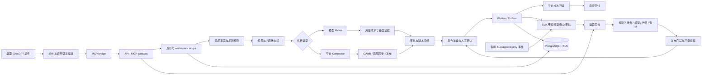

# Codex 商家营销插件主链路

日期：2026-08-31

## 范围

本文描述真实目标工作流：桌面 ChatGPT 插件入口 → MCP/API → 业务服务 → 模型中转或平台连接器 → Worker/持久化 → 商家交付与运营后台门禁。

主图源文件为 [main-chain-architecture.mmd](main-chain-architecture.mmd)。当前环境缺少离线渲染 bundle，暂未生成 SVG、PNG 和可编辑 Excalidraw 文件。

## 主链路

## 每个阶段的责任边界

| 阶段 | 负责内容 | 必须保留的证据 | 当前状态 |
|---|---|---|---|
| 插件入口 | 用户自然语言、宿主身份、单步交互 | 宿主 `tools/list`、身份和 MCP 地址 | 本地只读已验证，生产宿主未闭环 |
| 网关与租户 | Bearer、workspace、角色、方法白名单 | request/trace/workspace envelope、越权拒绝 | 代码和测试较完整 |
| 事实与品牌 | 商品事实、素材来源、品牌 revision、视觉规则 | 来源素材、人工确认、revision、冲突记录 | 本地能力高，生产素材链未验收 |
| 任务与生成 | 意图、方向、方案、生成、审核、版本 | 冻结输入快照、模型 provider、usage、cost、错误 | 文本路径中高，媒体路径中低 |
| 平台执行 | OAuth、同步、字段映射、媒体上传、发布回读 | account scope、远端状态、幂等键、快照 hash | fixture/connector 已有，真实平台未闭环 |
| 异步处理 | Outbox、Worker、重试、死信、未知状态 | job 状态、事件、重试记录、审计 | 本地测试较完整，生产长稳缺失 |
| 运营控制面 | 规则、套餐、模型、账务、告警、审计、数据删除 | 角色、原因、前后值、审批和操作审计 | 本地后台较完整，生产 OIDC/数据缺失 |
| 发布门禁 | release metadata、签名证据、回滚、备份恢复 | 固定 release、artifact digest、trust/nonce、PITR | fail-closed 代码存在，真实控制面未配置 |

## 关键门禁

1. 未确认商品事实、品牌字段或制作方案，不进入正式生成。
2. 模型请求必须经过业务 Relay；缺少真实鉴权、provider、request ID、用量或成本证据时失败关闭。
3. Logo、字体授权、素材扫描或商用权益不满足时，视觉生成失败关闭。
4. 内容生成、审核、批准、发布准备和发布确认是独立门禁。
5. 发布确认必须绑定最新版本、confirmation hash、remote snapshot hash 和幂等键。
6. `queued`、`submitted`、`reviewing` 或 `unknown` 不能表述为已发布。
7. fixture、本地扫描和示例数据只能证明开发联调，不得作为生产成功证据。

## 当前最重要的链路风险

- 源码 bridge 与 marketplace 安装镜像出现工具清单漂移，可能造成“源码能力”和“用户实际安装能力”不一致。
- 真实六平台 OAuth/读写/media canary、支付 provider、生产模型 Relay 和托管对象存储证据尚未绑定同一 release。
- canonical/listing 与 legacy product/task 两条数据链仍处于渐进迁移状态。

## 相关源码

- 插件入口：[apps/plugin/.codex-plugin/plugin.json](../../../apps/plugin/.codex-plugin/plugin.json)
- MCP bridge：[apps/plugin/mcp/bridge.mjs](../../../apps/plugin/mcp/bridge.mjs)
- API/MCP：[apps/api/src/server.ts](../../../apps/api/src/server.ts)
- 应用服务：[packages/application/src/service.ts](../../../packages/application/src/service.ts)
- 持久化/RLS：[packages/persistence/src/schema.sql](../../../packages/persistence/src/schema.sql)
- Worker：[packages/workers/src/runner.ts](../../../packages/workers/src/runner.ts)
- 发布清单：[doc/todo/release/release-checklist-0.1.1.md](../../todo/release/release-checklist-0.1.1.md)
