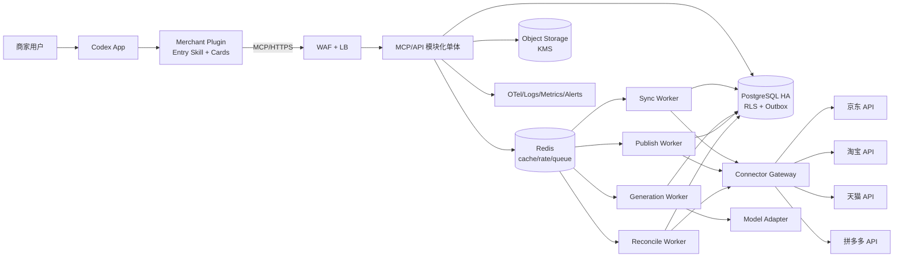
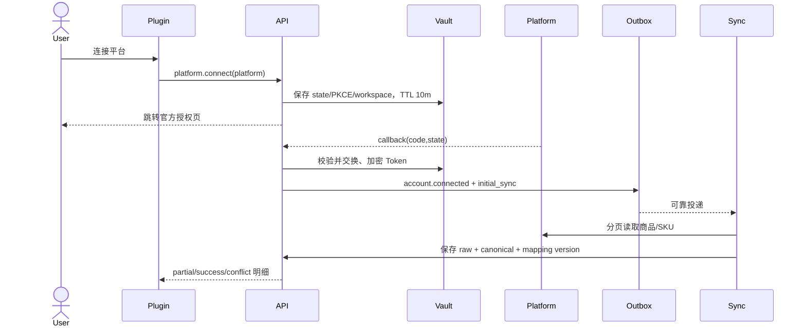
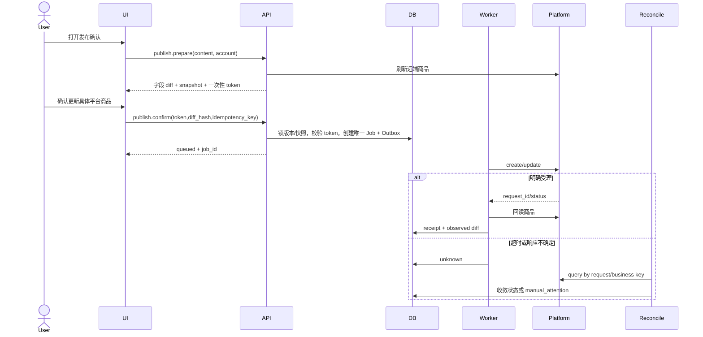

# 商家营销内容助手技术方案设计

版本：v1.0 RC  
日期：2026-08-29（架构基线复核）
产品基线：[PRD-merchant-marketing-codex-final.md](../product/PRD-merchant-marketing-codex-final.md)  
部署基线：[cloud-resources-and-deployment.md](../infra/cloud-resources-and-deployment.md)  
容量基线：Release 1 为 50 个并发工作区，可按同一架构扩容至 500

## 1. 评审结论

**结论：架构设计通过，工程开工有条件通过，生产发布尚未通过。**

通过的是技术方向和可实施契约：Codex Plugin + MCP、模块化单体、四类隔离 Worker、PostgreSQL 业务真相、Transactional Outbox、统一商业对象、四个 schema profile、不可变版本、确认后发布与 unknown 对账，能够支撑 9 人在 15 个工作日并行完成试点 RC。

当前实现的本地/集成验收已覆盖 PostgreSQL、Redis、对象存储补偿、资产一致性、运营台深链和多租户权限；生产发布仍受三类外部门禁约束：

1. 京东、淘宝、天猫、拼多多官方应用的读/写权限和测试店铺必须真实获批。
2. 六个 profile 的 sandbox/测试店铺 contract test、写入回读和错误映射必须通过。
3. 50 工作区容量、故障恢复、安全和数据隔离验收必须产生运行证据。

没有平台写权限时，系统仍可完成授权、同步、生成、检查、版本和导出；对应平台的“发布”必须通过 feature flag 保持关闭，不能用网页爬虫或账号密码绕过。

### 1.1 当前数据事实模型（2026-08-29）

实现以迁移后的真实表为准，早期示例中的 `stores`、`commerce_products`、`product_versions`、`source_assets` 和 `remote_snapshots` 不是当前表名：

```text
workspace
  ├─ brands
  │   └─ canonical_products
  │       ├─ product_listings ── platform_accounts
  │       ├─ batch_campaign_items ── tasks ── content_versions ── publish_jobs
  │       └─ product_asset_bindings ── assets/object storage
  └─ business_entity_snapshots / knowledge snapshots / reconciliation status
```

`platform_accounts` 当前同时承担授权账号和店铺连接身份，稳定键是 `workspace_id + platform + platform_account_id`；店铺名称只用于展示。若后续某平台出现“一个授权账号下多个远端店铺”，需新增独立 `stores` 实体，不能复用名称字段。Canonical 商品与 Listing 的统一切读仍按工作区逐步推进，旧 `products` 路径保留为兼容/迁移来源，不能在生产门禁中宣称已完全移除。

结构化商品事实、任务和资产元数据进入 PostgreSQL；图片、视频、原件、预览和未来的原始平台响应归档进入私有对象存储，数据库只保存哈希、大小、扫描/权益状态和对象 Key。Redis/outbox 只允许携带 `event_id`、`aggregate_id`、`workspace_id` 等引用，worker 必须回源 PostgreSQL，禁止把商品或素材正文放进队列。

## 2. 架构目标与约束

### 2.1 目标

- 用户在 Codex App 内完成授权、同步、事实确认、生成、审核、版本和确认后发布。
- 所有正式内容可还原输入事实、来源、规则、映射、模型、软件和远端商品快照。
- 接收成功的异步任务不丢失；重复点击、网络超时和 Worker 重启不造成重复发布。
- 所有层级都具备 workspace 隔离；平台 Token 不进入 Skill 上下文、日志、导出或浏览器存储。
- Release 1 以 50 工作区真实验收，扩容不需要重写领域模型或拆微服务。

### 2.2 明确不做

- 不做网页抓取、账号密码托管和验证码自动化。
- 不做跨三个平台的单事务发布；每个平台是独立子任务和回执。
- 不做多商品批量无人值守写入。
- 不做复杂审批编排和自定义状态机。
- 不在 P0 生成真实商品图和视频。

## 3. 系统上下文与组件



### 3.1 部署单元

| 部署单元 | Release 1 起步 | 职责 | 扩容信号 |
|---|---:|---|---|
| MCP/API | 2 × 2C/4G | 同步请求、查询、命令受理、SSE/轮询状态 | CPU、P95、连接数 |
| Sync Worker | 1 × 2C/4G | 全量/增量读取、raw 保存、canonical 映射 | 最老任务年龄、平台配额 |
| Generation Worker | 1 × 2C/4G | 提取、方向、内容生成、模型检查 | 队龄、模型 TPM/RPM、成本 |
| Publish Worker | 2 × 1C/2G | 经确认的平台 create/update | 队龄、平台写配额 |
| Reconcile Worker | 2 × 1C/2G | timeout/unknown 查询与收敛 | unknown 数量与年龄 |
| PostgreSQL | HA 4C/16G | 唯一业务真相、状态、审计、outbox | CPU、IO、锁、慢 SQL、连接池 |
| Redis | HA 4G | 队列、限流、短缓存、租户公平调度 | 内存、eviction、队深 |
| Object Storage | 1TB | 原件、raw payload、预览和交付包 | 容量、请求、生命周期 |

## 4. 代码组织与模块边界

建议单仓库：

```text
apps/
  plugin/                  # manifest、Entry Skill、卡片资源、文本降级
  api/                     # MCP + REST 入口、鉴权、命令与查询
  workers/
    sync/ generation/ publish/ reconcile/
packages/
  contracts/               # OpenAPI、MCP schemas、events、error codes
  domain/                  # Commerce/Task/Rule/Version/Publish 领域逻辑
  connectors/
    core/ jd/ taobao/ tmall/ pinduoduo/
  persistence/             # repositories、migrations、outbox
  security/                # OAuth/PKCE、Vault、redaction、tenant scope
  observability/           # trace、metrics、audit helpers
  testkit/                 # fixtures、fake connector、clock、fault injection
infra/                     # IaC、capacity profiles、dashboards、alerts
doc/                      # ADR、runbook、API 与 readiness evidence
```

模块依赖方向固定为 `apps → contracts/application → domain → ports`；平台 SDK、数据库、队列和模型都通过 adapter 接入。领域包不能 import 具体平台 SDK，也不能读取环境变量。

## 5. 公共契约

### 5.1 MCP 工具

| MCP Tool | 输入关键字段 | 输出 | 副作用 |
|---|---|---|---|
| `workspace.health` | 无 | schema/rule/connector 状态 | 无 |
| `platform.connect` | platform, return_uri | 官方授权 URL、state expiry | 创建短期 OAuth state |
| `platform.sync` | account_id, mode | job_id、排队信息 | 入 sync queue |
| `catalog.search` | query, platform, cursor | product/SKU 摘要 | 无 |
| `facts.list_conflicts` | product_id | 字段候选、来源、状态 | 无 |
| `facts.confirm` | field_version_ids, scope | 新 FactFieldVersion | 创建不可变确认版本 |
| `task.create` | product/platform/sku/goal | task_id、阻断问题 | 创建 TaskSnapshot |
| `task.answer` | task_id, answers, expected_version | 新 task version | 乐观并发写 |
| `creative.directions` | task_id | 3 个方向版本或 job_id | 可入 generation queue |
| `content.generate` | task_id, direction_version | job_id | 入 generation queue |
| `review.run` | content_version_id | findings、规则版本 | 确定性 + 模型检查 |
| `content.approve` | version, finding decisions | approval_id | 锁定批准版本 |
| `publish.prepare` | content_version, account | diff、snapshot、confirmation token | 刷新远端快照 |
| `publish.confirm` | token, diff_hash, idempotency_key | publish_job_id | 唯一写入受理 |
| `publish.status` | publish_job_id | 状态、回执、恢复动作 | 可触发安全对账 |
| `delivery.export` | content_version_id | job_id / signed URL | 创建交付包 |

所有 tool 响应使用统一 envelope：

```json
{
  "request_id": "req_01J...",
  "trace_id": "tr_01J...",
  "workspace_id": "ws_01J...",
  "data": {},
  "warnings": [],
  "next_actions": [],
  "error": null
}
```

客户端不得自由提交 `workspace_id` 改变授权范围；服务端从 Codex identity/session 解析 workspace，并只将其作为响应上下文返回。

### 5.2 REST 资源

MCP 工具和 UI 共用 application service。必要的 REST 路由：

```text
GET    /v1/healthz
GET    /v1/platform-accounts
POST   /v1/platform-accounts/{platform}/authorize
GET    /v1/oauth/callback/{platform}
POST   /v1/platform-accounts/{id}/sync-jobs
GET    /v1/products
GET    /v1/products/{id}/facts
POST   /v1/fact-confirmations
POST   /v1/tasks
GET    /v1/tasks/{id}
POST   /v1/tasks/{id}/directions
POST   /v1/tasks/{id}/content-jobs
POST   /v1/content-versions/{id}/reviews
POST   /v1/content-versions/{id}/approvals
POST   /v1/publish-previews
POST   /v1/publish-jobs
GET    /v1/publish-jobs/{id}
POST   /v1/publish-jobs/{id}/reconcile
GET    /v1/jobs/{id}
GET    /v1/jobs/{id}/events
```

写请求必须包含 `Idempotency-Key`；更新类请求包含 `If-Match` 或 `expected_version`。错误使用稳定代码，不暴露 SDK 原始异常。

### 5.3 Job Envelope

```json
{
  "job_id": "job_01J...",
  "job_type": "publish.product.update",
  "workspace_id": "ws_01J...",
  "actor_id": "actor_01J...",
  "platform": "tmall",
  "account_id": "acct_01J...",
  "task_id": "task_01J...",
  "content_version_id": "cv_01J...",
  "remote_snapshot_id": "snap_01J...",
  "idempotency_key": "sha256:...",
  "attempt": 0,
  "trace_id": "tr_01J...",
  "created_at": "2026-08-22T06:30:00Z",
  "not_before": null,
  "quota_class": "merchant_interactive"
}
```

队列消息只保存引用，不放 Token、商品大 payload 或用户文件正文。

## 6. 连接器设计

### 6.1 接口

```ts
interface PlatformConnector {
  authorize(input: AuthorizeInput): Promise<AuthorizeResult>
  exchangeCode(input: CallbackInput): Promise<CredentialRef>
  refreshCredential(ref: CredentialRef): Promise<CredentialRef>
  revoke(ref: CredentialRef): Promise<void>
  listStores(ctx: ConnectorContext): Promise<StorePage>
  syncProducts(ctx: ConnectorContext, cursor?: Cursor): Promise<ProductPage>
  getProduct(ctx: ConnectorContext, remoteId: string): Promise<RawProduct>
  mapToCanonical(raw: RawProduct, mapping: MappingVersion): CommerceProductDraft
  validateWrite(input: PlatformWriteDraft): ValidationFinding[]
  createProduct(ctx: ConnectorContext, input: PlatformWriteDraft): Promise<WriteReceipt>
  updateProduct(ctx: ConnectorContext, input: PlatformWriteDraft): Promise<WriteReceipt>
  queryWrite(ctx: ConnectorContext, request: WriteIdentity): Promise<WriteStatus>
  normalizeError(error: unknown): NormalizedPlatformError
}
```

### 6.2 Profile 隔离

淘宝和天猫可共享认证、HTTP、限流和重试基础设施，但必须拥有独立 `schema_profile`、mapping、rules、fixture 和 readiness 证据。平台枚举为 `jd | taobao | tmall | pinduoduo`，UI 可把淘宝/天猫组合展示，但服务端不可合并。

### 6.3 原始值与统一值

每次同步同时保存：

- `raw_payload_ref`：KMS 加密对象存储引用，默认 90 天。
- `mapping_version_id`：当次转换代码和字典版本。
- `canonical_product_version`：统一业务对象不可变版本。
- `source_observed_at`：平台返回或本地接收时间。
- `sync_cursor`：平台支持时保存增量游标；否则使用可重放的时间窗 + 去重。

不能为了“统一模型”丢弃平台独有字段。写回由 profile 根据显式字段白名单转换，未映射字段 fail closed。

## 7. 数据模型

### 7.1 关键表

| 表 | 主键/唯一约束 | 关键字段 |
|---|---|---|
| `workspaces` | id | status, capacity_tier |
| `actors` | id, unique(workspace_id, external_subject) | role |
| `platform_accounts` | id, unique(workspace_id, platform, remote_account_id) | credential_ref, token_state, scopes |
| `stores` | id, unique(account_id, remote_store_id) | schema_profile |
| `commerce_products` | id, unique(workspace_id, store_id, remote_product_id) | current_version_id |
| `product_versions` | id | mapping_version_id, raw_payload_ref, observed_at |
| `skus` / `sku_versions` | id | remote_sku_id, canonical attributes |
| `fact_fields` | id | entity_type/id, field_path |
| `fact_field_versions` | id | value_json, source_id, state, valid_from/to |
| `source_assets` | id | object_key, hash, mime, scan_state |
| `rule_packs` / `rule_versions` | id | scope, effective period, checksum |
| `tasks` / `task_snapshots` | id | state, platform, product, sku scope, version vector |
| `creative_directions` | id | task_snapshot_id, content_json |
| `content_versions` | id | parent_id, immutable body, version vector, state |
| `review_findings` | id | severity, rule_id, location, decision |
| `approvals` | id | object_type/id, version_hash, actor, scope |
| `remote_snapshots` | id | product hash, raw ref, observed_at |
| `publish_jobs` | id, unique(workspace_id, idempotency_key) | state, content/snapshot refs |
| `publish_receipts` | id, unique(publish_job_id, remote_request_id) | status, response ref |
| `outbox_events` | id, unique(aggregate_id, event_type, sequence) | payload, published_at |
| `audit_events` | id | actor, action, object, before/after hash, trace |

所有业务表包含 `workspace_id`，复合外键优先使用 `(workspace_id, id)`，避免只靠应用层过滤。生产数据库启用 RLS 作为第二道隔离，连接进入事务后设置不可由客户端控制的 workspace context。

### 7.2 事实字段

```json
{
  "field_path": "product.claims.sun_protection",
  "value": "UPF50+",
  "source": {"type":"document","asset_id":"asset_...","locator":"page:2,row:4"},
  "state": "confirmed",
  "confidence": 1,
  "applicable_skus": ["sku_..."],
  "valid_from": "2026-04-01",
  "valid_to": null,
  "confirmed_by": "actor_...",
  "confirmed_at": "2026-08-22T06:00:00Z"
}
```

状态为 `extracted → candidate → confirmed | conflicted | rejected | expired`。关键字段只有 `confirmed` 且有效期覆盖任务时间时可进入正式内容；冲突不能靠模型自动选择。

### 7.3 内容版本向量

```text
content_version = {
  task_snapshot_id,
  fact_version_ids[],
  rule_version_ids[],
  mapping_version_ids[],
  prompt_bundle_version,
  model_id + model_config_hash,
  software_release_id,
  remote_snapshot_id,
  parent_content_version_id
}
```

`approved/delivered/published` 内容只读。恢复 v2 不是覆盖 v4，而是创建 parent 指向 v2 的 v5。

当前 API 的 P0 最小实现提供：`GET /v1/tasks/{taskId}/content-versions` 版本列表、`GET /v1/content-versions/{id}/diff` 同任务差异、`POST /v1/content-versions/{id}/restore` 新建 `review_required` 子版本，以及 `GET /v1/content-versions/{id}/export?format=manifest|json|markdown|bundle` 下载。导出 manifest 只记录真实存在的发布任务状态；没有 connector 回执时不生成“已发布”回执。

## 8. 状态机

### 8.1 Task

```text
draft
  → resolving_context
  → blocked_missing_facts | blocked_conflict | ready_for_direction
  → direction_selected
  → plan_confirmed
  → generating
  → review_required
  → changes_requested → generating/review_required
  → approved
  → publish_prepared
  → publishing
  → delivered

任意非终态 → canceled
技术错误 → failed_recoverable | failed_terminal
```

状态迁移由 application service 执行，使用 `expected_version`，每次迁移写 audit event。UI 只呈现服务端允许的 `next_actions`。

### 8.2 PublishJob

```text
prepared → confirmed → queued → submitting
submitting → submitted → reviewing → published
submitting → rejected
submitting → unknown → reconciling → submitted/reviewing/published/rejected/manual_attention
```

禁止：`unknown → queued/submitting` 的直接重试。只有查询证明远端没有对应请求，且 connector 明确支持安全重试时，才能创建新的 attempt；仍使用原业务幂等身份。

### 8.3 PlatformAccount

```text
unconnected → authorizing → connected
connected → refresh_required → connected
connected/refresh_required → revoked
任意状态 → disabled_by_admin
```

## 9. 关键时序

### 9.1 OAuth 与首次同步



### 9.2 确认后发布



## 10. 一致性、幂等与补偿

1. API 事务内同时写业务状态和 outbox；dispatcher 可重复发布，consumer 以 job/event ID 去重。
2. `publish.confirm` 的幂等键由 workspace、account、remote product、content hash、snapshot hash 和 confirmation nonce 组成。
3. 同一店铺同一 remote product 的写操作使用数据库 advisory lock 或串行队列 partition；不同商品可并行。
4. 平台 SDK 超时不等于失败；先保存 unknown，再通过平台 request ID、商品版本或业务键查询。
5. 发布后回读并比较预期字段；平台异步审核时保存 submitted/reviewing，直到最终回读。
6. 不能跨平台事务回滚。多平台需求创建独立子任务，任一失败不篡改其他平台结果。
7. 交付包生成可重做；对象 key 使用 content hash，重复任务返回同一逻辑制品。

## 11. 调度、限流和 50→500 扩容

### 11.1 负载语义

Release 1 的 50 并发指 50 个工作区保持在线并可在同一分钟各提交一次操作；同步、生成、发布异步受理。平台调用受官方配额限制，不承诺 50 个写操作同时到达平台。

### 11.2 公平调度

- 队列按 `job_type` 隔离为 sync/generation/publish/reconcile。
- 每个队列采用 workspace 轮转或 weighted fair queue，默认每 workspace 同类并发 1–2。
- 当前实现使用 Redis 原子固定窗口 admission：`platform + account` 与 `model` 分开计数，并保留 `quota_class` 作为后续按 endpoint/成本细分的扩展边界；若平台正式额度要求滑动窗口，再替换为同一端口的 token-bucket 实现。
- 当前上线门禁至少要求 RPM/调用次数额度；TPM、并发和单任务成本需在选定模型供应商提供正式额度口径后接入同一 admission 端口，不能用服务器扩容推断。
- 交互任务优先于后台首同步，但不得无限饿死后台任务；设置最大等待时间提升优先级。
- 同店同商品写入以 `workspace + platform + account + remote_product` 为锁键，使用 Redis lease lock 串行化；锁忙仅进入可重试状态，不能生成远端 unknown。

### 11.3 放行指标

| 指标 | Release 1 门槛 |
|---|---:|
| API | 30 RPS 持续、60 RPS 突发 |
| API P95 | ≤ 800ms（不含异步工作） |
| 同时会话 | 50 工作区 |
| 作业突发 | 50 jobs/min 被接受且不丢 |
| 数据库连接 | 峰值 < 80% 上限 |
| accepted job recovery | 100% |
| duplicate publish | 0 |
| cross-workspace leakage | 0 |
| unknown 10 分钟收敛 | ≥ 99%（可收敛平台样本） |

扩至 100/250/500 前分别执行负载、额度、成本和故障门禁；API 与 Worker 可扩副本不代表平台/模型额度已扩。

## 12. 安全设计

### 12.1 身份与租户

- Codex identity 映射为 actor；每次请求由服务端解析 workspace。
- 后台 Job 携带 workspace scope，并在 repository、cache key、object key、trace 中重复校验。
- 试点角色为 editor、confirmer、rule_maintainer、pilot_admin；平台写要求 confirmer 权限。
- 管理员默认只能看元数据和诊断，不可读取素材正文。

### 12.2 凭证

- OAuth 使用 state + PKCE；state 绑定 workspace、actor、platform 和 callback host，TTL 600 秒且单次使用。
- access/refresh Token 进入托管 Secret/Vault；数据库只保存 `credential_ref` 和状态。
- Token 日志字段全局 redact；Skill、模型 prompt、队列和导出不出现 Token。
- 撤权立即禁用读写并取消未提交写任务；已 submitted 任务仍保留审计和对账。

### 12.3 上传和模型边界

- 预签名上传到隔离 bucket 前缀，校验 MIME、扩展名、文件头、大小和哈希。
- 恶意文件扫描后才解析；解析器在低权限隔离容器执行，禁网或仅 allowlist。
- 上传正文是非可信数据；prompt 中以 data block 引用，禁止其中指令改变系统策略。
- 模型只返回 JSON Schema；最多修复两次，失败进入人工恢复，不把自由文本直接写平台。
- 敏感原文默认不用于模型提供方训练，内容日志关闭。

### 12.4 威胁优先级

| 威胁 | 主要控制 | 验收 |
|---|---|---|
| 跨租户 IDOR | 服务端 scope + 复合外键 + RLS | 负向集成测试 100% 拒绝 |
| OAuth state 劫持 | PKCE、state 绑定与单次 TTL | 重放/错 workspace 被拒绝 |
| Token 泄露 | Vault ref、redaction、禁止进入 prompt | secret scan 与日志抽检为 0 |
| 重复发布 | 一次性 token、唯一幂等键、unknown 对账 | 故障注入下重复写 0 |
| Prompt injection | 文件隔离、结构化提取、policy 不可被数据覆盖 | 黄金攻击集无越权工具调用 |
| 远端商品已变化 | fresh snapshot + diff hash + stale 禁用确认 | stale 请求 409 |

## 13. 可观测性与运维

### 13.1 指标

- RED：API request rate/error/duration，按 route 与 workspace tier 聚合，不以商家名做高基数 label。
- Queue：depth、oldest age、accepted/completed/retried/dead-letter。
- Connector：platform/operation/status、429、token refresh、quota remaining。
- Publish：prepared、confirmed、submitted、published、rejected、unknown、duplicate prevented。
- Data：sync freshness、mapping failure、fact conflicts、outbox lag。
- Model：latency、schema failure、token、cost、provider error；不记录 prompt 正文。

### 13.2 Trace 与审计

`request_id → job_id → connector request_id → publish receipt` 使用同一 trace；审计事件保存 actor、动作、对象版本、before/after hash、结果和稳定错误码。平台 raw response 大对象存储，只在审计表保存加密引用。

### 13.3 告警

| 严重度 | 条件 | 动作 |
|---|---|---|
| P0 | 跨租户异常、重复发布、凭证泄露迹象 | 关闭写 flag、隔离、通知安全负责人 |
| P1 | publish unknown >10m、outbox lag >2m、DB >80% | 停止新写或降级、扩容/排障 |
| P1 | 单平台 5xx/429 激增 | 打开断路器，保留排队并告知用户 |
| P2 | 同步过期、生成 P95 超标、成本接近预算 | 调整调度、提示稍后重试 |

## 14. 测试与验证

### 14.1 测试层级

| 层级 | 必测内容 | Owner |
|---|---|---|
| Unit | 状态迁移、映射函数、规则、diff、幂等哈希 | 各模块 Owner |
| Contract | 六 profile connector、MCP JSON Schema、错误映射 | P2/P3/P4 + P1/P8 |
| Integration | DB/RLS/outbox/queue/Vault/对象存储 | P1/P5/P9 |
| Golden Eval | 10+ 真实任务，事实引用、禁用词、结构化输出 | P6/P8 |
| E2E | 安装→授权→同步→确认→生成→批准→发布→回执 | P9 |
| Fault | 超时、重复消息、Token 过期、Worker kill、平台 429/5xx | P8/P9 |
| Load | 50 workspace、60 RPS burst、50 jobs/min | P1/P9 |
| Security | IDOR、OAuth 重放、prompt injection、secret scanning | P1/P8 |
| Accessibility | 键盘、focus、读屏名称、状态播报、375–1440px | P7 |

### 14.2 Connector readiness matrix

每个 profile 必须独立提供：

```text
[ ] app 权限截图/审批编号
[ ] OAuth 正常、拒绝、过期、撤权
[x] 本地商品与 SKU 分页读取契约：游标格式、游标推进和重复游标 fail-closed（`0d78ae7`，`sync-contract.test.ts`）
[x] 本地增量/时间窗同步与去重契约：时间窗传递、同页去重、remote ID 内容冲突和重复 next cursor fail-closed（`0d78ae7`，`sync-contract.test.ts`）
[x] 可重放 raw fixture + canonical golden fixture：六平台 raw 字段白名单、精确映射和重放一致性（`f2cef8d`，`connector-fixture-golden.test.ts`）
[x] 本地 create/update 字段白名单：golden fixture 与 connector 输入契约拒绝未知或越界字段（`f2cef8d`）。真实平台写入白名单仍需 sandbox/测试店铺证据。
[x] 本地 connector preflight：placeholder、HTTPS、scope/host、tenant binding 和 production-canary evidence fail-closed（`7774064`，`platform-preflight.test.ts`）
[x] 本地 400/401/403/409/429/5xx/timeout 错误映射契约（`60f16c3`，`http-connector.test.ts`）
[x] 本地写入后回读契约：远端 ID 缺失/不匹配时保持 `unknown`，不生成发布成功语义（`60f16c3`，`connector.http.contract.test.ts`）
[x] 本地 timeout 后安全查询/对账契约：timeout 可重试但回读身份不匹配时 fail-closed（`60f16c3`、`bc4dc72`，相关 connector/API contract tests）
[x] 本地 sandbox/测试店铺证据：`runPlatformCanary` 已覆盖受控测试店铺的授权、读、增量读、写后回读、撤权和媒体上传契约；证据/租户标识畸形时在 connector 调用前 fail-closed（`canary.test.ts`）。该项仅为本地 E2 证据，不代表真实平台 sandbox 或生产 canary 已通过。
```

淘宝通过不能替代天猫通过，反之亦然。

上述勾选仅表示本地代码与 contract test 已覆盖，不表示已完成 OAuth sandbox、真实店铺或真实平台证据；这些外部验收仍保持未完成。

## 15. CI/CD、环境与上线配置

### 15.1 环境

- `local`：fake connector + fake model + 本地 DB/Redis。
- `integration`：真实托管依赖，平台 sandbox/测试店铺，脱敏 fixture。
- `staging`：与生产同拓扑的小规格环境，真实 OAuth callback 域名。
- `production`：白名单商家、平台级 auth/read/write feature flags。

### 15.2 Pipeline

```text
format/lint/typecheck
  → unit + contract
  → integration + migration dry-run
  → build/sign/SBOM/secret scan
  → deploy staging
  → E2E + accessibility + fault smoke
  → manual release gate
  → production canary 1 workspace/platform
  → 10% → 50% → 100% whitelist
```

数据库迁移遵循 expand/migrate/contract；应用先兼容新旧 schema，回滚应用不依赖不可逆 DDL。平台写 flag 默认 false，按 `platform + schema_profile + workspace allowlist` 打开。

### 15.3 必要外部配置

- 一个生产主域名及 DNS/TLS；建议拆 `merchant`、`mcp` 或按路由统一入口。
- 六平台官方应用 key/secret、callback、webhook、scope、测试店铺、限额。
- 托管 PostgreSQL、Redis/Queue、对象存储、KMS/Secret Store、WAF/LB。
- 模型 provider、固定模型 ID、RPM/TPM、成本阈值和数据处理条款。
- 日志/指标/trace、告警联系人、备份、恢复演练和数据保留策略。
- Codex Plugin 注册信息、manifest、最低兼容版本和发布渠道。

完整字段见 [production-config.example.yaml](../infra/production-config.example.yaml)。示例中的 `SET_*`、关闭的 feature flag 和未验证额度都属于上线阻断项。

## 16. 9 人实施分工与 15 日排期

### 16.1 模块 Owner

| 人员 | 主责 | 必须交付 | Reviewer |
|---|---|---|---|
| P1 平台基础/Tech Lead | Plugin/MCP、contracts、OAuth/Vault、CI | contracts 包、身份/凭证、纵向薄切 | P8/P9 |
| P2 京东 | JD connector | OAuth/read/write/query fixtures | P1/P8 |
| P3 淘宝/天猫 | 两个 profile adapter | 独立 mapping/rules/readiness | P1/P8 |
| P4 拼多多 | PDD connector | OAuth/read/write/query fixtures | P1/P8 |
| P5 商业数据 | Commerce、facts、sync persistence | schema、RLS、conflict/confirm | P1/P7 |
| P6 任务/AI | Task、snapshot、direction、generation | 状态机、prompts、schema、eval | P8/P7 |
| P7 UI/版本/交付 | cards、文本降级、version/diff/export | 可访问 UI、版本与 ZIP | P6/P9 |
| P8 规则/质量/安全 | deterministic review、quality gates | rule engine、golden/fault/security | P1/P9 |
| P9 Worker/发布/集成 | queue/outbox/publish/reconcile/E2E | 四 Worker、发布闭环、release | P1/P8 |

功能模块可以一人负责，但公共合同、OAuth、安全、状态机和发布一致性不能让平台 Owner 各自实现。每个模块保持单一 DRI，同时使用固定 reviewer 环，避免九套架构。

### 16.2 排期

| 时间 | 全队里程碑 | 关键结果 |
|---|---|---|
| Day 0 | 外部门禁核验 | 六 profile 权限、测试店铺、模型额度、域名/云账号 |
| Day 1–2 | 契约冻结 | schema、状态机、错误码、MCP、connector、job、fixture |
| Day 3 | 第一条纵向薄切 | fake connector 下安装→任务→内容→模拟回执 |
| Day 4–5 | 读取闭环 | 六平台 OAuth/read、事实存储、首次同步、E2E #1 |
| Day 6–7 | 生成闭环 | 追问、3 方向、内容 JSON、规则 finding、UI 工作台 |
| Day 8–9 | 发布闭环 | prepare/diff/confirm/outbox/write/query，E2E #2 |
| Day 10 | 版本与导出 | 不可变版本、恢复、manifest、signed download |
| Day 11–12 | 质量与故障 | golden eval、安全、超时/429/Worker kill、unknown 对账 |
| Day 13 | 50 容量 | 50 workspace、60 RPS burst、DB/queue/成本报告 |
| Day 14 | staging RC | 六 profile readiness、迁移/回滚、E2E #3 |
| Day 15 | canary 决策 | Go/No-Go、1 家/平台 canary、runbook 与值班 |

关键路径为：P1 contracts → P5 facts/snapshot → P6 content → P8 review → P9 publish。平台 adapter、UI、规则 fixture 和基础设施并行。

## 17. 多轮技术评审记录

### Round 1：产品范围与交付复杂度

- 争议：六平台是否应降为一家试点。
- 决定：六平台都保留 P0，但每平台 feature flag 和 readiness 独立；单任务单平台。
- 原因：目标用户边界明确要求六平台，connector 契约允许并行；无法获批的平台不伪装完成。

### Round 2：架构与团队并行

- 争议：是否提前拆微服务，是否按功能一人负责。
- 决定：模块化单体 + 独立 Worker；按功能设置 9 个 DRI，公共契约集中冻结。
- 原因：三周内降低分布式事务和运维成本，同时保留按队列独立扩容能力。

### Round 3：数据与 AI 可信边界

- 争议：是否只保存最新商品和最新内容。
- 决定：raw、canonical、mapping、fact、task snapshot、content 和 remote snapshot 全部版本化。
- 原因：只存最新值无法解释历史生成，也无法判断发布前远端是否变化。

### Round 4：平台写入一致性

- 争议：平台超时后直接重试是否可接受。
- 决定：unknown 必须进入 reconcile，先查询后重试；confirmation token 和 PublishJob 一一对应。
- 原因：外部系统可能已成功但响应丢失，直接重试会重复创建/更新。

### Round 5：容量与云资源

- 争议：是否按 500 商家一次性采购。
- 决定：首购 50 profile；API/Worker 无状态横向扩，100/250/500 逐波门禁。
- 原因：平台/模型配额是主要外部瓶颈，提前购买计算资源不能替代额度证据。

### Round 6：交互与安全

- 争议：批准内容后能否直接发布、submitted 是否显示成功。
- 决定：内容批准与平台写入二次确认分离；submitted/reviewing/unknown 均不用成功语义。
- 原因：线上影响、远端 stale 和平台审核都需要用户清楚理解。

### 评审关闭状态

| 议题 | 状态 | 关闭证据 |
|---|---|---|
| 架构分层和模块边界 | 已关闭 | 本文第 3–5 节 |
| 数据/状态/版本契约 | 已关闭 | 第 7–8 节 |
| 幂等/unknown/补偿 | 已关闭 | 第 9–10 节 |
| 50→500 容量模型 | 已关闭 | 第 11 节及生产配置 |
| 安全和租户隔离 | 已关闭 | 第 12 节 |
| UI 信息架构与高风险确认 | 已关闭 | UI 调研文档及 Demo |
| 六 profile 官方权限 | 外部门禁 | 平台审批与测试店铺证据 |
| 生产运行证据 | 实施门禁 | Day 11–15 测试报告 |

## 18. Go/No-Go

### Engineering 开工 Go

- PRD v1.4 为唯一产品基线。
- 本文 contracts、状态机、模块边界和 50 profile 在 Day 2 冻结。
- 9 个 DRI 到位，公共 reviewer 环到位。
- fake connector/model 允许无平台网络完成纵向薄切。

### Production Go

以下全部满足才可上线：

- 六 profile 中准备开放的 auth/read/write 均有真实审批和 contract 证据。
- 迁移、回滚、备份恢复和 secret rotation 通过。
- 50 工作区容量门槛通过，无跨租户泄漏、无重复发布、accepted job 100% 恢复。
- P0 黄金集漏检为 0；unknown 对账和人工处置 runbook 已演练。
- Codex Plugin 安装、文本降级、键盘和刷新恢复通过。
- 平台级 write flag 默认关闭并能独立回滚。

若任一平台写门禁失败，只关闭该 profile 的 write，不能把整个系统描述为“六平台自动发布已完成”。
