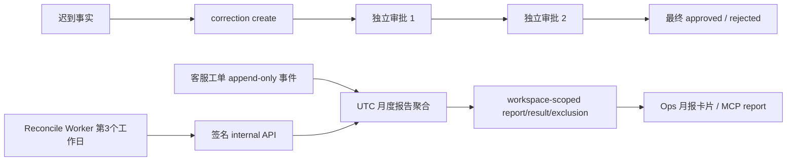

# 客服 SLA 月报、修正与自动调度

日期：2026-08-31  
状态：`TODO / NO-GO`（代码链已完成，本地门禁通过；生产证据未闭合）

## 能力范围

| 能力 | 入口 | 代码证据 | 状态 |
|---|---|---|---|
| 月报聚合 | `ops.support.sla.report` | append-only 工单事件重建首响、解决率、排除项与 checksum | 已实现 |
| 月报持久化 | API + Memory/Postgres repository | migration 114，workspace scope、RLS、不可变报告/修正证据 | 已实现，生产待验 |
| 修正创建 | `ops.support.sla.correction.create` | 关联原报告、重新计算 checksum、变化后进入 `pending_review` | 已实现 |
| 独立审批 | `ops.support.sla.correction.decide` | migration 115/116；两名不同 actor 批准后才最终通过，拒绝立即终止 | 已实现 |
| 桌面运营交互 | Ops 客服页 | cutoff、checksum、理由、二次确认、`1/2` 独立批准状态 | 已实现，本地 UI 待正式宿主验收 |
| 自动月报 | reconcile Worker → internal API | 次月第 3 个 UTC 工作日后规划上月报告，稳定 report id 与 workspace 调用 | 已实现，本地测试通过 |

## 主链路

## 已验证证据

- 定向 worker、API、合同和现有 worker 回归：97 项通过。
- `npm run typecheck`：通过。
- `npm run test:release-gates`：75 个文件通过、1 个跳过；421 项通过、7 项跳过。
- 迁移链已到 116，MCP 方法计数为 254；历史迁移断言已改为按版本定位，避免新增迁移造成尾部索引回归。

## 未完成与上线阻断

以下证据尚未获得，因此不能迁移到 `doc/done`：

- 生产 PostgreSQL 非超级用户、RLS、迁移窗口和恢复演练。
- 生产 Worker 凭据、定时运行、重复投递和跨副本并发证据。
- 真实 OIDC 角色映射与双人审批值班策略。
- 正式 ChatGPT Host → MCP → API → Ops 的桌面链路证据。
- 生产告警/审计投递与 canary 证据。

## 归档判定

本文件保留在 `doc/todo/ops`。本地代码和测试完成不等于真实插件生产链路完成；完成上述证据并绑定同一 release 后，才允许迁移到 `doc/done/ops`。
