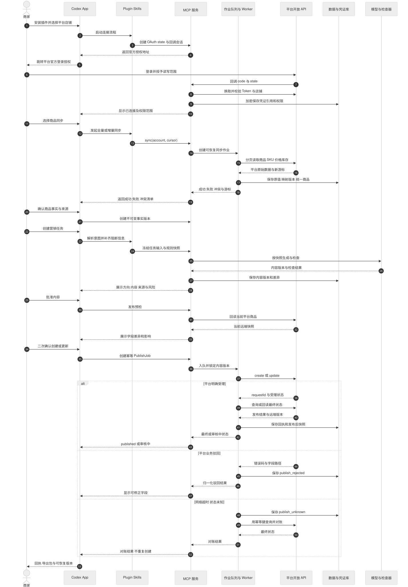

# 商家营销内容助手（Codex Plugin）产品需求文档

版本：v1.7 Final（六平台范围统一，新增知识库、自然语言多模态、持续记忆、竞品参考与运营后台需求）  
状态：Day 0 门禁满足后可进入 3 周 Engineering RC 与 canary 开发  
定稿日期：2026-08-25  
产品形态：Codex Plugin（一个商家入口 Skill + 内部模块 Skills + MCP 服务 + 版本化存储 + 可选交互卡片）  
首发范围：京东 + 淘宝 + 天猫 + 拼多多 + 小红书 + 抖音 × 服装鞋包 × 单商品营销内容、知识库与确认后发布  
投入：9 名全职，15 个工作日，AI vibe coding 方式开发  
需求来源：白板原图、白板逐项梳理、PM Skills 问题定义/优先级/多视角/Pre-mortem 定稿、gstack CEO/Engineering Review、六平台范围修订、交互/版本/上线配置评审、三周排期、9 人模块划分和 500 家商家同时在线容量要求  

> 本文是开发、测试、试点和验收的唯一产品基线。白板中的需求没有删除；未进入首发的内容均在“非目标与路线图”中明确延后。

## 1. 一页结论

### 1.1 产品是什么

商家营销内容助手是安装在 Codex App 中的多平台商家工作流插件。京东、淘宝/天猫和拼多多商家可通过各平台官方授权连接店铺，同步商品、SKU、价格、库存、图片和上下架状态；也可继续上传补充材料。系统先归一化并让用户确认事实，再依据法律安全、目标平台、品类、品牌和活动规则，生成可追溯的详情页结构、营销文案和静态素材制作方案，并在用户确认后调用对应平台连接器创建或更新商品。主流程可完全通过对话完成；宿主支持插件 UI 时，用授权、事实确认、版本差异、检查和发布回执卡片增强交互。

首发闭环为：

```text
安装插件
  → 授权京东/淘宝/天猫/拼多多/小红书/抖音店铺
  → 同步并确认品牌/商品事实
  → 用自然语言发起单商品任务
  → 系统只追问阻断信息
  → 输出 3 个创意方向
  → 用户确认制作方案
  → 生成详情页结构/文案/静态素材 Brief
  → 确定性检查 + 模型辅助检查
  → 用户修改并人工确认
  → 确认后发布/更新目标平台商品
  → 保存平台回执
  → 导出带版本、来源和检查结果的交付包
```

### 1.2 核心价值

核心价值不是“多生成几段文案”，而是让每一条正式营销内容都能回答：

1. 使用了哪个品牌、商品和 SKU。
2. 价格、卖点和参数来自哪里，何时生效、是否已确认。
3. 使用了哪些规则及其版本。
4. 哪些内容由 AI 推断，哪些是用户事实。
5. 谁确认了版本，修改过什么，最终交付了什么。

### 1.3 已冻结的产品决策

| 决策 | 最终选择 | 原因 |
|---|---|---|
| 交付形态 | Codex Plugin，而非裸 Skill | Skill 适合工作流指令；商家资产、任务恢复、审计与版本需要 MCP 和持久化 |
| 用户入口 | 一个商家入口 Skill | 对用户保持连续体验，内部按模块拆分 |
| 首发平台 | 京东、淘宝、天猫、拼多多、小红书、抖音（六个平台、六个 schema profile） | 六个平台均是目标用户；采用统一商业对象模型和独立平台连接器，淘宝与天猫以及社交平台均保留独立 schema、授权、读写和 readiness 证据 |
| 首发品类 | 服装鞋包 | 资料结构较清楚，规避食品、医疗、保健等高风险品类 |
| 任务原子 | 一个品牌、一个店铺、一个商品、一个目标平台、一个版位；可显式选多个 SKU | 一个商家可连接六个平台的多个店铺，但每个任务只产生一个平台快照、规则结论和发布回执 |
| 首发输出 | 详情页结构与文案、静态素材 Brief/文案、Markdown/JSON/ZIP | 三周内可验证价值与准确性，不依赖高风险视觉生成链路 |
| 图片能力 | 上传、引用、预览、裁切建议和真实商品图保护；不生成商品本体 | 生成式模型不能保证商品颜色、包装文字和结构完全不变 |
| 视频能力 | 不进入 P0；P1 仅脚本/分镜，P2 才渲染 | 工具链、成本和一致性不适合三周首发 |
| 知识库 | 平台固定/品类/活动规则，品牌资料和客户提供的素材资产统一沉淀 | 规则必须有来源、版本、有效期和责任人；客户资产不等同于 CRM 客户数据 |
| 自然语言多模态 | P0 一句话生成文案；P1 在真实素材基础上生成图片候选；视频先脚本/分镜，成片后置 | 生成前必须读取已确认品牌和商品事实；视觉结果仍需审核和确认 |
| 持续学习与记忆 | P0 保存反馈、驳回和营销动作历史；P1 将重复问题整理为规则建议 | 不自动把一次偏好或一次驳回直接升级为全局规则 |
| 竞品参考 | P1 支持录入竞品公开信息并拆解结构、卖点和表达方式 | 只做参考和差异化创作，不复制受保护内容或承诺“原样模仿” |
| 审核边界 | 确定性校验 + 模型风险提示 + 人工最终确认 | 自动检查不等于法律、版权或平台官方审核 |
| onboarding | 资料优先、渐进追问，不展示 30 题长表单 | 先让用户看到价值，再补齐正式交付所需阻断字段 |
| 交互形态 | 对话为主、结构化卡片增强，所有卡片均有文本降级 | 保证 Codex App 中可用，同时让高风险确认和差异比较更清楚 |
| 版本策略 | 事实、规则、映射、任务快照、内容、连接器和远端发布快照分别版本化 | 防止“只看 v3”却无法还原当时输入、规则和平台状态 |
| 商品同步 | 六个平台、六个 schema profile 均支持官方授权后的全量首同步与增量同步；小红书/抖音在官方证据未齐前保持只读或 fixture/API | 不使用保存账号密码或网页爬虫的方式抓取商家私有数据 |
| 发布方式 | P0 支持用户确认后的一键创建/更新商品；无人确认的定时全自动发布后置 | 写操作直接影响线上店铺，必须保留预检、二次确认、幂等和平台回执 |
| 试点方式 | 每个平台至少 1 家、总计 6–9 家白名单商家，不公开市场发布 | 分平台验证字段映射、规则、授权、同步和发布错误 |
| 容量目标 | 500 家商家同时在线并可各提交一次操作；重任务异步接收，平台调用按配额调度 | “在线可操作”不等于绕过平台配额并行写入；以 500 会话、API RPS、作业突发和租户公平性共同验收 |

六个平台都是当前产品边界，不再通过 `pilot_platform` 二选一。工程上使用统一 `CommerceProduct` 模型和 `PlatformConnector` 契约，每个平台独立实现 OAuth、读取、字段转换、创建/更新、状态查询和错误映射。单个商家可以只授权其中一个，也可以同时授权多个店铺；跨平台生成必须创建彼此独立的子任务，不共享价格、规则结论或发布状态。小红书和抖音只有在官方 OAuth、字段映射、读写、状态回读、限流/拒绝码和 production canary 证据齐全后，才能升级为生产可写。

## 2. 背景与问题定义

### 2.1 目标用户

主要用户：

- 中小品牌电商运营：组织活动、上新和转化素材。
- 品牌市场/内容人员：维护品牌表达和营销文案。
- 设计执行者：依据明确 Brief 生产或调整静态素材。
- 商家审核人：确认价格、卖点、授权和最终版本。

试点期允许一人兼任多个角色，但系统仍区分“编辑”和“最终确认”两个动作。

### 2.2 当前问题

品牌规范、商品参数、SKU 图片、活动价格、卖点证据、授权材料和平台规则散落在聊天记录、Excel、网盘和个人经验里。现有 AI 工具直接从自然语言生成，容易把事实、推断和创意混在一起，造成：

- 反复追问和重复整理资料。
- 引用错误 SKU、过期价格或无证据卖点。
- 文案、视觉方向和品牌调性不一致。
- 修改覆盖旧版本，无法恢复和追责。
- 发布前依赖人工记忆检查，返工和合规风险高。

### 2.3 5 Whys

1. 为什么营销素材经常返工？因为输入事实、规则和任务目标不完整或冲突。
2. 为什么不完整或冲突？因为资料分散在不同文件、人员和历史版本里。
3. 为什么 AI 不能自动解决？因为模型无法可靠地区分用户事实、过期信息、推断和创意。
4. 为什么错误会重复出现？因为系统没有记录来源、确认状态、适用范围和有效期。
5. 根因是什么？缺少一个以“已确认事实 + 适用规则 + 可审计任务状态”为基础的内容生产工作流，而不只是缺少生成模型。

### 2.4 证据状态

当前强证据是白板中的完整业务流程和约束；用户访谈、实际耗时、返工率、错误率和付费意愿仍是弱证据。试点 Week 1 必须补齐以下基线：

- 访谈 5–8 位运营/市场/设计人员。
- 收集至少 10 个历史真实任务。
- 记录现流程准备资料、首稿、审核、返工和交付耗时。
- 标注每次返工的原因和严重程度。
- 验证用户是否愿意持续维护结构化品牌/商品事实。

若试点商家不愿维护最低事实，产品假设不成立，不以继续增加生成功能掩盖问题。

## 3. 产品目标、成功指标与非目标

### 3.1 P0 产品目标

1. 商家可在 Codex App 中安装插件，并授权至少一个京东、淘宝/天猫或拼多多店铺。
2. 系统可通过官方 API 同步或从已有资料提取品牌、店铺、商品、SKU、价格、库存、图片、证明和授权信息，并让用户确认。
3. 用户可自然语言发起任务，系统只追问影响正确性和正式交付的缺失信息。
4. 系统可生成 3 个创意方向、一个确认后的制作方案，以及详情页/静态素材的结构化文案结果。
5. 正式输出中的事实可追溯，关键风险可阻断，任务可修改、恢复、版本化、确认后发布并导出。
6. Release 1 先在 50 个商家工作区同时在线并各提交操作时达到生产门槛；架构、数据和部署契约保持可横向扩展到 500，扩至 100/250/500 前分别执行 15.1 对应容量门禁；平台和模型调用在受控队列中按配额执行。
7. 建立可持续维护的商家营销知识库：沉淀平台固定规则、品类规则、大促/活动节点规则、品牌资料和客户提供的素材资产，并将适用范围、来源、版本和有效期绑定到任务。
8. 支持商家用大白话发起文案任务；生成前自动读取已确认品牌和商品上下文。图片生成和图片局部语言修改进入后续阶段，视频先支持脚本/分镜，再评估成片生成。

### 3.2 北极星指标

试点商家每周完成的“已人工确认、事实可追溯、可直接进入设计/上架流程”的营销任务数。

### 3.3 试点成功指标

| 指标 | 目标 | 统计口径 |
|---|---:|---|
| 插件安装与连接成功率 | ≥ 95% | 成功安装并通过健康检查的试点工作区 / 尝试安装工作区 |
| 店铺授权成功率 | 每个平台 ≥ 95% | 完成 OAuth 并成功校验店铺身份 / 发起有效授权 |
| 商品首次同步成功率 | 每个平台 ≥ 95% | 商品、SKU、价格、库存和图片完整落入统一模型 / 有效同步任务 |
| 首次价值时间 P50 | ≤ 15 分钟 | 从开始导入资料到看到第一个可审核 Brief |
| 首次价值时间 P90 | ≤ 30 分钟 | 同上；资料损坏或缺失授权的阻断任务排除 |
| 关键事实引用覆盖率 | 100% | approved 输出中的参数、SKU、价格、证明型卖点均有关联来源 |
| P0 错误漏检 | 0 | 10 个黄金任务中 SKU、价格、授权、禁用词和规则版本错误未在交付前发现 |
| 任务恢复率 | 100% | 中断后可从最近已保存状态继续的任务 / 中断任务 |
| 首稿用时降低 | ≥ 50% | 与同类历史任务的中位数比较 |
| 平均修改轮次 | ≤ 2 | 从首稿到 approved 的用户修改轮次 |
| 阻断问题轮次 P50 | ≤ 3 | 每轮最多 4 问，不计算用户主动补充 |
| 任务完成率 | ≥ 70% | 创建后 48 小时内到达 approved/delivered 的有效任务 |
| 试点满意度 | ≥ 4/5 | 任务完成后的单题评分 |
| 发布请求可追踪率 | 100% | 每次二次确认只产生一个 PublishJob，并归入受理/驳回/未知之一 / 有效确认 |
| 确认后最终发布成功率 | 每个平台 ≥ 95% | 最终 published / 通过本地预检并实际提交的发布任务；平台业务驳回计入失败并单列原因 |
| 未知状态 10 分钟内对账率 | ≥ 99% | 10 分钟内收敛为受理/驳回/仍需人工的平台未知任务 / publish_unknown |

上述指标是试点验证目标，不作为公开商业承诺。所有比例必须同时展示分子/分母；单个平台有效样本少于 20 次时只作为方向信号，不能声称达到统计稳定的 95%。P0 错误漏检仍按“出现 1 次即 No-Go”执行，不因样本小而放宽。

### 3.4 P0 非目标

- 不保存或代填商家的京东、淘宝/天猫、拼多多账号密码；只走官方授权流程。
- 不使用网页爬虫抓取商家私有商品数据；官方 API 不可用时提供 CSV/文件导入降级。
- 不做未经用户逐任务确认的定时、批量、无人值守自动发布。
- 不发布到广告账户；P0 只创建或更新平台商品内容。
- 不在一个任务中同时向三个平台发布；跨平台需求拆成三个可独立检查、确认和回滚的子任务。
- 不支持一个任务包含多个商品。
- 不渲染商品主图、Banner、广告图或完整详情页视觉稿。
- 不生成商品本体、Logo、包装文字、认证标识或人物/IP。
- 不渲染视频、数字人或自动配音。
- 不把平台驳回或单次用户反馈自动训练成全局规则；规则升级必须由有权限的规则维护者审核发布。
- 不承诺直接在任意图片上通过语言注释完成局部像素级修改；该能力须在视觉编辑子 PRD 中单独定义。
- 不提供“复制竞品”的能力；竞品信息只能用于公开信息分析、差异化参考和创意启发。
- 不做复杂多人协作、审批流和企业级 RBAC。
- 不自动抓取并发布平台规则；规则必须有来源并由责任人发布。
- 不判断真实版权归属，不提供法律意见，不承诺平台审核一定通过。
- 不做定时自动生成、每日任务或自动清理业务数据。

## 4. 用户角色与核心任务

### 4.1 角色

| 角色 | 主要目标 | P0 权限 |
|---|---|---|
| 商家编辑者 | 导入资料、发起任务、修改内容 | 读写本工作区资产与任务，可提交确认 |
| 商家确认者 | 对事实、方案和最终版本负责 | 可确认资产、approved 和 delivered；试点可与编辑者同一人 |
| 规则维护者 | 发布首发平台/品类规则 | 创建规则版本、设置有效期、下线规则；不可替商家确认商品事实 |
| 试点管理员 | 创建/停用工作区、排障 | 查看审计与健康状态，不默认读取商家素材正文 |

### 4.2 Jobs to be Done

- 当我要为一个商品做上新或活动内容时，我希望直接上传已有资料并描述目标，系统只问真正缺失的信息，让我尽快看到可讨论的方向。
- 当文案引用价格、参数或卖点时，我希望看到来源和适用 SKU，避免发布错误信息。
- 当平台规则或授权不明确时，我希望系统明确阻断原因和恢复方法，而不是生成后悄悄放行。
- 当我提出修改时，我希望只改指定部分，并能恢复上一版。
- 当我交付内容时，我希望有一份文件清单、版本、规则与检查记录，方便设计和审核继续工作。

## 5. 产品原则

1. **事实先于创意**：没有已确认事实时，可以生成方向草案，但不能进入正式交付。
2. **资料优先于提问**：先提取用户已有材料，再问缺口，不重复询问已确认信息。
3. **渐进披露**：每轮最多 3–4 个问题，并解释为什么需要。
4. **不猜关键实体**：多品牌、多店铺、同名商品或多 SKU 时必须让用户选择。
5. **默认不覆盖**：资产、规则、任务和交付均生成新版本。
6. **自动检查不是裁决**：确定性规则负责可计算事实，模型负责风险提示，用户负责最终确认。
7. **一次偏好不污染全局**：任务修改只有用户明确选择时才升级为品牌/店铺规则。
8. **可失败、可恢复、可解释**：每个失败有原因、用户可见结果和下一步。

## 6. P0/P1/P2 范围与优先级

优先级采用 ICE（Impact × Confidence × Ease）辅助判断；当前缺少真实用户数据，分数仅用于相对排序，不伪装成精确商业测算。

| 能力 | I | C | E | ICE | 阶段 |
|---|---:|---:|---:|---:|---|
| 自然语言任务 + 渐进追问 | 9 | 8 | 7 | 504 | P0 |
| 详情页结构/文案生成 | 9 | 8 | 8 | 576 | P0 |
| SKU/价格/授权确定性检查 | 10 | 8 | 6 | 480 | P0 |
| 版本、修改和导出 | 8 | 8 | 7 | 448 | P0 |
| 品牌/商品资料提取与确认 | 10 | 7 | 5 | 350 | P0 |
| 规则版本与命中记录 | 8 | 7 | 5 | 280 | P0 |
| 静态图创意 Brief 和文案 | 8 | 7 | 7 | 392 | P0 |
| 知识库：平台/品类/活动规则与品牌/客户资产 | 9 | 7 | 6 | 378 | P0 |
| 一句话生成文案并自动读取品牌上下文 | 9 | 8 | 7 | 504 | P0 |
| 基于真实商品素材的图片候选生成 | 8 | 6 | 4 | 192 | P1 |
| 图片上语言注释与局部修改 | 7 | 5 | 3 | 105 | P1 |
| 驳回/反馈归纳为规则建议 | 7 | 5 | 4 | 140 | P1 |
| 竞品公开信息录入与差异化拆解 | 7 | 5 | 4 | 140 | P1 |
| 视频脚本/分镜与成片生成 | 6 | 4 | 2 | 48 | P2 |
| 六平台账号 OAuth 与凭证生命周期 | 10 | 8 | 5 | 400 | P0 |
| 六平台商品读取与增量同步 | 10 | 8 | 4 | 320 | P0 |
| 六平台规则/字段 adapter | 9 | 7 | 4 | 252 | P0 |
| 用户确认后创建/更新商品 | 9 | 6 | 3 | 162 | P0（权限门禁） |
| 真实商品图背景合成 | 7 | 5 | 3 | 105 | P1 |
| 多商品 Banner/店铺装修 | 6 | 5 | 3 | 90 | P1 |
| 视频脚本与分镜 | 5 | 6 | 5 | 150 | P1 |
| 更多电商平台 adapter | 7 | 5 | 3 | 105 | P1 |
| 视频渲染/数字人 | 5 | 3 | 1 | 15 | P2 |
| 无人值守批量/定时发布 | 6 | 3 | 2 | 36 | P2 |

### 6.1 P0 内容类型

1. 商品详情页：信息架构、模块顺序、标题、卖点正文、参数/SKU/证据区、CTA 和图片使用建议。
2. 静态营销素材：商品主图、广告图或 Banner 的创意 Brief、标题/副标题/卖点/价格文案、构图与真实商品图使用说明；不渲染最终视觉图。

### 6.2 P1/P2 延后内容

- P1：真实商品图抠图与背景合成、图片局部语言修改、广告投放规格、多商品店铺装修、视频脚本/分镜、多尺寸批量适配、竞品公开信息拆解、驳回/反馈规则建议和更多电商平台。
- P2：完整视频渲染、AI 模特/数字人、无人值守批量/定时发布、多品牌协作、规则自动采集和自动规则发布。

## 7. 产品形态与系统边界

### 7.1 为什么不是单个裸 Skill

Skill 可以定义可复用工作流，但白板要求跨会话保存品牌、商品、规则、任务和版本，还要求文件处理、确定性检查、权限隔离和导出。因此首发形态为：

能力依据：OpenAI 官方将 Plugin 定义为可用 Skills、MCP Servers 和可选 UI 扩展 Codex 的载体；Skills API 支持目录/ZIP 上传和不可变版本。因此“Plugin 作为安装单元、Skill 作为工作流、MCP 作为业务工具与状态边界”的方案符合宿主能力模型。

```text
Codex App
└── Merchant Marketing Plugin
    ├── 一个用户可见入口 Skill
    ├── 内部模块 Skills
    │   ├── platform-connect
    │   ├── brand-profile
    │   ├── product-catalog
    │   ├── campaign-intake
    │   ├── creative-copy
    │   ├── review-delivery
    │   └── rule-maintenance（管理员）
    ├── MCP Server
    │   ├── Workspace/Identity
    │   ├── OAuth Callback/Credential Vault
    │   ├── Platform Connector Gateway
    │   │   ├── JD Connector
    │   │   ├── Taobao/Tmall Connector
    │   │   └── Pinduoduo Connector
    │   ├── Product Sync/Publish Orchestrator
    │   ├── Brand/Product/Rule Store
    │   ├── Task/Revision/Delivery Store
    │   ├── File/Object Storage Adapter
    │   ├── Deterministic Validators
    │   └── Audit/Telemetry
    └── 可选交互 UI
        ├── 平台连接/同步卡片
        ├── 事实确认卡片
        ├── 方向比较/版本差异卡片
        ├── 风险检查卡片
        ├── 发布确认/回执卡片
        └── 文件预览/下载
```

对话是 P0 主界面；轻量 UI 只增强确认和预览，不能成为核心流程的硬依赖。宿主不支持某个 UI 表面时，全部操作必须可在对话 + Markdown/JSON 中完成。

### 7.2 外部依赖

- Codex App 的 Plugin、Skill、MCP 与文件能力。
- OpenAI 模型调用，用于提取、追问、创意和模型辅助审核。
- 一个关系型数据库，用于结构化记录和版本。
- 一个对象存储，用于原始文件、预览与交付包。
- 京东、淘宝开放平台和拼多多开放平台的开发者应用、测试店铺、回调域名及所需读写权限。
- 三个平台/品类规则的人工核验来源。

### 7.3 部署模型

- 采用同一代码库、模块化单体 MCP，但运行时为无状态多副本，统一经过 HTTPS Edge/WAF/负载均衡；不依赖粘性会话。
- 同步、生成、发布、对账使用同一业务契约下的隔离 Worker 池和独立队列/并发预算，避免大店同步阻塞发布确认。
- 每个工作区强制 `workspace_id` 隔离。
- 生成、提取、审核使用 adapter 接口，供应商可替换，但 P0 只接一套默认实现。
- 三个平台实现同一 `PlatformConnector` contract，但平台字段、类目、状态和错误码不得强行同值化。
- 所有功能由 Feature Flag 控制；每个平台的授权、读取和写入能力可分别停用。

### 7.4 生产架构图



可维护源文件：[Mermaid](../platform/multi-platform-architecture.mmd)；可编辑画布：[Excalidraw](../platform/multi-platform-architecture.excalidraw)；演示用：[PNG](../platform/multi-platform-architecture.png)。



500 家并发部署拓扑：[SVG](../infra/merchant-500-capacity-topology.svg)；可维护源文件：[Mermaid](../infra/merchant-500-capacity-topology.mmd)；可编辑画布：[Excalidraw](../infra/merchant-500-capacity-topology.excalidraw)；演示用：[PNG](../infra/merchant-500-capacity-topology.png)。

架构约束：

- Codex App 与插件只承载交互和工作流编排，Token、业务状态、版本和审计不保存在对话上下文。
- MCP P0 采用无状态多副本的模块化单体；连接器通过统一 contract 接入，但平台字段和错误码由各 adapter 保真保存。
- 同步/生成/发布/对账长任务通过隔离 Queue/Worker 池执行；`PublishJob + outbox` 与业务状态在同一数据库事务提交，平台调用在事务外执行并通过回执/回读收敛。
- API、Worker 和数据库总连接数有统一预算；使用连接池代理，禁止按副本数无界放大数据库连接。
- 调度至少按 `workspace_id + platform + account_id` 限流并保证租户公平；单一商家不能占满全部 Worker 或平台配额。
- 模型只通过受控 adapter 读取任务快照；没有直接访问凭证库、平台写接口或其他工作区数据的权限。
- OAuth/平台 API、模型、数据库和对象存储均按外部依赖处理，具有超时、限流、熔断和用户可见降级。

### 7.5 授权、同步、生成与发布时序图



可维护源文件：[Mermaid](../platform/auth-sync-publish-sequence.mmd)；演示用：[PNG](../platform/auth-sync-publish-sequence.png)。时序图可渲染为 SVG/PNG，但受当前上游转换器限制，不能转换为可编辑 Excalidraw；架构图和交互流程图可以。

该时序将三次关键一致性边界固定下来：同步完成后由用户确认事实；生成前冻结任务/规则快照；平台写入前回读远端并二次确认。HTTP 成功不等于业务发布成功，异步审核、业务驳回和超时未知均走独立状态分支。

### 7.6 技术可行性依据与限制

- Codex 官方能力模型支持以 Plugin 组合 Skills、MCP Server 和可选 UI；Skills 支持目录/ZIP 上传和不可变版本。因此安装单元与工作流可落在 Codex，但 OAuth 回调、凭证、数据库和平台写入必须由外部 MCP/后端承载，不能只靠一个本地 `SKILL.md`。依据：[Codex 开发者文档](https://developers.openai.com/)、[Skills API](https://developers.openai.com/api/reference/python/resources/skills/methods/create)。
- 京东开放平台公开提供 OAuth2，以及“获取商品信息”“商品维护”等能力目录，具备连接器所需能力面；最终可调用 API、类目和配额以获批应用控制台为准。依据：[京东开放平台](https://jos.jd.com/)、[获取商品信息](https://jos.jd.com/apilist?apiGroupId=1433&apiGroupName=%E8%83%BD%E5%8A%9B-%E8%8E%B7%E5%8F%96%E5%95%86%E5%93%81%E4%BF%A1%E6%81%AF)、[商品维护](https://jos.jd.com/apilist?apiGroupId=1414&apiGroupName=%E8%83%BD%E5%8A%9B-%E5%95%86%E5%93%81%E7%BB%B4%E6%8A%A4)。
- 淘宝开放平台公开说明商家 OAuth 授权/access token，并列出商品读取、新增和更新 API；淘宝与天猫的可用接口、安全等级和类目规则仍须按应用审批结果验证。依据：[商家授权](https://developer.alibaba.com/doc/doc.htm?articleId=102635&docType=1&treeId=1)、[应用环境与商品发布/更新](https://developer.alibaba.com/doc/doc.htm?articleId=108&docType=1&treeId=456)、[商品 API 列表](https://developer.alibaba.com/doc/api.htm?apiId=6)。
- 拼多多开放平台公开提供商家/自研系统接入商品、交易、物流等 API 的能力入口；其文档和具体 scope 依赖登录后的控制台，Day 0 必须用真实应用核对商品读取、创建/更新、状态查询、回调和配额，不以主页描述替代 E2E 证据。依据：[拼多多开放平台](https://open.yangkeduo.com/)。

结论：六平台能力方向可行，但“开发完成”和“生产可用”是两个状态。只有六个 schema profile 的应用、测试店铺、目标 scope、最小 OAuth/读写探针和初始 payload fixture 已在 Day 0 就绪后，15 个工作日交付时钟才启动；目标是在该窗口内完成 Engineering RC，并对各 profile 独立做 production canary。外部审批等待时间不计入 15 日工程窗口，也不得用模拟结果冒充生产能力。

## 8. 端到端用户旅程

### 8.1 首次安装

1. 商家在 Codex App 安装插件。
2. 插件展示用途、数据使用、非法律审核声明和试点限制。
3. 用户创建或绑定工作区，完成健康检查。
4. 首屏并列提供“连接店铺并同步”“上传资料开始”“用示例体验”三条路径，同时展示示例成品、预计首次耗时，以及各平台当前 `可授权/可读取/可写入/待审批` 能力状态；未授权用户也能看到方向草案价值，只有同步和发布要求连接平台。
5. 选择连接后提供“连接京东”“连接淘宝”“连接天猫”“连接拼多多”“连接小红书”“连接抖音”，用普通语言列出读取/写入范围和用途，再跳转平台官方授权页；插件不接触用户密码。
6. 授权回调完成后验证 `state`、店铺身份、令牌有效期和权限范围，并立即加密保存凭证。
7. 为降低首次价值时间，默认让用户搜索并同步一个商品或最近一小批商品；“同步全部在售商品”是显式选择并展示预计数量/时间。
8. 系统继续提供导入品牌资料、导入商品资料和直接描述营销任务入口。
9. 用户可先描述任务；若缺少资产，系统保存任务草稿并引导补齐，不丢失原始意图。后续要发布时再连接目标平台，并将本地商品与平台稳定 ID 显式绑定。

### 8.2 品牌与商品建档

```text
平台 API 同步或上传资料
  → 凭证/文件安全检查
  → 字段映射或文本与元数据提取
  → 字段候选 + 来源
  → 冲突与缺失清单
  → 用户逐项/批量确认
  → 保存版本化资产
```

- 首屏不展示 30 个问题。
- 已从资料中识别且来源清楚的字段只需确认。
- 未识别字段按当前任务需要渐进追问。
- 用户可保存草稿；未确认字段不能用于正式事实表达。
- API 同步字段记录平台对象 ID、同步游标和平台更新时间；用户补充字段不得无提示覆盖平台字段。

### 8.3 创建营销任务

用户示例：

> 给淘宝旗舰店的羽绒服 A 做一版冬季上新详情页，主推黑色 M/L，突出轻暖和通勤，月底前不展示价格；确认后更新淘宝商品草稿。

系统解析品牌、店铺、商品、SKU、平台、版位、场景、目标、卖点、价格策略、输出类型和限制，随后：

1. 用稳定 ID 解析实体，不以名称直接绑定。
2. 读取规则、品牌、店铺、商品和任务上下文。
3. 建立不可变任务输入快照。
4. 运行缺失、冲突、过期和授权预检。
5. 每轮提出最多 4 个问题。

### 8.4 方向、制作与确认

1. 信息足够时输出 3 个创意方向。
2. 每个方向包含核心思想、结构、配色/构图建议、文案方向、使用卖点、适合原因和风险。
3. 用户选择、合并、修改或要求重新推荐。
4. 系统输出最终制作方案，列明实体、SKU、平台、版位、价格时效、卖点、数量、输出格式、禁改项和预计成本。
5. 用户明确确认后才生成正式初稿。

### 8.5 检查、修改与交付

1. 生成内容先进入自动检查。
2. P0 问题阻断；P1 问题需处理或由确认者带理由接受；P2 为建议。
3. 用户可指定对象、位置和修改范围；未指定时系统先澄清。
4. 修改只重生成受影响片段，创建新版本。
5. 用户点击/回复明确确认后进入 approved。
6. 若用户选择发布，系统展示最终字段差异、目标店铺、商品、SKU 和不可逆影响，要求二次确认。
7. 系统调用目标平台连接器创建或更新商品，保存平台 request ID、商品 ID、受理/审核状态和错误明细。
8. 平台结果明确成功后进入 `published`；状态未知时保持 `publish_unknown`，不得显示成功。
9. 系统导出 Markdown、JSON、manifest、平台回执和 ZIP，进入 delivered。

### 8.6 交互设计与页面/卡片契约



可维护源文件：[Mermaid](../../done/plugin/merchant-interaction-flow.mmd)；可编辑画布：[Excalidraw](../../done/plugin/merchant-interaction-flow.excalidraw)；演示用：[PNG](../../done/plugin/merchant-interaction-flow.png)。

P0 交互由“对话回复 + 结构化操作卡片”组成。卡片不是独立 SaaS 页面，也不能保存只有 UI 才知道的隐藏状态；每个按钮动作都对应一个可审计 MCP 命令，并可用文本指令完成。

| 交互表面 | 必须展示 | 主要动作 | 高风险约束 |
|---|---|---|---|
| 工作区健康卡 | Plugin/MCP/schema/规则版本、六平台连接状态 | 重试、查看诊断、连接平台 | 不把局部可用显示成全部正常 |
| 平台连接卡 | 平台、店铺、用普通语言解释的读取/写入权限、Token 状态、最近同步 | 授权、重新授权、撤销、立即同步 | 登录只发生在平台官方页面；撤销需说明影响；不以专业 scope 名称代替用途说明 |
| 同步结果卡 | 成功/失败/冲突数量、游标时间、失败商品 | 查看冲突、单项重试、文件导入 | 部分成功不能显示为全量成功 |
| 事实确认卡 | 字段值、来源、平台原值、本地候选、有效期、状态 | 单项/批量确认、编辑、标记冲突 | 关键事实必须逐字段可追溯；批量确认显示范围 |
| 任务理解卡 | 平台/店铺/商品/SKU/版位/目标/限制 | 修正实体、拆分平台子任务、继续 | 同名实体不得默认绑定 |
| 渐进追问卡 | 最多 4 个问题、提问原因、不回答后果 | 回答、使用推荐值、稍后补充 | 阻断项不能用“跳过”越过 |
| 方向比较卡 | 3 个方向的差异、事实依据、风险和预计成本 | 选择、合并、重生成 | 合并创建新方向版本 |
| 制作方案卡 | 输入快照、输出模块、禁改项、成本/时间 | 确认、返回修改 | 明确确认后才生成正式初稿 |
| 检查与版本卡 | P0/P1/P2 finding、来源、版本 diff | 定位修改、带理由接受 P1、恢复版本 | P0 不可接受；恢复生成新版本 |
| 发布确认卡 | 平台/店铺/商品、创建或更新、字段 diff、SKU/价/库存、远端快照 | 二次确认、取消、刷新远端值 | 不使用模糊“确定”；按钮写明“确认更新淘宝商品”等具体影响 |
| 发布回执卡 | submitted/审核中/published/rejected/unknown、request ID、时间 | 查询状态、修正、对账、导出 | submitted 和 unknown 绝不使用成功色或“已发布”文案 |

统一状态反馈：

- `loading`：显示正在执行的步骤、开始时间和可安全取消范围；超过 10 秒显示进度说明。
- `empty`：说明尚无数据，并给出连接平台、上传资料或新建任务的首要动作。
- `partial`：同时显示成功数、失败数、未处理数和可重试对象，不以绿色整卡掩盖失败。
- `error`：显示用户可理解原因、稳定错误码、重试/重新授权/手工导入入口和诊断 ID。
- `success`：只在服务端状态提交成功后显示；平台写入还必须区分受理、审核中和最终生效。
- `stale`：若卡片打开后事实、远端商品或规则版本发生变化，确认按钮失效，必须刷新 diff。

确认层级：事实确认、制作方案确认、最终内容批准、平台写入二次确认是四个独立事件，互不替代。高风险动作不得仅依赖用户输入“好的”；必须绑定当前对象 ID、版本、作用域和一次性 confirmation token。

交互验收：所有 P0 流程能用键盘和纯文本完成；卡片有读屏名称/描述，异步状态使用可访问的动态播报，操作后焦点回到结果或首个错误；每个按钮有禁用原因；刷新 App、弱网、断网或切换会话后从最后已提交状态恢复；批量确认明确显示范围并可通过新版本恢复；重复点击由幂等键吸收；颜色不是状态的唯一表达方式。

## 9. 状态机

### 9.1 资产字段状态

```text
missing ──提取/填写──▶ pending_confirmation ──确认──▶ confirmed
   ▲                         │                         │
   │                         ├──发现多来源冲突──▶ conflict
   │                         └──无授权/限制──▶ restricted
   │                                                   │
   └────────────删除值/来源失效─────────────────────────┘
```

- `confirmed`：可作为正式事实使用。
- `pending_confirmation`：可用于方向草案，但输出必须标注“待确认”。
- `conflict`：涉及该字段的正式生成被阻断。
- `restricted`：可保存为内部参考，但不得进入商用交付。
- `missing`：按任务重要度决定阻断、默认或跳过。

### 9.2 任务状态

```text
draft
  → collecting
      ├── blocked ──补齐/解决冲突──▶ collecting
      └── brief_ready
            → direction_selected
            → plan_confirmed
            → generating
                ├── generation_failed ──重试/降级──▶ generating
                └── review_pending
                      ├── needs_changes ──修改──▶ generating
                      └── approved
                            ├── 仅导出 ───────────────▶ delivered
                            └── 二次确认 ──▶ publishing
                                                ├── publish_rejected ──修正──▶ needs_changes
                                                ├── publish_unknown ──▶ reconciling
                                                │                         ├── publish_rejected
                                                │                         └── published
                                                └── published ──带回执导出──▶ delivered

delivered ──有效期结束/停用──▶ expired/archived
```

非法转换必须返回明确错误。例如 `draft → delivered`、`review_pending → delivered`、含 P0 阻断项时 `review_pending → approved`、未二次确认时 `approved → publishing`、状态未知且未完成对账时 `publish_unknown → published` 均不允许。`publish_rejected` 修正后必须重新检查和批准；不能直接重放旧写请求。

### 9.3 平台连接状态

`unconnected → authorizing → connected → token_expiring → refreshing → connected`；授权被撤回、权限不足或刷新失败进入 `reauthorization_required`，用户主动解除进入 `revoked`。`reauthorization_required/revoked` 状态只允许查看已有快照，禁止同步和发布。

### 9.4 素材版本状态

`draft → pending_confirmation → confirmed → delivered → expired/disabled`。任何修改创建新版本；旧版本只读，可恢复为新版本，不原地覆盖。

## 10. 数据模型与可信事实契约

### 10.1 核心实体

```text
Workspace
  ├── PlatformAccount
  │   ├── CredentialReference
  │   ├── SyncCursor
  │   └── PlatformStore
  └── BrandAsset
      ├── StoreProfile
      │   └── ProductAsset
      │       ├── SKU
      │       ├── EvidenceRecord
      │       └── AuthorizationRecord
      ├── AssetSource
      └── BrandAuthorization

RuleDocument ──▶ RuleVersion ──▶ RuleSnapshot

CampaignTask
  ├── TaskInputSnapshot
  ├── CreativeDirection
  ├── ProductionPlan
  ├── GeneratedContent
  ├── ReviewFinding
  ├── Revision
  ├── PublishJob
  ├── PublishReceipt
  └── DeliveryPackage

CommerceProduct ──▶ PlatformProductBinding ──▶ PlatformSKUBinding
PlatformConnector ──▶ JD / TaobaoTmall / Pinduoduo
```

### 10.2 每个事实字段的统一结构

```json
{
  "value": "轻量羽绒填充",
  "source_id": "asset_source_123",
  "source_location": "检测报告第 2 页",
  "status": "confirmed",
  "scope": {
    "workspace_id": "ws_1",
    "product_id": "prod_1",
    "sku_ids": ["sku_black_m", "sku_black_l"],
    "platform": "jd"
  },
  "valid_from": "2026-08-01T00:00:00+08:00",
  "valid_to": null,
  "confirmed_by": "user_1",
  "confirmed_at": "2026-08-22T10:00:00+08:00",
  "version": 3
}
```

所有价格、活动、规则和授权必须有 `valid_from/valid_to`；无有效期的长期事实仍保留 `valid_to = null` 和最后核验时间。

### 10.3 ID、快照和并发

- 所有实体使用稳定、不透明 ID；名称只用于显示和搜索。
- 创建任务时保存规则、品牌、店铺、商品、SKU、授权和价格快照。
- 资产后续更新不会静默改变历史任务。
- 更新使用乐观锁 `version`；版本冲突返回当前版本和差异，不覆盖他人修改。
- 所有生成、审核和导出请求使用幂等键和 `attempt_id`。

### 10.4 版本管理模型

版本分为“软件发布版本”和“业务对象版本”，两者不能共用一个模糊的 `v3`。

| 版本对象 | 标识方式 | 何时创建 | 恢复/回滚规则 |
|---|---|---|---|
| Plugin/Skill/MCP release | SemVer，如 `1.1.0` | 每次可部署发布 | 可将默认版本指回上一稳定版；schema 只前向兼容 |
| Connector contract/实现 | `contract_semver + connector_build` | contract 或平台实现变化 | contract 破坏性变更必须升 major；旧任务保留原 build |
| RuleVersion | 不透明 ID + 业务版本 + 生效期 | 规则发布，不是草稿保存时 | 旧版只读；恢复等于基于旧版发布一个新版本 |
| MappingVersion | 平台 + 类目 + 版本 | 字段/类目映射变化 | 历史同步记录保持原映射；可用新映射重新生成候选，不静默重写 |
| AssetVersion | 资产 ID + 单调递增整数 | 事实确认、批量确认、冲突解决或来源变化 | 恢复创建新版本，记录 `restored_from_version_id` |
| TaskInputSnapshot | 内容寻址快照 ID | 进入方向生成前及用户明确刷新输入时 | 不可修改；刷新创建新快照并使旧批准失效 |
| ContentVersion | 任务内单调递增整数 + 全局 ID | 首稿、局部修改、恢复、平台适配 | P0 采用线性父版本 + 候选版本，支持 diff 和恢复；approved/delivered 版本只读 |
| PlatformRemoteSnapshot | 平台对象 ID + 平台更新时间 + 本地 hash | 发布预检前和发布回读后 | 作为发布前镜像/发布后证据；恢复远端需再次确认并产生新 PublishJob |
| PublishJob/Receipt | attempt ID + 幂等键 + 平台 request ID | 每次用户确认的平台写意图 | Job 不可改写；未知状态先对账，禁止通过复制 Job 重发 |

每个 `ContentVersion` 必须记录完整版本向量：`asset_version_ids`、`task_input_snapshot_id`、`rule_snapshot_id`、`mapping_version`、`plugin_version`、`skill_bundle_version`、`mcp_version`、`connector_build`、模型 ID、`prompt_bundle_version`、创建人/模型、时间、原因和父版本。交付 manifest 和平台发布回执必须包含该向量。

版本向量保证“可审计、可解释、可比较”，不承诺对第三方模型或平台 API 做逐字节重放；供应商模型退役、平台数据变化或接口下线时，系统仍能展示当时输入、输出、配置、hash 和回执，但可能无法产生完全相同的新结果。

交互和并发规则：

- 默认主线为当前内容版本；实验性重生成先创建候选版本，只有用户明确“设为当前版本”才移动 current pointer。P0 不提供任意分支合并管理。
- 比较视图同时提供字段级 diff、段落级 diff 和受影响事实/规则；不得只显示两个完整长文让用户人工寻找差异。
- 客户端提交 `expected_version`；不一致时返回服务器新版本、共同基线和冲突字段，由用户选择保留、接受或合并。
- “恢复 v2”实际创建 `v5`，父版本指向当前版本并记录来源 v2；任何版本、确认、检查和回执不得物理覆盖。
- 平台发布前再次回读远端商品。若远端 hash 与发布预检快照不同，原 confirmation token 失效，必须重新展示 diff 和确认。
- 内容回滚不等于平台回滚。已写入平台的内容只能基于 `PlatformRemoteSnapshot(before)` 创建新的恢复候选，重新预检和二次确认。
- 因数据删除而去内容化时保留版本 ID、hash、状态和审计关联，不保留已删除正文或密钥。

版本管理验收：可从任一交付包还原“当时的事实、规则、映射、软件、模型、内容和平台回执”；并发修改不会丢数据；恢复不会覆盖历史；旧版本不能使用新 confirmation token 发布。

## 11. 详细功能需求与验收标准

### FR-01 插件安装、工作区与健康检查（P0，Owner P1）

需求：

- 提供可安装的 Codex Plugin 包和版本说明。
- 首次运行创建/绑定商家工作区。
- 显示插件版本、MCP 状态、存储状态、六平台连接状态和规则版本。
- 安装失败时给出可操作的错误原因；不得只返回“连接失败”。
- 支持停用插件；停用不自动删除商家数据。

验收：

- Given 新用户安装插件，When 完成授权，Then 60 秒内创建工作区并通过健康检查。
- Given MCP 不可用，When 用户发起任务，Then 不创建半成品任务，展示重试和诊断信息。
- Given 重复安装同一版本，When 初始化，Then 复用工作区，不重复建档。
- Given 用户选择任一首发平台，When 完成官方 OAuth 回调，Then 系统验证店铺身份并显示已授予的读取/写入权限，不记录用户密码。

### FR-02 规则中心（P0，Owner P2/P3/P4/P8）

需求：

- 支持法律/安全、平台、品类、品牌、店铺和活动规则。
- 京东、淘宝/天猫、拼多多分别维护独立平台规则集、版位规格和类目约束，不用最低公分母规则替代。
- 优先级固定为：法律/安全 > 平台硬规则 > 品类硬规则 > 品牌/店铺规则 > 活动约束 > 创作偏好。
- 用户规则不能覆盖上位硬规则。
- 每条规则包含 ID、来源、版本、范围、生效/失效日期、最后核验时间、严重度和处理动作。
- 规则只有 `draft/published/expired/disabled` 状态；只有 published 版本进入任务快照。
- 规则过期后按配置阻断或警告，不静默继续。

验收：

- 冲突规则始终按优先级产生唯一可解释结果。
- 每条命中结果可追溯到具体规则 ID 和版本。
- 同一内容复制到另一平台时必须重新加载该平台规则并生成新快照。
- 过期的平台 P0 规则会阻断正式方案确认，并提示规则维护者更新。

### FR-03 品牌资产建档（P0，Owner P5）

覆盖白板品牌问题 1–16：

- 已有资料、品牌名称/简称、主营品类、定位、核心人群、品牌级卖点。
- 品牌性格、文案语气、Logo 版本与使用限制。
- 主色/辅助色/禁用色、字体及商用授权、视觉风格。
- 禁用内容、人物/代言人/IP、优秀和不喜欢的历史素材及原因。
- 素材权利状态、适用平台/地区/时间/用途、是否允许 AI 修改。
- 资产确认、冲突、缺失和草稿保存。

交互要求：

- 支持上传品牌手册、Logo、字体说明、品牌介绍和历史素材。
- AI 提取结果必须显示来源和置信提示，并由用户确认。
- 未确定品牌调性时提供 3 段试写，不强迫用户理解专业术语。
- 默认禁止 Logo 改色、变形、重绘；字体授权不明时标记 restricted。

验收：

- 已确认字段不会在后续产品建档重复询问。
- 同一字段出现不同来源值时进入 conflict，不自动选择。
- 权限不明的品牌素材不能进入 approved 交付。

### FR-04 店铺、商品与 SKU 建档（P0，Owner P5）

覆盖白板问题 17–30：

- 店铺名称、平台、主营品类和相对品牌的差异覆盖。
- 支持平台 API 同步和资料上传两种来源；记录商品名称、货号/型号、平台商品 ID、类目、所属店铺和上下架状态。
- 真实商品图类型、参数、SKU/规格及 SKU 图片映射。
- 最多 3 个核心卖点、适用人群/场景、证明状态。
- 长期建议价/日常价；活动价只存于任务，必须有范围和有效期。
- 同步库存、平台更新时间和 SKU 平台绑定；平台字段映射失败时保留原始 payload 摘要并进入待处理队列。
- 风险与禁用项、证明材料、素材授权和最终确认。

规则：

- AI 只能从资料提取参数，不自行补全事实。
- 不同 SKU 的颜色、价格、图片和参数必须分别关联。
- 产品图不得被声明为可改变商品结构、颜色、材质或包装文字。
- 无证据卖点只能作为创意候选，不能作为强事实进入 approved 文案。

验收：

- 多个同名商品必须让用户选择稳定 ID。
- SKU 图片错配、活动价过期、授权不明均能在生成前阻断。
- 新商品复用品牌信息，只询问商品差异。
- 同一商家在三个平台的商品只有经用户确认后才能建立跨平台同款关系；不得仅凭名称自动合并。

### FR-05 文件上传、解析与资产安全（P0，Owner P7）

需求：

- P0 支持 PDF、DOCX、XLSX、CSV、TXT、PNG、JPG/JPEG、WEBP、SVG；AI/EPS 只存储并提示无法完整解析。
- 文件大小默认单文件 ≤ 50 MB，单批 ≤ 20 个，总计 ≤ 250 MB。
- 校验扩展名、MIME 和内容签名；拒绝可执行文件、加密压缩包和路径穿越文件名。
- 原始文件只读保存，派生预览另存；不覆盖原文件。
- 上传文档中的指令视为不可信数据，不得改变系统规则或调用工具。
- 解析失败保留原文件并说明失败位置，允许用户手工填写。

验收：

- 伪装成图片的可执行文件被拒绝并记录安全事件。
- 同一文件重复上传可去重，但保留用户本次引用关系。
- 解析超时后任务可恢复，不产生空白“已提取”记录。

### FR-06 自然语言任务与上下文解析（P0，Owner P6）

需求：

- 接受自然语言任务，不要求固定模板，同时提供简短/标准/完整示例。
- 识别品牌、店铺、商品、SKU、平台、位置、内容类型、场景、目标、卖点、受众、价格/优惠、活动有效期、输出数量和特殊限制。
- 若用户要求多平台，系统创建京东、淘宝/天猫、拼多多独立子任务；每个子任务拥有自己的字段映射、规则、内容版本、确认和发布回执。
- 解析后显示“系统理解”，允许用户快速修正。
- 建立任务快照并记录规则最后检查时间、预计时间与成本区间。
- 用户中断、关闭 App 或切换会话后可恢复。

验收：

- 存在多个候选实体时不得自动绑定。
- 用户纠正解析结果后，后续流程只使用纠正后的 ID。
- 重复提交同一句任务不会产生重复交付。
- 一个子任务发布失败不改变其他平台子任务状态，用户可单独重试。

### FR-07 智能追问（P0，Owner P6）

问题分类：

- 阻断型：无授权、SKU 不明、价格/活动时效不明、证明型卖点无证据、目标位置/规格缺失、规则冲突。
- 推荐型：创意方向、场景、文案密度、详情页结构、输出数量等；可给默认值并说明。
- 可选型：参考素材、无文字版、源文件、额外方向等。

交互要求：

- 每轮最多 3–4 问，按对正确性的影响排序。
- 每个问题说明“为什么问”和“不回答会怎样”。
- 已确认内容不再询问；用户可说“稍后补充”。
- 紧急任务可减少推荐/可选问题，不可跳过 P0 事实和授权。

验收：

- 30 项建档不会一次性展示。
- 仅缺推荐型字段时可使用明确默认值进入 Brief。
- 仍有阻断项时不能进入 `plan_confirmed`。

### FR-08 创意方向与制作方案（P0，Owner P6）

需求：

- 输出恰好 3 个差异清楚的方向，不用同义词伪装差异。
- 每个方向包含名称、核心思想、结构/构图、配色、文案方向、使用卖点、适合原因和风险。
- 支持选择一个、合并两个、修改、重新生成。
- 最终制作方案包含任务、平台/位置、商品/SKU、目标、卖点、价格/时效、方向、数量、必需资产、禁改项、格式、预计修改轮次、时间和成本区间。
- 未明确确认制作方案，不执行正式生成。

验收：

- 方向中每个事实型卖点都能关联事实字段或标记待确认。
- 用户合并方向后生成新的方向版本，不原地修改旧记录。
- 确认动作记录用户、时间和方案版本。

### FR-09 内容生成（P0，Owner P6）

详情页输出至少包含：

- 首屏信息、核心卖点、产品解决方案、细节/材质/工艺、使用场景。
- 参数规格、尺码/使用指南、SKU 说明、证据材料、包装清单、售后、品牌介绍和 CTA；无数据的模块明确省略，不编造。
- 每个模块的目的、标题、正文、事实引用和建议使用的真实图片类型。

静态素材 Brief 至少包含：

- 平台与版位、目标尺寸、画面层级、产品真实图使用、Logo 安全要求。
- 标题、副标题、一个核心卖点、价格/优惠表达、CTA、文字密度和安全区。
- 禁止修改区域：Logo、印花、商品颜色/结构/配件、材质纹理、包装文字和认证标识。

通用要求：

- 生成内容使用任务快照，不在生成中读取可能变化的“最新值”。
- 模型输出必须通过 JSON Schema；格式错误最多自动修复 2 次。
- 明确区分事实、创意建议和待确认内容。
- 支持字段锁定和局部重生成。

验收：

- 缺少参数时对应模块被省略或标记待补，不生成虚假值。
- 不展示价格的任务不得在标题、正文、CTA 中出现价格。
- 不同 SKU 事实冲突时拆分内容单元，不能用一个值代表全部 SKU。

### FR-10 自动检查与人工确认（P0，Owner P8）

自动检查六类：

1. 商品真实性：商品/SKU、颜色、结构、材质、配件、Logo/印花和使用方式。
2. 品牌一致性：Logo、颜色、字体、视觉方向、文案语气和品牌禁用项。
3. 文案/价格/合规：事实来源、卖点证据、价格范围和有效期、绝对化表达、平台/品类规则、人物/IP 授权。
4. 视觉 Brief 质量：画面完整、文字清晰、安全区、构图和真实商品图保护说明。
5. 技术规格：输出 schema、尺寸/比例建议、格式、文件命名和清单完整性。
6. 平台发布预检：必填字段、类目/属性 schema、标题/详情长度、图片要求、SKU/价格/库存映射、目标商品状态和账号权限。

严重度：

- P0 阻断：错误 SKU、过期/范围错误价格、无授权素材、已知硬规则冲突、事实无来源、规则快照缺失。
- P1 需处理或带理由接受：高风险措辞、品牌调性明显不符、推荐规格缺失。
- P2 建议：可读性、冗余、风格优化。

验收：

- P0 未解决时 `approved` 转换失败并列出每条证据。
- 模型辅助检查不能单独将内容标为合规，只能产生 finding。
- 用户可看到检查项、严重度、规则/事实来源、建议和处理状态。
- 本地预检通过不等于平台受理成功；平台驳回必须原样保存错误码并提供字段级修正入口。

### FR-11 修改与版本管理（P0，Owner P7/P9）

需求：

- 修改前识别对象、位置、要求、禁改项和影响范围。
- 区分“只改当前内容”“更新商品资产”“更新店铺/品牌规则”。
- 默认只改当前内容；升级资产或规则必须再次确认。
- 每次修改产生新版本，记录修改原因、输入、模型、规则快照和差异。
- 支持查看、字段/段落比较、候选版本、设为当前版本和恢复旧版本；恢复会创建新版本。P0 不做任意分支合并 UI。
- 内容版本保存 10.4 定义的完整版本向量；批准、交付和发布均绑定不可变版本 ID。
- 平台远端值在发布确认前变化时，旧 diff 和 confirmation token 失效，必须刷新后重新确认。

验收：

- 修改 CTA 不会重生成商品参数模块。
- 用户说“以后默认”时，系统展示将更新的作用域并要求确认。
- 已 delivered 版本保持只读；后续修改创建新的交付候选。
- 两个客户端基于同一旧版本并发保存时，第二个请求收到可合并差异，不覆盖第一个版本。
- 恢复本地内容不会自动写回平台；平台恢复必须生成新的预检、确认和 PublishJob。

### FR-12 输出与交付包（P0，Owner P7/P9）

交付包：

```text
品牌_商品_平台_版位_YYYYMMDD_vNN/
  README.md                 # 使用说明和人工确认声明
  content.md                # 人类可读内容
  content.json              # 结构化内容
  manifest.json             # 实体、版本、来源、规则和文件清单
  review-findings.json      # 检查结果与处理状态
  source-map.json           # 事实到来源映射
  publish-receipt.json      # 平台请求、商品 ID、状态和错误；未发布时省略
  previews/                 # 上传素材缩略图/引用预览
```

需求：

- 文件名包含品牌、商品、平台、版位、日期和版本；特殊字符安全归一化。
- 支持 Markdown、JSON 和 ZIP；P0 不承诺 PSD/AI 等设计源文件。
- 输出说明目标平台/位置、商品/SKU、价格/活动版本、规则版本、人工确认人和时间。
- 已发布交付包同时记录平台账号、平台商品/SKU ID、幂等键、请求时间、平台 request ID、受理/审核状态；不包含 access token。
- 默认不覆盖旧交付包。

验收：

- ZIP 解压后 manifest 中每个文件存在且校验和一致。
- 过期价格任务导出时重新阻断；已导出的旧包标记 expired，不自动删除。
- 下载失败可重试，幂等重试不创建新内容版本。

### FR-13 历史、搜索与反馈（P0，Owner P7）

需求：

- 按品牌、店铺、商品、SKU、平台、状态和日期查找任务。
- 可按平台账号、同步状态、平台商品 ID 和发布状态查找。
- 显示任务时间线、版本、确认、失败和交付事件。
- 交付后收集“喜欢/一般/需改进”和可选原因。
- 反馈默认只用于当前任务分析，不自动变成全局规则。

验收：

- 用户可从历史任务恢复上下文并创建新任务副本。
- 已过期任务不会默认带入旧活动价。
- 删除/停用商品后历史交付仍可审计，但不能创建新任务。

### FR-14 运营与可观测性（P0，Owner P1/P8/P9）

需求：

- 每个请求携带 `trace_id/workspace_id/task_id/attempt_id/platform/account_id`。
- 记录结构化事件：安装、平台授权/撤销、同步、导入、确认、阻断、生成、检查、修改、批准、发布、平台回执、导出和失败。
- 仪表盘按平台显示授权成功率、Token 刷新、同步延迟/失败、发布成功/驳回/未知状态，以及任务漏斗、模型失败率、P0 finding、恢复率和成本。
- 告警：MCP 不可用、平台 API 错误突增、Token 刷新失败、同步游标停滞、发布状态未知、存储失败、规则过期、跨工作区访问尝试和 P0 漏检回归。
- 提供试点排障 runbook 和数据导出工具。

验收：

- 任一试点任务报错后，工程师可仅凭 task ID 重建执行时间线。
- 日志不记录完整密钥、原始授权证件或不必要的商家正文。
- 单个 adapter 可被 Feature Flag 关闭，不影响资产查看和导出。

### FR-15 六个平台、六个 schema profile 的账号授权、商品同步与确认后发布（P0，Owner P1/P2/P3/P4/P5/P9）

统一连接器契约：

```text
PlatformConnector
  authorize() / handle_callback() / refresh_or_reauthorize()
  list_stores()
  full_sync_products() / incremental_sync_products(cursor)
  get_product() / map_to_canonical() / validate_platform_schema()
  create_product() / update_product()
  query_publish_status() / normalize_error()
  revoke()
```

平台实现：

- `JDConnector`：京东 OAuth、商品信息、商品维护和状态查询。
- `TaobaoTmallConnector`：淘宝开放平台 OAuth、淘宝/天猫商品读取、发布/更新和状态查询；淘宝与天猫共享授权基础但保留不同商品 schema。
- `PinduoduoConnector`：拼多多商家授权、商品数据读取、商品创建/更新和状态查询。

能力证据矩阵：

`CapabilityEvidence` 对京东、淘宝、天猫、拼多多、小红书、抖音六个 schema profile 分别记录 `authorize/read/full_sync/incremental_sync/create/update/query_status/revoke`，状态只允许 `unverified → documented → fixture_verified → test_e2e → production_canary`。每格保存应用 ID、scope、API/版本、测试店铺、请求/回执证据、验证人和时间；产品界面和上线结论读取该矩阵，不能用“连接器已写完”推断生产可用。

| 时间 | 每个 profile 的最低证据 |
|---|---|
| Day 0（开钟前） | 应用/店铺可用、目标 scope 已批准；最小 OAuth/读取/创建或更新/查询探针成功并留存初始 payload fixture，API 与配额达到 `documented`，已探测能力达到 `fixture_verified` |
| Day 2 | 初始 fixture 已补齐边界样例并通过冻结后的 Connector contract test |
| Day 9 | OAuth、读取、同步、创建/更新、查询和撤销达到 `test_e2e` |
| Day 15 | 对应能力在 canary 店铺达到 `production_canary`，否则该能力保持关闭 |

授权要求：

- 由各平台官方页面完成登录授权；回调验证 `state`，支持的平台应使用 PKCE。
- 凭证只存加密引用，按工作区、平台、店铺隔离；展示权限范围和有效期。
- Token 即将到期时按平台能力刷新；无法刷新时要求重新授权，不静默使用失效 Token。
- 用户可随时撤销本系统连接；撤销后停止同步和发布，但保留已确认任务快照与审计。

同步要求：

- 首次支持全量同步，之后按平台更新时间、游标或消息能力做增量同步；平台不支持可靠增量时使用有配额的周期差异同步。
- 同步字段至少覆盖店铺、商品、类目、标题、状态、商品图、详情、SKU、属性、价格、库存和平台更新时间。
- 统一模型保留 `canonical value + platform raw value + mapping version`，不丢失平台专属字段。
- 同步冲突默认以平台当前值作为“平台事实”，用户本地编辑作为“候选变更”；发布前显示差异。
- 批量同步允许部分成功，失败对象可单独重试；游标只在成功提交已处理批次后推进。

发布要求：

- P0 为“用户确认后发布”，不是无人值守自动发布。
- 发布前展示平台、店铺、商品、创建/更新动作、字段差异、SKU/价格/库存、规则检查和可能影响。
- 每个平台/schema profile 维护版本化 `PlatformWritePolicy` 字段白名单。更新已有商品时默认只写用户选择的标题、卖点、详情和平台支持的图片引用，不默认改价格、库存、类目或 SKU；用户明确选择这些高影响字段时重新预检并单列确认。
- 创建商品时只使用已确认的类目、属性、SKU、价格、库存、图片和内容快照补齐平台必填字段；平台支持草稿时默认创建草稿，不支持草稿且可能直接上架时必须在确认按钮上写明影响。
- 用户二次确认后才创建 `PublishJob`；每个平台请求使用稳定幂等键，禁止重复创建商品。
- 二次确认在一个数据库事务内锁定 `ContentVersion/PlatformRemoteSnapshot`、创建 `PublishJob` 和 outbox 事件；事务提交后 Worker 以 at-least-once 语义消费。数据库与平台 API 不做伪分布式事务。
- 平台原生支持幂等键时透传；不支持时使用本地唯一约束、目标店铺/商品/动作指纹、发送前查询和超时后对账共同防重。Worker 崩溃后只能从 outbox/Job 状态恢复，不能凭对话重放写请求。
- 平台同步返回、异步审核回调或主动查询共同决定最终状态；网络超时后的未知结果必须先对账再重试。
- 平台拒绝时保存原始错误码、归一化错误、字段路径和可操作建议，不将“已提交”显示为“已发布”。
- 发布成功后立即回读商品，确认关键字段与本地版本一致；不一致则产生 P0 finding。

验收：

- 六个平台各至少 1 个测试店铺完成 OAuth、全量同步、增量同步、单商品创建或更新、状态查询和撤销授权 E2E；小红书/抖音在真实证据未齐前必须保持只读或 fixture/API。
- 每个平台至少覆盖：Token 失效、429/限流、单商品脏数据、部分同步失败、发布业务驳回、请求超时后状态未知和重复确认。
- 任一平台未取得生产读写权限时，该平台不能标为“生产可用”；允许以 connector contract 完成度展示“开发完成/待平台审批”。

### FR-16 知识库、自然语言多模态、持续记忆与竞品参考（P0/P1/P2，Owner P5/P6/P7/P8/P9）

#### FR-16.1 知识库范围（P0）

知识库由两类内容组成：

1. **规则知识库**：平台固定规则、品类规则、品牌/店铺规则和大促/活动节点规则。每条规则必须记录平台或适用范围、品类/活动标识、来源、版本、有效期、最后核验时间、严重度、处理动作和责任人。规则中心沿用 FR-02 的不可变版本和发布状态，不能把未经核验的网页内容直接当成正式规则。
2. **资产知识库**：品牌资产和客户提供的业务素材资产。品牌资产包括品牌定位、目标人群、语气、禁用词、Logo、颜色、字体、视觉风格和历史偏好；客户资产包括商品资料、图片、视频、文档、证明材料、活动资料和客户明确上传的参考内容。客户资产不是 CRM 客户联系人或客户画像，若未来需要 CRM 数据，必须另立数据范围和权限评审。

需求：

- 支持按品牌、店铺、平台、品类、活动、商品和任务检索适用知识。
- 生成前只读取当前工作区、当前任务和已授权范围内的知识；跨工作区、跨客户和未授权内容不得进入上下文。
- 知识引用显示来源、版本、有效期和确认状态；过期、冲突或未确认内容不能作为正式事实直接使用。
- 规则和资产更新不静默改写历史任务；历史任务继续使用创建时的快照。
- 支持“保存为品牌偏好/店铺规则/当前任务偏好”的明确作用域选择，默认只作用于当前任务。

验收：

- 同一商品在大促节点生成内容时，命中平台规则、品类规则和活动规则，并能展示命中来源。
- 同一品牌在不同店铺生成内容时，复用品牌级资产，但保留店铺差异。
- 资产没有完成安全、权益或事实确认时，系统明确阻断或标记待确认，不把它作为已批准素材。
- 规则更新后，新任务使用新版本，历史已交付任务仍可还原原规则版本。

#### FR-16.2 一句话生文、生图、生视频（分阶段）

**一句话生文（P0）**

- 用户可用大白话描述商品、活动、受众和目标，不要求使用固定模板。
- 系统自动读取已确认的品牌、店铺、商品、SKU、规则和素材上下文，并先展示“系统理解”与缺失信息。
- 生成结果必须区分商品事实、品牌表达、创意建议和待确认内容。

**一句话生图（P1）**

- 用户确认方向后，可以用一句话生成商品图片候选或静态营销视觉候选。
- 生成必须优先使用已确认的真实商品素材；不得擅自改变商品颜色、结构、Logo、包装文字、认证标识或配件。
- 图片候选进入安全、权益、品牌和平台适用性检查；未通过检查的图片不能进入正式交付或发布。
- 生产环境必须配置图片模型和受控对象存储；本地 fixture 或演示图不算生产能力。

**一句话生视频（P2）**

- Phase 1 仅支持视频脚本和分镜草案，要求用户确认脚本、镜头、字幕、旁白、音乐和素材来源。
- Phase 3 再评估视频成片生成、剪辑、字幕、旁白和多平台输出。
- 视频成片能力必须单独评估模型供应商、成本、人物/商品一致性、版权和平台上传规格，不从图片生成能力自动推导。

#### FR-16.3 图片上语言注释与局部修改（P1）

该能力指用户在图片预览上标记区域，并用自然语言说明修改目标，例如“只把右上角标题改成‘轻盈防晒’，不要改变商品本体”。

需求：

- 图片预览必须生成区域标识、原图版本、修改范围和不可修改区域。
- 系统将图上注释转换为结构化编辑指令，并展示将影响的区域、素材和风险。
- 默认只生成新图片候选，不覆盖原图；用户确认后才能替换当前候选。
- 修改仍需执行商品本体保护、品牌资产、文字清晰度、Logo/版权和平台规格检查。
- 若无法可靠识别区域或指令可能改变商品本体，系统必须要求用户补充说明或拒绝执行。

验收：

- 修改右上角文案不得改变商品主体区域。
- 修改失败、区域不清晰或超出编辑能力时，原图和历史候选保持不变。
- 新图片必须关联来源图片、区域标注、修改指令、模型版本和审核结果。

#### FR-16.4 自动检查、反馈与持续记忆（P0/P1）

- P0 继续沿用 FR-10：内容交付前自动检查事实、品牌、价格、平台规则、图片和技术规格；系统检查结果不能替代商家、法务或平台最终审核。
- 平台驳回必须保存平台原始错误码、字段路径、原因、平台、店铺、商品、内容版本和 PublishJob，并引导创建新的修正版，不能直接重放旧写请求。
- 系统保存已完成的营销动作、任务、版本、方向、活动节点、发布结果和用户反馈，支持按品牌/店铺/商品/平台检索。
- P1 提供“学习建议”：从重复驳回、重复修改和高频反馈中归纳候选规则或品牌偏好，展示证据、作用域和影响范围，由规则维护者或商家明确确认后发布。
- 禁止一次驳回、一次点赞或一次对话偏好自动升级为全局规则；默认只用于当前任务分析或候选建议。

验收：

- 平台驳回后，系统能定位到被驳回字段并创建新的内容版本，旧版本和原始回执保持只读。
- 用户选择“以后默认这样”时，系统明确展示作用域和影响对象，并要求确认。
- 未确认的学习建议不影响正式生成、审核和发布。
- 历史营销动作可被检索和复用，但活动价、平台规则和商品事实必须重新验证有效期。

#### FR-16.5 竞品公开信息录入与差异化参考（P1）

需求：

- 用户可以上传或手工录入合法取得的竞品公开信息，例如商品标题、公开卖点、页面结构、活动表达、公开图片或用户有权使用的分析材料。
- 系统提取竞品的结构、卖点主题、表达方式、价格呈现、视觉层级和活动机制，输出“参考点、差异点、风险点”。
- 用户发起“参考竞品生成”时，系统只生成差异化方案，必须绑定本方已确认商品事实和品牌规则。
- 竞品信息单独标记来源、获取时间、使用范围和权利状态，不与本方商品事实混合。
- 禁止逐字复制、仿冒 Logo/包装、复制受保护图片、制造混淆性品牌表达或承诺“完全模仿竞品”。

验收：

- 输入竞品资料后，系统先输出拆解报告，再让用户确认是否用于创意参考。
- 生成结果能列出本方与竞品的差异，不把竞品参数或价格写入本方商品事实。
- 权利状态不明或来源不清的竞品素材不能进入正式发布内容。

## 12. 运营后台（P0/P1，Owner P1/P5/P8/P9）

### FR-17 运营后台定位与现状

运营后台是独立于 Codex 插件商家端的控制面，代码位于 `apps/ops-console`，通过受保护的 `/mcp` API 访问工作区和平台运营数据。它不是商家营销工作台，也不能绕过商家端的事实确认、内容审核和发布确认。

当前已具备的后台能力：

- 工作区、套餐、订阅、任务额度和钱包余额总览；
- 套餐、加购、优惠券、灰度和平台展示配置；
- 京东、淘宝、天猫、拼多多的平台开关、店铺别名和 readiness；
- 成员角色、退款、账单导出、操作审计和增长漏斗；
- 平台告警确认、数据删除申请/双人审批、数据生命周期和生产证据门禁；
- 传统规则中心的草稿、来源、版本、状态和审批提示。

### FR-17.1 新增能力必须进入运营后台

新增知识库和多模态能力不能只存在于 MCP/API。运营人员必须能够在后台看到状态、来源、责任人、作用域和待处理动作：

| 后台模块 | P0/P1 需求 | 运营动作 | 权限与审计 |
|---|---|---|---|
| 知识规则中心 | 平台、品类、品牌、店铺、大促规则；版本、来源、有效期、严重度、处理动作、责任人 | 查询、创建草稿、发布/停用、标记过期、查看命中范围 | `platform_ops`/规则管理员；发布和状态变更必须留痕 |
| 品牌与客户资产 | 品牌资产、客户素材、确认状态、权益状态、来源和工作区归属 | 查看、审核、驳回、补充来源、限制使用 | 工作区隔离；未确认/权益未知资产不能标记为正式可用 |
| 学习建议队列 | 驳回、反馈、重复修改产生的候选规则/偏好 | 查看证据、作用域、影响范围；确认或驳回建议 | 确认不等于自动激活全局规则；必须记录操作者和理由 |
| 竞品参考 | 公开来源、获取时间、权利状态、结构/卖点/表达拆解 | 审核来源、标记可参考范围、查看差异化方案 | 禁止原文复制、Logo/包装仿冒和权利不明素材进入发布链 |
| 内容与生成任务 | 文案、图片、图片局部修改、视频脚本/分镜任务状态 | 工作区角色或明确 support 授权下查看候选、风险、来源快照、审核结果和失败原因 | `platform_ops` 默认不可读取客户任务详情；运营台不能代替商家确认或绕过发布二次确认 |
| 平台运营队列 | 授权失效、同步失败、平台驳回、内容阻断、生成失败 | 平台运营看跨工作区汇总；工作区角色或明确 support 授权后，才可按工作区/平台/商品/任务查看详情、确认告警和关联修正版 | `platform_ops` 不得默认调用 `ops.marketing.queue` 及其客户数据写操作；原始平台回执只读 |

### FR-17.2 工作区、角色和安全边界

- 后台每次请求必须携带当前工作区和 Bearer token grant；禁止 wildcard grant 和前端伪造工作区权限。
- `workspace_owner`、`merchant_admin`、`operator`、`support`、`finance`、`platform_ops` 采用最小权限；财务写操作和规则发布操作必须分离。
- 运营后台只展示脱敏的模型、平台凭证、支付和生产证据元数据，不展示 Secret、完整 access token、refresh token 或原始证据文件。
- 所有高风险操作必须有操作者、时间、原因、旧值、新值和关联资源；并发更新使用 revision/幂等键。
- 后台可以创建草稿、发起审核和确认告警，但不能直接替商家确认商品事实、批准内容版本或确认最终发布。

### FR-17.3 数据流和一致性要求

1. 后台通过 MCP 契约调用 API，不直接连接数据库，不复用插件端的本地状态。
2. API 先执行工作区、角色、订阅、能力和状态门禁，再调用业务服务和持久化仓储。
3. 读取展示使用安全投影；写操作使用命令接口，并在同一业务边界内写入业务快照、outbox/审计事件。
4. 规则、资产、学习建议、竞品分析和生成请求必须保留版本或事件引用；后台刷新后不能覆盖历史任务快照。
5. 生产环境后台缺少真实平台、模型、支付、数据生命周期或容量证据时，必须展示阻断原因，不能把 fixture 状态显示成生产 ready。

### FR-17.4 验收标准

- 运营人员可以从后台定位一条平台驳回到工作区、店铺、商品、任务、内容版本和原始平台回执，并创建待审核修正版。
- 运营人员可以查看某条规则/资产/学习建议/竞品分析的来源、版本、有效期、权益状态和影响范围。
- 未确认资产、权利状态不明竞品素材和未确认学习建议不能进入正式发布内容。
- 运营人员确认学习建议后，系统仍不会自动激活全局规则；正式规则发布需要单独的规则管理员动作。
- 运营后台刷新或 API 重启后，已持久化的规则、资产、反馈、学习建议和竞品记录仍可查询。
- 无权限角色尝试跨工作区读取、修改套餐、退款、发布规则或审批删除时，服务端拒绝并写入安全审计。
- 运营台构建产物不包含 token、密钥和平台凭证；HTTPS/CORS/生产 Bearer grant 门禁在发布前通过。

### FR-17.5 分期范围

- **P0：** 工作区/订阅/额度/平台/账务/成员/审计/告警/上线门禁，以及规则和资产的只读安全投影。
- **P1：** 知识规则生命周期、资产审核、学习建议队列、竞品来源与差异化审核、内容候选和生成任务运营队列。
- **P2：** 跨工作区运营报表、批量知识治理、复杂告警编排、视频成片任务运营和高级成本分析。

### FR-17.6 运营工作台导航与角色（P0/P1）

运营后台导航必须从当前单页静态分组逐步演进为可授权的运营域：总览、工作区与店铺、商品与同步、知识库、学习建议、竞品参考、内容与生成任务、驳回与异常处理、平台授权与发布状态、财务商业化、审计与权限。每个域同时由服务端角色和工作区 grant 控制可见与可操作范围，前端隐藏按钮不能作为权限实现。

### FR-17.7 平台驳回处理闭环（P1）

运营人员必须能够：

1. 查看平台原始错误码、字段路径、原因和回执；
2. 定位工作区、店铺、商品、任务和内容版本；
3. 查看命中的规则、自动审核结果和当前候选；
4. 创建修正版并重新触发审核；
5. 记录处理结果、责任人和下一步；
6. 将重复问题转为学习建议。

原始平台写请求和原始回执只读，不能通过后台直接重放旧请求。

### FR-17.8 知识库治理（P1）

后台支持规则草稿、版本、来源、有效期、严重度、处理动作、责任人、适用平台/品类/品牌/店铺/活动和影响任务预览；支持品牌资产和客户资产的审核、权益状态、引用关系及工作区隔离。规则发布、资产确认和权益状态变更必须写入审计，未经确认的内容只能作为待确认参考。

### FR-17.9 学习建议队列（P1）

每条学习建议展示来源反馈/驳回、原始任务和内容版本、重复出现次数、建议作用域、影响范围、建议规则、推荐动作、创建人和确认人。建议只能执行确认、驳回或延期；确认只沉淀人工判断，不能直接自动升级全局规则。

### FR-17.10 竞品参考审核（P1）

后台支持竞品来源、获取时间、使用范围、权利状态、结构/卖点/表达拆解、风险点和差异化方案查看。权利不明、来源不清或包含复制原文/Logo/包装/受保护图片的资料必须阻断进入正式发布链路，并显示 `differentiation_only` 合规结果。

### FR-17.11 生成任务运营队列（P1）

后台统一查看文案、图片、图片局部编辑、视频脚本/分镜和后续视频渲染请求，展示任务状态、耗时、失败原因、重试次数、模型版本、品牌/商品/规则上下文快照、自动审核结果、工作区、店铺、商品和操作者。运营人员可标记异常、创建修正版或转人工，不得替商家确认事实、批准最终内容或绕过发布确认。

当前实现验收补充：`ops.marketing.queue` 返回生成/发布异常、学习建议和资产风险；其中前三项处置命令已完成服务端角色门禁、状态保护、操作审计和 E2E 验证：

1. `ops.marketing.generation.retry`：仅允许失败生成任务安全重新入队，不重放外部写入；
2. `ops.marketing.publish.acknowledge`：确认异常/未知回执并记录原因，不直接重放外部写入；
3. `ops.marketing.revision.create`：从驳回内容创建待审核新版本，保留原始回执、父版本和审计；
4. `ops.marketing.queue.assign`：已开发；generation/publish job 持久化负责人字段、revision 并发控制、事件/审计和运营台队列投影均已接入。生产部署仍需验证实际持久化适配器和权限配置。

### FR-17.12 新能力的权限和审计（P0）

新增知识库、竞品和多模态 API 必须由服务端执行明确角色门禁：至少区分知识读取、知识编辑、规则管理员、竞品审核、生成运营和平台运营职责。规则发布与学习建议确认、竞品审核与最终发布必须支持职责分离。所有创建、确认、驳回、状态变更和跨工作区拒绝都记录操作者、时间、原因、前后值、关联资源和诊断 ID。
- 低权限角色不能因为无权访问某个商业接口而导致整页运营台失败；前端按运营域和权限分组加载，并展示只读/不可见状态。
- 正式运营环境不得以手工输入长期 Bearer token 作为登录方案；应使用 SSO/OIDC、短时会话、httpOnly secure cookie、退出和撤销能力。localStorage token 仅允许本地演示。
- `workspace.health` 返回 memory、配置缺失、模型缺失、写入关闭或 capability/capacity evidence 阻断时，后台必须显示为未就绪，不得显示为生产可用。

## 13. 本轮新增商业化、六平台与批量运营要求（P0/P1）

> 范围修订（2026-08-26）：本节历史表述已与当前六平台范围统一：京东、淘宝、天猫、拼多多、小红书、抖音。小红书和抖音已进入统一类型、授权入口、商品/任务/运营配置和 fixture/API contract；在真实 OAuth、字段映射、读写、状态回读、限流/拒绝码和 canary 证据齐全前，必须显示为 fixture/API 或未就绪，不能宣称生产可写。

### FR-18 Codex App 插件钱包与能力解锁（P0）

- 用户端形态是 Codex App 内的 `merchant-marketing` 插件；用户不提供 OpenAI API Key，也不需要在 Codex App 内充值，模型调用统一经过产品自有中转服务。
- 插件首次进入时必须展示钱包余额、充值入口、订单状态和“已解锁/需充值”状态。充值订单只能在支付服务商验签、金额匹配、幂等入账后解锁能力。
- 钱包余额大于 0 才能调用模型生成、图片生成、视频请求、发布确认等高成本/写入能力；店铺授权、商品只读同步、账单查询和充值入口在余额为 0 时仍可用，便于用户完成激活。
- 订阅套餐和月度任务额度可以继续作为商业化配置，但不能替代钱包余额门禁；产品文案不得把 `subscription.active` 直接表述为“已充值”。
- 余额扣减必须具备工作区隔离、幂等键、并发安全、失败退款和操作审计；客户端永远不接触中转站密钥。

### FR-19 首次安装与多店铺授权（P0）

- 下载/安装插件后的第一步是创建或绑定工作区，然后引导授权店铺；当前范围支持京东、淘宝、天猫、拼多多、小红书、抖音六个平台标识，并按平台 readiness 显示真实可用或 fixture/API 状态。
- 每个平台允许绑定多个店铺/账号，所有商品、SKU、同步、发布和回执必须携带 `platform + accountId`，店铺别名不能替代账号范围。
- 其他平台不进入首发运行时；未来新增平台必须另立范围评审，并完成独立 OAuth、字段映射、写入、回执和生产 canary 证据后才能加入 UI。

### FR-20 SKU 商品生产、SEO/GEO 与批量发布（P0/P1）

- 商品模型必须保留商品、SKU、平台商品和素材版本的关联；不同店铺可拥有不同 SKU、价格、库存、规格和图片字段映射。
- 从上传素材或已同步商品生成主图、副图、详情页模块和视频脚本；所有生成内容必须引用事实快照、品牌资产和平台规则，并经过自动检查与人工确认。
- 标题、卖点、属性和详情模块提供平台站内搜索优化（SEO）与生成式搜索可理解性（GEO）建议，输出建议依据、关键词覆盖、风险提示和人工确认状态，不承诺自然排名或流量结果。
- `publish.batch.prepare` 支持一次准备最多 50 个已审核任务；每个任务保留自己的 confirmation hash、店铺账号、回执和失败原因。批量确认必须可幂等、可暂停、可重试，不能因一个商品失败而丢失其他结果。

### FR-21 发布后的店铺自动化运营（P1）

- 第一阶段定义为定时同步、库存/价格/授权风险扫描、平台驳回回执、告警和人工确认重试；不默认执行无人值守改价、改图或重发。
- 自动化任务必须有开关、作用店铺、执行窗口、最大频率、失败重试上限、暂停原因和审计记录；平台规则冲突或授权失效时自动暂停。

## 14. 规则与审核责任矩阵

| 检查项 | 确定性代码 | 模型辅助 | 人工确认 | 自动放行 |
|---|---:|---:|---:|---:|
| SKU 是否存在及与商品匹配 | 是 | 否 | 异常时 | 通过可放行 |
| 价格范围与有效期 | 是 | 否 | 是 | 否 |
| 授权声明是否齐全/适用 | 是 | 否 | 是 | 否 |
| 规则版本是否有效 | 是 | 否 | 过期时 | 有效可放行 |
| 平台账号权限与 Token 状态 | 是 | 否 | 重新授权时 | 有效可放行 |
| 平台必填字段与类目 schema | 是 | 否 | 异常时 | 通过只代表可提交 |
| 文件格式、命名、清单 | 是 | 否 | 否 | 通过可放行 |
| 参数/卖点是否有来源 | 是 | 可检查语义对应 | 是 | 否 |
| 绝对化/禁用词 | 词典和规则 | 上下文风险判断 | P1/P0 时 | 否 |
| 品牌语气与风格 | 部分 | 是 | 是 | 否 |
| 版权真实归属 | 否 | 否 | 用户声明/法务 | 永不自动放行 |
| 法律或平台最终合规 | 否 | 风险提示 | 商家/专业审核 | 永不承诺 |
| 创建/更新商品 | 幂等与字段预检 | 否 | 必须二次确认 | 不允许无人确认放行 |

正式输出页必须显示：系统检查只能降低风险，不能替代商家、法务或平台审核。

## 14. 异常、恢复与用户可见结果

| 代码路径 | 失败原因 | 系统处理 | 用户看到 | 测试 |
|---|---|---|---|---|
| 安装/连接 | MCP 超时或鉴权失败 | 不创建半工作区；重试并保留诊断 ID | 明确连接问题和重试入口 | 集成/E2E |
| 平台 OAuth | state 不匹配、用户拒绝、code 过期、权限不足 | 拒绝回调或保存连接；清理一次性状态 | 重新授权及缺失权限 | 安全/E2E |
| Token 生命周期 | 过期、刷新失败、授权撤回 | 停止同步/发布，进入重新授权 | 哪个平台/店铺需重连 | 集成/E2E |
| 商品同步 | API 限流、分页中断、部分脏数据、游标失效 | 退避重试；逐对象记录；不越过未提交批次 | 成功/失败数量及重试入口 | 合同/故障注入 |
| 字段映射 | 平台新增字段、类目 schema 变化、SKU 无法映射 | 保存原值和 mapping version，进入待处理 | 具体商品/字段及处理建议 | 合同/Eval |
| 文件上传 | 类型不允许、过大、内容签名不符 | 拒绝该文件，其余文件继续 | 文件名、原因和允许格式 | 单元/安全 |
| 文件解析 | 加密、损坏、OCR/解析超时 | 保留原文件，标记解析失败 | 可重试或手工录入 | 集成 |
| 资料提取 | 模型空响应/格式错误/拒绝 | 最多 2 次 schema 修复，随后降级手工 | 不显示伪成功；说明未提取 | Eval/集成 |
| 资产保存 | 乐观锁冲突 | 不覆盖；返回差异和最新版本 | 选择合并或重新确认 | 并发测试 |
| 任务解析 | 多个同名实体 | 阻断绑定 | 候选列表与关键信息 | E2E |
| 规则查询 | 规则缺失/过期 | P0 规则缺失则阻断；其他警告 | 规则状态和维护入口 | 合同/E2E |
| 内容生成 | 模型超时/429/无效 JSON | 指数退避；可恢复重试；不重复版本 | 当前进度、重试和取消 | 集成/Eval |
| 自动检查 | 检查服务失败 | 不进入 approved；允许稍后重试 | “检查未完成”，不是“已通过” | E2E |
| 用户重复确认 | 双击/重复消息 | 幂等处理 | 只生成一次确认事件 | 并发/E2E |
| 平台发布 | 业务校验驳回 | 保存原始错误码和字段路径，不进入 published | 可操作的字段修正列表 | 合同/E2E |
| 发布超时 | 请求结果未知，重试可能重复创建 | 使用幂等键并先查询/回读对账 | “状态确认中”，绝不显示成功 | 故障注入/E2E |
| 平台回调 | 重复、乱序或签名错误 | 验签、去重、按平台事件版本推进 | 正常时无干扰；异常进入审计 | 安全/并发 |
| 导出 | 对象存储失败/ZIP 校验失败 | 不进入 delivered；清理不完整包 | 重试，旧版本仍可下载 | 集成 |
| 工作区访问 | ID 属于其他工作区 | 拒绝、审计、告警 | 无权限，不泄露对象存在性 | 安全测试 |

任何“无测试 + 无错误处理 + 用户无感知”的路径均为发布阻断。

## 15. 安全、隐私与授权

### 14.1 数据隔离与权限

- 所有查询必须以 `workspace_id` 作为服务端条件，不能只信任客户端 ID。
- 平台账号、店铺、Token 引用和发布任务同时按 `workspace_id + platform + account_id` 隔离。
- 对象下载使用短时签名 URL；文件路径不包含可猜测的用户标识。
- 管理员操作、规则发布、资产确认、approved、delivered 和删除均记录审计。
- 试点只提供工作区级角色，不实现字段级或复杂组织权限。

### 14.2 平台凭证与写权限

- OAuth 登录发生在各平台官方域名；插件和 MCP 不采集或保存商家密码。
- AppSecret、Access Token、Refresh Token 使用密钥系统/信封加密；数据库只保留密文或凭证引用。
- 读取和写入权限分开申请与展示，默认最小权限；写权限缺失不影响已授权的只读同步。
- OAuth 回调校验 state、redirect URI 和一次性 code；回调日志不得记录完整 code/token。
- 发布前验证当前用户拥有商家确认权限；每次写操作记录确认人、作用域、diff、幂等键和平台回执。
- 用户撤销连接后立即阻断新调用并清理可用凭证；历史快照不再刷新。

### 14.3 上传内容与提示注入

- 上传材料是数据，不是系统指令。
- 文档中出现“忽略规则”“调用工具”“上传密钥”等内容不得执行。
- 提取器只返回允许的 schema 字段和来源片段。
- 文件名、Markdown、HTML 和导出内容进行转义，避免脚本/路径注入。

### 14.4 权利与商用边界

- 权利状态：自有、已获商用授权、限用途授权、仅内部参考、权限不明、不可用。
- 保存授权平台、地区、时间、用途、是否允许 AI 修改和广告投放。
- 权限不明可保存，但不得进入 approved/delivered 商用输出。
- 系统不验证声明真实性，不替代法务；交付 manifest 记录用户声明。

### 14.5 数据生命周期

- 试点默认保留工作区数据 90 天，可配置提前删除。
- 用户发起删除后，活动数据 7 天内删除；备份按基础设施策略在 30 天内轮转清除。
- 删除品牌/商品前提示受影响任务；历史审计使用去内容化引用，避免失去交付追踪。
- 密钥仅保存在环境密钥系统，日志和导出不得包含密钥。

## 16. 非功能需求

| 维度 | P0 要求 |
|---|---|
| 可用性 | 自有 API/MCP 月度服务可用性目标 99.9%，计划维护除外；平台/模型依赖可用性单列，不用外部故障掩盖自有服务故障 |
| 性能 | 在 15.1 标准负载下，普通查询 P95 < 1 秒、状态变更/作业接收 P95 < 2 秒；单文件解析 P95 < 60 秒；一次文本生成 P95 < 90 秒（后两项在上游配额满足时统计） |
| 容量 | 至少 500 个商家工作区同时在线、750 条客户端连接余量、150 RPS 持续流量和 300 RPS 短突发；每工作区 10 GB、每天 100 个任务，超额时明确提示 |
| 幂等 | 安装、保存、生成、确认和导出均支持幂等键 |
| 平台调用 | 按平台配额做限流、指数退避和熔断；写操作在状态未知时先对账后重试 |
| 同步新鲜度 | 正常情况下商品增量同步延迟 P95 ≤ 15 分钟；用户可手动立即同步 |
| 试点数据量 | 单店首次同步默认最多 5,000 个商品、单商品最多 100 个 SKU；超限分批并显示进度，不截断为成功 |
| 队列与背压 | 同步/生成/发布/对账隔离队列；按 `workspace_id + platform + account_id` 公平调度；同一店铺/商品写串行；积压时优先保留交互和已确认发布，并显示预计等待 |
| 数据库 | HA PostgreSQL + 连接池代理；高频查询均含 `workspace_id` 复合索引；同步分页批量 upsert；禁止无界列表、逐 SKU N+1 和副本各自无界建连 |
| 内存与文件 | API 分页、上传解析和 ZIP 导出使用流式/分块处理；单 Worker 设置内存上限，超限作业失败可恢复而非拖垮进程 |
| 恢复 | 每次用户输入、确认和版本产出后持久化；进程重启不丢已确认状态 |
| 一致性 | 任务使用不可变快照；资产更新不回写历史任务 |
| 可观测 | 100% 请求有 trace ID；P0 事件有结构化日志和指标 |
| 可维护 | 模块化单体、公共 schema、contract tests；不在 P0 引入微服务 |
| 可访问性 | 对话内容可复制；轻量 UI 支持键盘、读屏语义、动态状态播报、焦点恢复、可读对比度和非颜色状态文本 |
| 兼容 | 插件声明最低 Codex App 版本；升级前提供 schema migration 和回滚验证 |

### 15.1 50 家首发与 500 家目标容量合同

Release 1 先按 50 家并发 profile 上线；500 家仍是目标容量，并在扩大到对应波次前按以下目标 profile 重跑压测，不能只看登录数或机器 CPU。50 家 profile 使用 150 条连接、30 RPS 持续、60 RPS 突发和 50 作业/分钟；其余延迟、正确性、公平性、稳定性和故障恢复阈值不降低。

| 负载维度 | P0 验收口径 |
|---|---|
| 并发商家 | 500 个不同 `workspace_id` 保持活动会话，每个工作区至少 1 个操作客户端；系统按 750 条同时连接预留 50% 连接余量 |
| 交互流量 | 150 RPS 持续 30 分钟；300 RPS 持续 60 秒突发；基准混合为查询 72%、保存/确认 25%、作业提交 3%，突发测试另固定包含 500 次作业提交 |
| 同时操作 | 500 个商家在 60 秒内各提交 1 个同步、生成、导出或发布预检作业；100% 形成唯一 job，接收响应 P95 ≤ 2 秒 |
| API 结果 | 自有普通查询 P95 < 1 秒、P99 < 2 秒；作业接收 P95 < 2 秒；非预期 5xx < 0.5%，无请求静默丢失 |
| 异步结果 | 响应先返回 job ID、排队位置/预计等待和可恢复状态；平台/模型完成时间按批准配额单列，不能把上游排队算成 API 超时 |
| 租户公平 | 单一工作区制造 10 倍正常流量时，其余工作区 P95 退化不超过 20%；任何工作区默认不得占用超过 10% 的可用 Worker 并发 |
| 数据正确性 | 跨工作区数据泄漏为 0；作业丢失为 0；重复发布为 0；同店同商品写顺序不乱；超时 unknown 必须进入对账 |
| 稳定性 | 在 500 活跃会话下连续运行 6 小时，内存无持续增长、数据库连接不耗尽、队列可收敛；重启任一 API/Worker 副本不中断已接收作业 |
| 扩缩容 | API 或队列超过阈值后 2 分钟内开始扩容；降容不得终止运行中作业；生产最小副本数不低于 3 个 API 和每类关键 Worker 2 个 |

这是一版基准流量模型：真实埋点可用于提高 RPS、突发或作业比例，但不得在没有用户明确变更的情况下把 500 并发商家目标下调。平台写入吞吐仍受各平台应用总配额、店铺级限制和审核流程约束；系统必须接收、排队、反馈和公平调度，不能承诺绕过外部配额即时完成 500 次写入。

### 15.2 建议生产起步规格

500 家是产品容量目标；首期云资源采购按 50 家并发 profile 执行，具体起步规格、扩容上限和 50→100→250→500 阶段计划见 [cloud-resources-and-deployment.md](../infra/cloud-resources-and-deployment.md)。本节的 500 规格用于目标容量规划，不要求首期一次性购买。

| 组件 | 建议起步规格 | 扩缩容与边界 |
|---|---|---|
| HTTPS Edge | 托管 DNS、证书、WAF、L7 负载均衡 | 连接上限 ≥ 750，启用健康检查、请求大小限制和按身份限流 |
| MCP/API | 3 × 4 vCPU / 8 GB，无状态 | 按 CPU、P95 和并发连接从 3 扩到 12；禁止粘性会话 |
| Sync Worker | 2 × 4 vCPU / 8 GB | 按队列最老作业和深度扩到 12；大店分页/游标恢复 |
| Generation Worker | 2 × 4 vCPU / 8 GB | 按模型 RPM/TPM 和队列扩到 16；不需要 GPU，调用批准的模型 API |
| Publish Worker | 2 × 2 vCPU / 4 GB | 按平台配额扩到 8；同店同商品串行、确认任务优先 |
| Reconcile Worker | 2 × 2 vCPU / 4 GB | 扩到 4；专门收敛 timeout/unknown/乱序回调 |
| PostgreSQL | 托管 HA，建议 8 vCPU / 32 GB 起 | 连接池代理；后端连接预算 ≤ 300；CPU/IO/锁等待或数据量达阈值后再升配 |
| Redis/队列 | 托管 HA，Redis 4–8 GB + 可恢复队列/outbox | Redis 只承担缓存、限流和短状态；数据库 outbox 保证队列消息可重建 |
| 对象存储 | 托管对象存储 + KMS + 生命周期 | 按工作区前缀隔离，支持至少 5 TB 逻辑配额；上传/导出流式传输 |
| 可观测 | OTEL、指标、日志、错误上报和告警 | 按 workspace/platform/job 观测 P95、错误、队龄、连接池、限流与成本 |

上述是容量规划起点，不是跳过压测的采购结论。上线规格以同版本、同区域、同数据库参数和同模型/平台配额的预发布压测结果为准；若 500 并发门禁不通过，不能通过“多买一台机器但不复测”签署 Go。

## 17. 埋点与数据分析

### 16.1 关键事件

`plugin_install_started/succeeded/failed`  
`workspace_created/connected`  
`platform_oauth_started/succeeded/failed/revoked`  
`product_sync_started/partial/succeeded/failed`  
`asset_upload_started/succeeded/failed`  
`fact_extracted/confirmed/conflicted/restricted`  
`task_created/resumed/blocked`  
`question_asked/answered/skipped`  
`direction_generated/selected/merged`  
`plan_confirmed`  
`content_generated/generation_failed`  
`review_started/finding_created/finding_resolved`  
`revision_created`  
`task_approved/delivered/expired`  
`publish_confirmed/submitted/accepted/rejected/unknown/reconciled`  
`delivery_downloaded`  
`task_feedback_submitted`

### 16.2 漏斗

```text
安装成功
  → 首个平台店铺授权
  → 首次商品同步
  → 首个事实确认
  → 首个任务创建
  → Brief 可用
  → 方向确认
  → 首稿生成
  → approved
  → published（选择平台发布的任务）
  → delivered
  → 7 日内第二个任务
```

除转化率外，必须同时看各阶段耗时、阻断原因和退出原因，避免用“多问问题”人为抬高资料完整率。

## 18. 测试与 Eval 计划

### 17.1 测试金字塔

- 单元测试：schema、规则优先级、状态机、价格/时间、授权、命名、差异和幂等。
- Contract tests：每个 MCP 工具和三个 `PlatformConnector` 的输入、输出、能力声明、错误码和 workspace 隔离。
- 集成测试：OAuth→同步→映射→确认、上传→解析→确认、任务快照、生成 adapter、检查、发布、版本和 ZIP。
- Eval：资料提取、实体识别、追问分类、方向差异、事实忠实、品牌语气和风险提示。
- E2E：每个平台分别执行安装→授权→同步→建档→任务→方向→生成→检查→修改→二次确认→创建/更新→状态回读→导出。
- 安全测试：跨工作区 IDOR、恶意文件、提示注入、路径穿越和日志泄密。
- 性能/故障测试：Release 1 覆盖 50 并发商家、30/60 RPS、50 作业突发；扩容到 500 前覆盖 500 并发、150/300 RPS、500 作业突发；两套 profile 均覆盖 6 小时稳定性、租户公平、429、超时、存储失败、模型空响应、重复请求和副本重启。

### 17.2 黄金集

建立 50 个可版本化样例：

- 10 个 P0 黄金 E2E：正常详情页、无价格、指定 SKU、多 SKU 同值、多 SKU 冲突、过期活动价、无授权图、无证明卖点、规则过期、修改与恢复。
- 10 个资料提取/冲突样例：品牌手册、表格、截图、损坏文件、相互冲突来源等。
- 10 个内容/Eval 样例：方向差异、品牌语气、禁用词、绝对化、事实引用和局部重生成。
- 20 个平台连接器样例：京东、淘宝、天猫、拼多多四个 schema profile 各 5 个，覆盖正常同步/发布、Token 失效、限流/部分失败、业务驳回和超时状态未知。

发布门槛：

- 10 个内容黄金 E2E 和三个平台各 1 个端到端授权/同步/发布黄金任务全通过。
- P0 错误检出率 100%，不得以模型随机性为理由跳过。
- 事实引用覆盖率 100%。
- Eval 相对冻结基线无 P0 回归；非确定性指标至少连续 3 次达到阈值。
- 无跨工作区访问、无静默失败、无覆盖旧版本。

### 17.3 必测用户交互边界

- 双击确认、重复发送相同请求。
- 生成中关闭 App、切换会话、网络中断和恢复。
- 页面/对话打开 30 分钟后价格或资产版本变化。
- 空资料、超长名称、特殊字符、零 SKU、1 个 SKU、20 个 SKU。
- 用户在任务中说“以后都这样”，但未确认升级作用域。
- 自动检查服务失败时尝试直接 approved。
- OAuth 回调 state 错误、Token 到期、同一店铺重复授权和用户撤销授权。
- 同步翻页中途失败、平台删除 SKU、平台字段在任务生成后发生变化。
- 发布按钮双击、平台 200 但业务驳回、HTTP 超时但平台实际创建成功、回调乱序。
- 宿主不支持交互卡片时使用纯文本完成同一流程；卡片 loading/partial/error/stale/success 状态均可恢复。
- 发布确认卡打开后远端值或本地内容版本变化，旧 confirmation token 必须失效。

### 17.4 计划覆盖图

```text
代码路径/集成路径                                  用户可见流程
OAuth 与凭证                                      连接店铺 [→E2E]
  ├── 正常回调/换 Token [合同+E2E]                  ├── 授权成功与 scope 展示
  ├── state 错误/拒绝/缺 scope [安全+E2E]           ├── 拒绝后可重试，不创建半连接
  └── 刷新/撤权/重新授权 [故障+E2E]                  └── 撤权后只读历史、禁止同步/发布

商品同步                                          选择并确认商品 [→E2E]
  ├── 全量/增量/游标提交 [合同+集成]                ├── 空店铺、单商品、大列表
  ├── 429/分页中断/部分脏数据 [故障注入]             ├── partial 显示成功/失败/未处理
  └── 映射版本/冲突/平台删 SKU [合同+Eval]           └── 冲突字段可处理且来源可见

任务与生成                                        内容生产 [→EVAL+E2E]
  ├── 实体解析/阻断追问/快照 [单元+E2E]              ├── 三方向→方案确认→首稿
  ├── 模型超时/无效 schema/两次修复 [集成+Eval]      ├── 断网/切会话后恢复
  └── 检查/局部修改/版本 diff [单元+Eval+E2E]        └── P0 阻断、恢复旧版生成新版本

平台写入                                          确认后发布 [→E2E]
  ├── 预读/远端 hash/stale token [并发+E2E]          ├── 明确 diff 与二次确认
  ├── accepted/rejected/async review [合同+E2E]      ├── 受理、驳回、审核中不混淆
  ├── timeout unknown/查询对账 [故障注入+E2E]        ├── 状态确认中，不重复创建
  └── 重复确认/回调乱序/幂等 [并发+安全+E2E]         └── 单一回执、可导出和恢复
```

实现期必须把每条 `[合同/单元/集成/Eval/E2E/安全/并发/故障注入]` 标记落实到具体测试文件和 CI 命令；当前仓库已具备代码、Vitest、HTTP/Compose 验收和容量 workload runner，但真实云、平台 canary 和模型额度结果仍不能由本地测试冒充。

### 17.5 500 并发容量测试计划

实现阶段使用 k6 或等价压测工具，以 15.1 的同一负载模型生成可版本化脚本和报告：

1. **基线**：50 个工作区、15 RPS，确认业务结果和监控口径正确。
2. **阶梯**：100→250→500 个工作区，每级 10 分钟，定位 API、数据库、Redis、队列和上游配额的第一个饱和点。
3. **目标负载**：500 活跃工作区、150 RPS 持续 30 分钟，检查 P95/P99、5xx、数据库池、队龄和租户公平。
4. **突发**：300 RPS 持续 60 秒，并在 60 秒内提交 500 个异步作业；所有请求必须返回唯一 request/job ID，不丢作业。
5. **噪声租户**：1 个工作区发送 10 倍流量并触发大店同步，其余工作区 P95 退化不得超过 20%，发布确认队列不被饿死。
6. **故障注入**：运行中依次重启一个 API、Sync Worker、Publish Worker，模拟 Redis 短暂不可用、数据库连接池满、模型 429 和平台 timeout；已接收作业不得丢失或重复发布。
7. **稳定性**：500 活跃会话运行 6 小时；检查内存趋势、连接泄漏、锁等待、积压收敛、Token 刷新风暴和成本。
8. **隔离**：随机抽取至少 50 个工作区验证响应、日志、缓存键、对象路径和事件均不串 workspace。

报告必须保存代码版本、配置版本、数据规模、压测脚本、开始/结束时间、环境规格、平台/模型 mock 与真实调用比例、全部原始指标和失败证据。用 mock 达到 500 并发只能证明自有系统容量；平台/模型真实配额还必须在 CapabilityEvidence 与 Go/No-Go 中独立签署。

## 19. 三周开发排期与 9 人模块 Ownership

### 18.1 团队划分

| 人员 | 模块 | 白板范围 | P0 交付 |
|---|---|---|---|
| P1 | Plugin、MCP 与连接器公共层 | 安装、会话、授权公共契约 | Plugin、工作区、OAuth 回调/凭证库、Connector contract、无状态 API/LB、连接池预算、CI/CD、扩缩容与观测 |
| P2 | 京东连接器与规则 | 京东店铺/商品/平台规则 | 京东授权、全量/增量同步、字段映射、创建/更新、状态与错误、京东最小规则集 |
| P3 | 淘宝/天猫连接器与规则 | 淘宝/天猫店铺/商品/平台规则 | TOP 授权、淘宝/天猫 schema、同步、发布/更新、状态与错误、最小规则集 |
| P4 | 拼多多连接器与规则 | 拼多多店铺/商品/平台规则 | 拼多多授权、同步、字段映射、创建/更新、状态与错误、最小规则集 |
| P5 | 统一商业数据与商家资产 | 品牌 1–16、商品 17–30 | CommerceProduct、品牌/商品/SKU、跨平台绑定、来源/确认、同步冲突 |
| P6 | 任务、追问与内容生成 | 流程 1–10 的文本部分 | 任务快照、渐进追问、3 方向、制作方案、详情页/静态 Brief 与文案 |
| P7 | 文件、修改、版本与交付 | 流程 10、11、13、14 | 上传解析、预览、局部修改、版本恢复、manifest、回执和 ZIP |
| P8 | 规则引擎、检查与质量 | 六类检查、流程 12 | 共用规则引擎、确定性检查、模型 finding、50 个样例、500 并发/故障压测、发布质量门槛 |
| P9 | 发布编排、总集成与 Release | 六平台写入和发布生命周期 | 隔离 Worker 池、PublishJob、二次确认、幂等/对账、公平调度、回执、平台总 E2E、灰度与回滚 |

固定 Reviewer 环：P1↔P9、P2↔P3、P3↔P4、P4↔P5、P5↔P6、P6↔P8、P7↔P9、P8↔P2。P2/P3/P4 每日互审连接器 contract，避免三个平台形成三套不可维护架构。每个模块 Owner 负责需求、数据、Skill、MCP/API、测试、文档和验收，不设“只写 Prompt”的角色。

P1 与 P9 是关键路径 Owner 但不能成为单人知识点：P1 的 backup 为 P5，P9 的 backup 为 P7；两组的状态机、outbox、幂等和发布 runbook 必须成对评审并可互相值班。9 名全职是产品研发团队；业务规则维护者、平台主体管理员、法务和安全签署人是启动门禁所需的兼职外部角色，不从 9 人中隐性借用。若这些角色不可用，相关正式输出/生产写入不启动。

### 18.2 15 个工作日计划

| 日程 | 产品/工程结果 | 发布门槛 |
|---|---|---|
| Day 0（不计入 15 日） | 验证六平台开发者应用、六个 profile 测试店铺、回调域名和目标 scope；完成 OAuth/商品读写最小 API 探针并保存真实 payload fixture | 任一 profile 未通过则不启动 15 日交付时钟；只能继续不计时的外部审批或技术预研 |
| Day 1 | 复核 Day 0 探针，补齐异常 payload、字段差异、限流和配额证据，建立 CapabilityEvidence 基线 | 六个 profile 的 fixture 可重放，能力状态不做跨 profile 推断 |
| Day 2 | 基于 Day 1 fixture 冻结 Connector contract v1、统一 CommerceProduct、ID/来源、状态机、错误模型、幂等、凭证安全，以及 50 首发/500 目标两套容量 profile | 九模块 contract stubs、四组 fixture tests 和容量测试脚本骨架通过 |
| Day 3 | Plugin 可安装；三条平台连接器 OAuth 回调 stub、品牌/商品/任务最小接口贯通；无状态 API 可运行 2 副本 | 三条授权连接器可进入 connected/reauthorization_required，淘宝与天猫 profile 状态分别保存；杀死一个 API 会话可恢复 |
| Day 4 | 六个 profile 的商品列表/详情读取与字段 mapping；上传解析降级 | 每个 profile 至少同步 1 个真实/官方沙箱商品 |
| Day 5 | 六类平台 connector全量同步、部分失败和游标；统一商品确认 | Demo 1：六个 profile 的测试店均可形成可追溯商品快照 |
| Day 6 | 渐进追问、阻断/推荐/可选、任务快照与平台子任务 | 多实体不猜、每轮 ≤4 问、平台上下文不串 |
| Day 7 | 3 方向、制作方案、详情页和静态 Brief 模板按 profile 生成 | 六个 profile 的规则快照和映射版本独立 |
| Day 8 | 六类平台 connector、六个 profile 的发布预检、创建/更新 adapter、二次确认和 PublishJob；同步/生成/发布/对账 Worker 隔离 | 未确认不得发起写调用；大店同步不阻塞发布确认 |
| Day 9 | 六个 profile 的状态查询/回读、驳回修正、超时对账与幂等 | 每个 profile 首条授权→同步→生成→发布 E2E |
| Day 10 | 修改、版本恢复、平台回执、导出包和跨平台子任务 | 功能冻结；Demo 2 |
| Day 11 | 50 个黄金/Eval/连接器样例、50 并发基线、故障注入、权限与回调安全测试 | 无静默失败、无重复创建商品；确认首个饱和点和扩缩容信号 |
| Day 12 | 6–9 家白名单商家进行预生产/测试店引导式走查；同时完成 50 工作区、30 RPS 和 50 作业突发测试 | 商家漏斗与容量报告分别留证；不以 synthetic load 替代真实平台 canary |
| Day 13 | 修复 P0/P1，完成噪声租户、连接池、队列公平、60 RPS 突发与 6 小时稳定性测试；补齐观测/runbook | Release Candidate 1；50 家首发容量门槛全部通过 |
| Day 14 | 六类平台 connector、六个 profile 全量回归，完成 API/Worker 重启、升级/撤权/回滚、备份恢复和数据删除验证 | 六个 profile 分别 Go/No-Go；500 家目标保留为后续扩容门禁，不能用 50 家报告代替 |
| Day 15 | 每个 Ready profile 选择 1 家生产 canary，再按 profile 逐步放量；商家培训和支持 | 六个 profile 分别签署试点验收；未达标 profile 保持关闭 |

### 18.3 每日协作机制

- 10:00：15 分钟风险站会，只讲阻断、接口变化和当天可验收结果。
- 14:00：每日主干集成，Day 3 起每天跑最小 E2E。
- 17:30：模块 Owner 与固定 Reviewer 验收当天切片。
- schema、状态机和错误码变更须 P1 审批，并同步 consumer contract。
- P8 对质量门槛有否决权；P1 对发布和范围有裁决权；产品负责人对用户体验和 P0 取舍负责。
- AI 生成的代码必须由 Owner 理解、测试并负责，不以“模型写的”为免责理由。

### 18.4 关键路径

```text
P1 公共契约/OAuth/凭证
  ├── P2 京东连接器 ────────┐
  ├── P3 淘宝/天猫连接器 ───┼──▶ P5 统一商业数据 ──▶ P6 任务/内容 ──▶ P8 检查
  └── P4 拼多多连接器 ──────┘             ▲              │             │
                                          └── P7 文件/版本┴──────┬──────┘
                                                                 ▼
                                                        P9 发布编排/总集成
```

P1–P5 的授权/同步链和 P6→P8→P9 的生成/发布链同为关键路径。若延误超过 1 天，先砍非核心预览、高级版本比较和 P1 建议型规则；不削弱六平台读取、字段来源、SKU/价格/权限检查、二次确认、幂等和状态对账。

### 18.5 并行开发 Lane 与合并顺序

| Lane | 人员/模块 | 依赖 | 主要冲突面 |
|---|---|---|---|
| A 公共底座 | P1：Plugin/MCP、OAuth/凭证、Connector contract、CI/CD | 无；Day 2 前置 | 公共 schema、错误码、回调接口 |
| B 三连接器 | P2 京东、P3 淘宝/天猫、P4 拼多多并行 | A 的 contract stub | 只通过 contract/fixture 合并，不直接改他人 adapter |
| C 商业数据 | P5：统一模型、平台绑定、同步冲突 | A；与 B 每日 fixture 对齐 | CommerceProduct、mapping 元数据 |
| D 内容生产 | P6：任务/追问/方向/内容；P8：规则/检查并行 | A + C 最小 schema | TaskInputSnapshot、finding schema |
| E 文件版本 | P7：上传/交付/版本 diff | A + C 版本契约 | manifest、对象存储、ContentVersion |
| F 发布总集成 | P9：PublishJob、二次确认、回读/对账、Release | A；从 Day 3 使用 B mock，Day 8 切真实 adapter | 状态机、幂等键、Feature Flag |

Day 1–2 先完成 Lane A 的契约和 fixture；Day 3 同时启动 B/C/D/E/F，P9 从 mock 端到端而不是等待三连接器完成；Day 5、Day 9、Day 14 为强制合并点。公共 schema、状态机、错误码和 config 模板只允许 P1 合并，其他 Owner 通过 RFC/contract test 提交变更，避免九人同时改核心文件。

### 18.6 现有能力复用与不重复建设

- 复用 Codex Plugin、Skills、MCP 和可选 UI 的宿主能力，不开发第二套通用聊天客户端。
- 复用六平台官方 OAuth 与开放 API，不自建账号密码登录、不维护网页反爬和 Cookie 池。
- 复用托管 PostgreSQL、对象存储、队列/Redis、Secret Store/KMS 和 OTEL，不在三周内自研数据库、密钥系统或消息系统。
- 复用平台原始错误码、request ID 和审核状态作为证据，再做统一错误分类；不创造一个抹平差异的“万能平台状态”。
- 当前工作区只有需求/评审文档，没有可复用业务代码、现成测试框架或已批准平台应用。排期中的“复用”是基础设施/官方能力复用，不应被误报为已有实现进度。

## 20. 发布、回滚与试点运营

### 19.1 发布方式

- 白名单开放给每个平台至少 1 家、总计 6–9 家商家。
- 每个平台的授权、读取和写入分别使用 Feature Flag；先内部/测试店铺，再该平台 1 家 canary，再开放该平台其余试点。
- 版本采用语义化版本；Skill、MCP 和 schema 版本写入 manifest。
- 发布说明包含新增、限制、已知问题、数据迁移和回滚路径。

### 19.2 部署顺序

```text
向后兼容 schema migration
  → 部署 MCP（新能力默认关闭）
  → 冒烟测试
  → 发布 Plugin/Skill 版本
  → 内部工作区启用
  → 京东 1 家 canary → 观察
  → 淘宝/天猫 1 家 canary → 观察
  → 拼多多 1 家 canary → 观察
  → 观察 2 小时
  → 其余 6–9 家试点工作区启用
  → 10 / 50 / 100 / 250 / 500 活跃工作区分波扩容
```

500 家容量通过预发布 synthetic load 验证；真实商家仍按上述波次开放。每一波至少观察一个业务高峰，并检查自有 API P95/5xx、数据库连接、队龄、租户公平、平台/模型配额和 P0 事件后再进入下一波。任一门槛失败只暂停新增工作区，不中断已接收任务。

### 19.3 回滚

1. 关闭受影响平台的写入 Feature Flag，停止该平台新发布；其他平台和历史查看/导出不受影响。
2. 将 Plugin 默认版本指回上一稳定版本。
3. MCP 保持向后兼容读取；不做破坏性 schema 回滚。
4. 标记受影响任务，通知用户检查，不把部分结果当作成功交付。
5. 软件版本回滚不会自动撤销已经写入平台的商品变更；系统保存发布前快照，提供“确认后恢复上一平台版本”，不能无确认自动反向写入。
6. 修复后从最近安全状态重试，保留原 attempt、平台 request ID 和审计。

### 19.4 生产上线配置清单

字段级参考模板见 [production-config.example.yaml](../infra/production-config.example.yaml)。该文件只定义配置契约，真实密钥必须注入托管密钥系统，禁止写入 Plugin 包、Skill、数据库明文、日志、导出包或代码仓库。

| 配置层 | 上线前必须配置 | Owner | 放行证据 |
|---|---|---|---|
| Codex Plugin | Plugin ID/manifest、入口及内部 Skill 版本、MCP 地址与认证、最低兼容 Codex App 版本、升级说明 | P1 | 干净工作区安装/升级/降级冒烟通过 |
| 公网与证书 | 生产域名、DNS、HTTPS 证书、OAuth callback、平台 webhook、允许来源与出站官方 API host | P1/安全 | 六平台控制台回调校验和 TLS 检查通过 |
| 运行时与流量入口 | WAF/L7 LB；Release 1 API 2 副本/Worker 6 副本；目标 API 3–12 副本、四类 Worker 最大 40 副本；健康检查、扩缩容、资源 requests/limits | P1/P8/P9 | 首发 50 会话、30/60 RPS、50 作业突发通过；进入 500 波次前再通过 500 会话、150/300 RPS、500 作业突发及副本重启 |
| 京东开放平台 | 生产应用、AppKey/Secret、回调地址、商品读取/维护权限、测试与 canary 店铺、配额 | P2/业务 | 授权、刷新、撤销、同步、单品创建/更新、状态回读 E2E |
| 淘宝/天猫开放平台 | 生产应用、AppKey/Secret、安全等级/权限包、回调地址、淘宝/天猫测试店铺、配额 | P3/业务 | 淘宝与天猫 schema 分别完成读写 E2E；不能只测其中一个 |
| 拼多多开放平台 | 生产应用、Client ID/Secret、回调地址、商品读写权限、测试与 canary 店铺、配额 | P4/业务 | 授权、同步、创建/更新、状态查询和撤销 E2E |
| 数据层 | HA PostgreSQL、连接池代理与 300 后端连接预算、前向 migration、对象存储桶/KMS、Redis HA、四类隔离队列、备份与留存 | P1/P5/P7 | migration/恢复、池耗尽、队列重建、跨工作区隔离和签名下载通过 |
| 凭证与安全 | 托管 Secret Store、Token 信封加密密钥、webhook 验签、state TTL、日志脱敏、轮换和应急撤销 | P1/安全 | 无明文 Token；密钥轮换、错误签名和撤权测试通过 |
| 模型与 Prompt | 已批准供应商、固定模型 ID、RPM/TPM/并发额度、提取/生成/审核配置、Prompt bundle 版本、超时/修复上限、成本限额、内容日志关闭 | P6/P8/安全 | 冻结 Eval 基线连续 3 次达标；首发 50 作业突发可排队，扩容前逐波复核目标配额、成本和数据处理审查 |
| 规则与映射 | 法律/品类/六平台规则包版本、来源/有效期/Owner、类目字段映射版本、缺失时 fail-closed | P2/P3/P4/P8 | 每个平台黄金商品预检通过，规则过期演练能阻断 |
| Feature Flag | Plugin 总开关；六平台 auth/read/write 独立开关；视觉/无人值守发布保持关闭；应急写 kill switch | P1/P9 | 默认关闭，按内部→逐平台 canary→试点的顺序启用 |
| 可观测与运营 | OTEL/错误上报、仪表盘、告警阈值、on-call、平台联系人、状态页、runbook、诊断 ID | P1/P8/P9 | 故障注入触发正确告警，值班人能凭 task ID 定位 |
| 容量证据 | 版本化压测脚本、500 工作区数据集、目标/突发/噪声租户/6 小时稳定性报告、平台与模型配额证据 | P8/P1/P9 | 15.1 全部阈值通过；报告绑定 RC 软件、配置、环境与数据版本 |
| 合规与商家协议 | 数据地域/留存、模型供应商披露、商家授权与责任声明、隐私政策、删除流程、平台协议核验 | 产品/法务/安全 | 书面签署；未完成时禁止真实商家数据和平台写入 |

环境隔离：开发、预发布、生产必须使用不同平台应用/凭证、数据库、对象存储桶、队列和加密密钥；生产 Token 不得进入本地开发环境。Day 0 开钟前，六个目标 profile 都必须满足启动门禁；进入开发和 canary 阶段后，某个 profile 的权限回退、复审或生产放行延迟不阻塞其他已达标 profile 独立上线，但项目的“六 profile 全量 DoD”仍未完成。产品界面必须准确显示其为“待平台审批”或“暂不可写”，不能宣称六平台均可用。

### 19.5 上线 Go/No-Go 清单

每个 schema profile 分别签署，以下任一项不满足即该 profile `No-Go`：

1. 生产应用主体、官方回调域名、读取权限和写入权限已批准；平台和模型配额有支持 500 商家负载模型的排队/吞吐容量证明。
2. 至少一个测试店铺完成授权→Token 刷新→全量/增量同步→创建或更新→状态回读→撤销全链路。
3. 平台类目/字段 mapping 与规则包已冻结版本，未知字段和过期 P0 规则均 fail-closed。
4. 平台 429、5xx、业务驳回、请求超时、重复回调和状态未知测试通过，无重复创建商品。
5. 生产数据库 migration/备份恢复、对象存储、队列、凭证轮换和数据删除演练通过。
6. Dashboard、错误告警、`publish_unknown` 超时告警、on-call 和平台联系路径可用。
7. 对内开关、该平台 canary allowlist、写入 kill switch 和软件回滚已演练。
8. canary 商家明确知道写入影响并完成一次真实低风险商品验证；观察 2 小时无 P0 事件后才扩容。
9. Release 1 的 50 活跃工作区、30/60 RPS、50 作业突发、噪声租户、6 小时稳定性和副本重启测试全部达到 15.1；无丢作业、重复发布或跨 workspace 泄漏。
10. 真实商家扩容按 10→50→100→250→500 波次执行；进入 100/250/500 前必须使用该波次目标配置重跑容量和配额门禁，失败时暂停新增放量并保留现有商家服务。

上线结论必须按 `JD / Taobao / Tmall / Pinduoduo` 四个 schema profile 记录 `Ready、Conditional、Blocked`，同时写明证据链接、签署人和时间；淘宝与天猫可共享授权连接器，但不能共享未经验证的发布结论。

## 21. Pre-mortem：假设三周后失败

### 20.1 Tigers：真实且需要处理

| 风险 | 分级 | 触发信号 | 缓解 | Owner | 截止 |
|---|---|---|---|---|---|
| 长建档导致用户未看到价值就离开 | 发布阻断 | TTFV P50 > 15 分钟；首份资料后退出 > 30% | 资料优先、最小字段、渐进追问、可先出方向草案 | P5/P6 | Day 6 |
| 引用错误 SKU/价格/卖点 | 发布阻断 | 黄金集出现 1 次漏检 | 稳定 ID、作用域/有效期、任务快照、确定性校验 | P5/P8 | Day 11 |
| 授权不明材料进入交付 | 发布阻断 | restricted 资产出现在 approved | 授权状态机、P0 阻断、人工确认和 manifest | P5/P8 | Day 10 |
| 规则过期仍静默生成 | 发布阻断 | 缺少 rule snapshot 或最后核验时间 | 版本、有效期、过期降级、六平台规则 Owner | P2/P3/P4/P8 | Day 9 |
| Skill 上下文过长或任务丢失 | 发布阻断 | 恢复失败或重复追问 | 模块化 Skills、MCP 状态、快照和断点恢复 | P1/P6/P7 | Day 10 |
| 模型同时生成错误并错误自审 | 发布阻断 | 模型 finding 与确定性结果冲突仍放行 | 确定性检查优先，模型不得自动合规放行 | P8 | Day 9 |
| 九人按模块开发但最后无法集成 | 发布阻断 | Day 5 仍依赖 mock；schema 每日变化 | Day 2 契约冻结、每日主干、固定 Reviewer、P1 裁决 | P1/P9 | 每日 |
| 商家数据越权或上传恶意文件 | 发布阻断 | 跨工作区访问、可执行内容进入解析 | 服务端 workspace scope、文件 allowlist、提示注入隔离 | P1/P7 | Day 11 |
| 六平台应用/读写权限未及时批准 | 外部发布阻断 | Day 1 仍无测试店铺或目标 scope | 开发前提交申请；按平台独立 Go/No-Go；无权限只允许文件导入/只读能力 | P1/P2/P3/P4/P9 | Day 0 |
| 重复或错误写入线上商品 | 发布阻断 | 一次确认产生多个商品或错误店铺变更 | 远端预读、明确 diff、二次确认、幂等键、unknown 先对账、写 kill switch | P9 | Day 11 |
| 内容版本与远端版本错配 | 发布阻断 | 已批准内容引用旧远端快照或旧 confirmation token 仍可发 | 完整版本向量、远端 hash、stale 失效、发布前回读 | P7/P9 | Day 10 |
| 首发 50 并发只在 mock 通过，或后续把 50 家报告冒充 500 家容量 | 发布/扩容阻断 | 目标 profile 下连接池 >80%、队龄不收敛、平台/模型大量 429 或租户饥饿 | 同版本预发布压测、连接总预算、四类 Worker、公平调度、平台/模型配额证据和分波放量 | P1/P8/P9 | Release 1 Day 13；其后每次扩容前 |
| 成本/时延超标 | 快速跟进 | 单任务成本或 P95 生成时间超预算 | 配额、缓存提取结果、两次修复上限、成本事件 | P1/P6 | Day 13 |

### 20.2 Paper Tigers：容易被高估

- “六平台必须在一次任务里同时发布”：拆成独立平台子任务更安全，也更容易恢复和审计。
- “三个平台可以共用完全相同字段”：统一商业对象不等于抹平平台 schema，平台 adapter 必须保真。
- “没有最终图片就没有价值”：结构化 Brief 和可追溯文案可直接减少运营、设计和审核返工。
- “自动发布必须等于无人值守”：P0 的用户确认后一键发布已形成闭环，定时/批量无人值守另行评审。
- “AI vibe coding 可以取消测试”：开发加速使完整测试更便宜，不降低发布门槛。

### 20.3 Elephants：必须持续跟踪

- 平台规则和授权材料最终由谁长期维护，组织责任是否可持续。
- 商家是否愿意为“减少返工和风险”付费，而不是只为生成数量付费。
- 中国商家素材的模型供应商、跨境传输和企业留存要求。
- 服装鞋包验证成功后，进入高合规品类会不会需要独立产品和规则专家。
- 真实商家扩到 500 家后，平台支持、客户成功、规则维护和 7×24 事故响应是否有足够人力；系统容量不能替代运营容量。

## 22. 产品路线图

### Phase 0：本 PRD，3 周试点

京东、淘宝、天猫、拼多多、小红书、抖音六个平台，服装鞋包，按 profile/平台拆分的单商品任务；覆盖官方授权、商品同步、事实建档、平台/品类/活动规则知识、品牌与客户素材资产、自然语言生文、详情页/静态 Brief 与文案、检查、版本、用户确认后创建/更新、驳回记录、回执和导出，并按 15.1 验证 500 家商家同时在线容量。业务试点仍先从 6–9 家开始，容量验证不等于一次性开放 500 家；小红书和抖音的生产可写能力受独立 readiness/canary 门禁约束。

### Phase 1：视觉生产与批量适配

- 使用用户真实商品图的抠图、蒙版、背景合成和低清预览。
- 基于真实商品素材的一句话生图和图片候选管理。
- 图片预览上的区域标注与自然语言局部修改；修改生成新候选，不覆盖原图。
- 平台尺寸、Logo 安全区、文字清晰度和文件规格检查。
- 同一活动批量创建六平台子任务、多尺寸规格适配；每个平台仍独立 approved 和发布。
- 视频脚本和分镜，不渲染成片。
- 从驳回、反馈和重复修改中生成候选规则/品牌偏好建议，由责任人确认后发布。
- 录入合法取得的竞品公开信息，输出结构、卖点、表达方式和差异化参考。

进入条件：试点完成率 ≥70%、P0 漏检为 0、TTFV 达标、至少 3 家商家愿意持续使用。

### Phase 2：多商品、多尺寸与协作

- 店铺活动 Banner、多商品页面结构、多 SKU 批量拆分。
- 多尺寸/多商品批量适配下更高阶的并发、队列、公平调度和成本控制；P0 的 500 单任务型商家并发门槛不得后移。
- 编辑者/确认者分离与基础审批。
- 竞品参考的批量对比、活动策略拆解和跨任务差异化复用。
- 在同一 Connector contract 下评估首发六平台之外的更多平台；不影响当前六平台范围。

进入条件：Phase 1 视觉保真通过真实商家人工审核，规则维护有明确 Owner 和 SLA。

### Phase 3：视频与自动化

- 真实视频剪辑、字幕、旁白，随后再评估生成式视频、数字人和商品一致性保障。
- 定时任务、通知、自动发布和回滚。
- 更多高风险品类。

进入条件：权限、幂等、审批、发布回滚和法律/平台责任模型已单独评审。

## 23. 依赖、假设与启动门禁

### 22.1 启动门禁

| 门禁 | 必须完成时间 | Owner | 不满足时 |
|---|---|---|---|
| 6–9 家种子商家、每个平台至少 1 家及 10 个历史任务 | Day 1 中午 | 产品负责人 | 不启动完整试点，只做技术骨架和已有平台验证 |
| 京东、淘宝/天猫、拼多多开发者应用与测试店铺 | Day 0 | P1/P2/P3/P4 | 15 个工作日交付时钟不启动；团队只能做不计入承诺的技术预研 |
| 六个 profile 的目标读取/写入 scope、配额、回调域名、最小 OAuth/读写探针和初始 payload fixture | Day 0 | P1/P2/P3/P4/P9 | 15 个工作日交付时钟不启动；不以 mock 代替真实/官方沙箱证据或生产发布验收 |
| 可承载 500 并发压测的预发布配额：LB、API/Worker 最大副本、HA PostgreSQL、Redis/队列、对象存储及模型 RPM/TPM | Day 0 | P1/P8/P9/基础设施负责人 | 15 个工作日交付时钟不启动；不能用开发机或缩小规格结果签署容量验收 |
| 数据存储区域、留存和模型供应商 | Day 1 | P1/安全责任人 | 禁止上传真实商家资料 |
| 六平台服装鞋包规则来源、映射 Owner 和核验日期 | Day 1 | P2/P3/P4/P8/业务负责人 | 对应平台正式输出与写入关闭 |
| approved 的商家责任声明 | Day 2 | 产品/法务 | 只能输出 draft，不可 delivered |
| 生产配置模板、域名、Secret Store 与环境隔离方案 | Day 2 | P1/安全/P9 | 只能本地/沙箱演示，不接真实生产 Token |
| 50 个测试/Eval 样例中首批 10 个 P0 黄金任务标注完成 | Day 3 | P8/产品 | Day 5 Demo 不视为验收 |

### 22.2 已作出的默认假设

- 试点商家拥有其上传材料的合法使用权，并对声明负责。
- 试点要求京东、淘宝/天猫、拼多多均使用官方授权/API；是否能在三周内生产发布取决于各平台按时批准目标权限。
- P0 自动化边界是用户逐任务二次确认后的创建/更新，不包含定时、批量、无人值守发布。
- 淘宝与天猫共享连接器基础能力，但类目 schema、规则、测试证据和上线结论分别管理。
- 一个商家可连接多个平台/店铺，但一个子任务只绑定一个平台和店铺；跨平台请求自动拆分。
- 详情页和静态素材的 P0 结果是结构与文案，不是最终设计成片。
- 9 名成员能独立负责纵向模块，并有日常主干集成能力。
- 商家可接受对 P0 风险进行人工最终确认。
- “500 家同时在线”指 500 个不同工作区能同时交互并各提交操作，系统负责可靠接收、公平排队和状态反馈；外部平台/模型实际完成吞吐以已批准配额为边界。

## 24. Definition of Done 与最终验收

只有同时满足以下条件，项目才算“3 周完成”：

### 产品闭环

- 新商家可在 Codex App 安装 Plugin，创建工作区并完成健康检查。
- 京东、淘宝/天猫、拼多多各至少一个测试店铺完成官方授权、Token 生命周期和撤权。
- 三个平台均能同步商品/SKU/价格/库存/图片并保留平台原值、映射版本和同步状态。
- 能从真实品牌/商品资料提取、确认并保存来源。
- 能以自然语言完成一个单商品任务的完整闭环。
- 能生成 3 个方向、确认制作方案、产出详情页或静态素材 Brief/文案。
- 能自动检查、局部修改、比较/恢复版本、人工批准，并在二次确认后创建或更新平台商品、保存回执和导出。

### 安全与准确

- 10 个 P0 黄金 E2E 全通过，P0 漏检为 0。
- approved 中关键事实引用覆盖率 100%。
- restricted/conflict/expired 数据不能进入正式交付。
- 跨工作区访问、覆盖旧版本和静默失败测试全部通过。
- 平台写操作具备最小权限、明确 diff、幂等、状态对账和应急 kill switch；`submitted/unknown` 不显示为 published。
- 版权/法律/平台审核边界在 onboarding、检查页和交付说明中可见。

### 工程与运营

- Plugin、Skill、MCP、schema、连接器、映射、规则、事实、内容和平台远端快照均按 10.4 版本化并可追溯。
- 9 个模块 contract tests 通过，完整 E2E 每日可运行。
- Release 1 的 50 并发、30/60 RPS、50 作业突发、租户公平和 6 小时稳定性门槛在同版本预发布环境通过；进入 100/250/500 波次前分别用目标配置重新压测，500 目标 profile 最终达到 150/300 RPS 和 500 作业突发；报告均可追溯到软件与配置版本。
- 有安装、升级、回滚、平台撤权/限流/驳回/unknown、规则更新和数据删除 runbook。
- 可通过 task ID 还原任务时间线。
- 京东、淘宝、天猫、拼多多、小红书、抖音六个 profile 至少各有 1 家覆盖，6–9 家试点商家至少各完成 1 个真实任务；未完成者有明确退出原因。

任何只完成演示 Prompt、不能恢复状态、没有确定性校验或不能导出的实现，不算完成。

## 25. 白板需求追溯矩阵

### 24.1 建档问题 1–30

| 白板范围 | 内容 | PRD 落点 | P0 状态 |
|---|---|---|---|
| 1–2 | 已有资料、品牌名称/品类 | FR-03 | 完整覆盖 |
| 3–6 | 定位、人群、品牌卖点、性格/语气 | FR-03 | 完整覆盖，渐进追问 |
| 7–10 | Logo、颜色、字体、视觉风格 | FR-03/FR-05 | 资产与规则覆盖；P0 不渲染视觉成片 |
| 11–13 | 禁用内容、人物/IP、历史偏好 | FR-03 | 完整覆盖 |
| 14–16 | 授权、确认、草稿/冲突 | FR-03/FR-10 | 完整覆盖并作为交付门槛 |
| 17–18 | 店铺与店铺差异 | FR-04 | 完整覆盖，单店铺任务 |
| 19–23 | 商品资料、基本信息、图片、参数、SKU | FR-04/FR-05 | 完整覆盖 |
| 24–25 | 卖点、人群和场景 | FR-04 | 完整覆盖；证明型卖点需来源 |
| 26 | 长期价与活动价 | FR-04/FR-06/FR-10 | 完整覆盖，有效期和作用域 |
| 27–29 | 风险、证明、产品素材授权 | FR-04/FR-10 | 完整覆盖并阻断不合格交付 |
| 30 | 产品资产最终确认 | FR-04 | 完整覆盖 |

### 24.2 营销任务 14 个部分

| 白板部分 | 内容 | PRD 落点 | P0 状态 |
|---|---|---|---|
| 1 | 会话和配置 | FR-01/FR-06 | 覆盖 |
| 2 | 自然语言发起 | FR-06 | 覆盖 |
| 3 | 自动识别与任务记录 | FR-06/数据模型 | 覆盖 |
| 4 | 后台有效性检查 | FR-02/FR-04/FR-10 | 覆盖 |
| 5 | 询问缺失信息 | FR-07 | 覆盖 |
| 6 | 阻断/推荐/可选问题 | FR-07 | 覆盖 |
| 7 | 各素材类型追问 | FR-06/FR-08/FR-09/FR-15 | 详情页和静态素材及六平台核心适配 P0；视频/视觉批量适配后置 |
| 8 | 2–3 个创意方向 | FR-08 | 固定 3 个方向 |
| 9 | 最终制作方案确认 | FR-08 | 覆盖，正式生成前强制确认 |
| 10 | 生成初稿 | FR-09 | 文案/结构/Brief 覆盖；图像和视频渲染后置 |
| 11 | 修改内容 | FR-11 | 覆盖，局部重生成 |
| 12 | 自动检查 | FR-10/责任矩阵 | 六类检查覆盖，能力边界收敛 |
| 13 | 版本管理 | FR-11/状态机/10.4 | 覆盖事实、规则、映射、任务、内容、软件和平台远端版本链 |
| 14 | 成品输出 | FR-12/FR-13/FR-15 | Markdown/JSON/ZIP/manifest 及平台回执覆盖 |

### 24.3 白板特殊要求

| 白板要求 | 处理 |
|---|---|
| 每日自动清理/执行示例 | P2；P0 只定义数据生命周期，不做业务调度 |
| 默认 1 张预览与 2–3 个方向冲突 | P0 输出 3 个低成本文字方向；视觉阶段选中后才生成 1 张预览 |
| 单任务与多商品 Banner 冲突 | P0 单商品；多商品 Banner P1，未来每个生成单元仍显式绑定商品/SKU |
| 自动版权检查 | 收敛为授权声明完整性检查，不判断真实权利归属 |
| 平台规则定期更新 | 版本化、来源和过期策略覆盖；自动采集后置 |
| 多种源文件格式 | P0 输出 Markdown/JSON/ZIP；设计源文件按后续真实生产链路支持 |

### 24.4 未进入 P0 的白板需求完整登记

以下内容不是删除，而是作为后续阶段的需求输入。进入对应阶段前须另写子 PRD、重新评估供应商、成本、权限和验收。

#### 价格与促销内容（P1）

- 支持日常价、活动价、到手价、价格区间、“XX 起”、划线/参考价、券后价、预售价、定金/尾款和赠品价值。
- 价格必须限定平台、店铺、商品、SKU、套餐和有效时间。
- 支持优惠券、满减、会员价、限时折扣、第二件优惠、多件多折、赠品、预售定金和平台补贴。
- 记录库存/数量限制、跨平台是否同价以及是否需要多个时间版本。
- 不同 SKU 价格不同时，禁止用一个价格代表全部 SKU。

#### 商品主图视觉生产（P1）

- 支持封面、卖点图、场景图、细节图和质感展示图。
- 以真实产品图为主体，可选 AI 背景、真人/模特、功能场景和材质特写。
- 支持无文字、单卖点、商品名+说明、促销信息等文字密度。
- 生成链路为真实图→抠图/蒙版→背景→合成→光影→Logo/文案→检查；不得生成或改变商品本体。

#### 店铺 Banner 和装修（P1）

- 支持首页/移动端/PC 端、日常首页/活动页和具体模块位置。
- 采集活动主题、主副标题、主推商品/SKU、活动时间、价格/优惠/赠品、CTA、文字安全区和多尺寸。
- 支持导航入口、优惠专区、品牌专区、活动倒计时和商品主推层级。
- 多商品任务先输出页面结构，再把每个生成单元绑定明确商品/SKU。

#### 广告投放素材（P1）

- 采集投放平台、广告位置、目标、消费者、商品/SKU、卖点、价格/优惠、多尺寸/多版本、预算、主视觉和禁用项。
- 输出创意矩阵和规格适配；禁止不真实、误导、夸大或无证据卖点。
- 自动上传、预算操作和投放优化不随视觉生产默认开放，需独立权限 PRD。

#### 商品视频（P1 脚本/分镜，P2 渲染）

- 类型包括主图视频、详情视频、产品展示、功能演示、模特展示、教程、开箱、活动宣传、信息流广告和口播。
- 发布位置包括京东、淘宝/天猫、拼多多、广告位和详情页；其他平台属于后续范围。
- 方式包括真实视频、图文字幕音乐组合、已有视频剪辑、模板讲解、AI 场景、AI 模特、数字人和多镜头广告。
- 采集时长、横/竖/方比例、分辨率、多比例/多时长、静音可理解、字幕、音乐和平台上传规格。
- 正式渲染前必须单独确认脚本和分镜，并检查人物、商品、字幕、旁白、音乐授权和镜头一致性。

#### 六平台批量与视觉适配（P1）

- P0 已覆盖京东、淘宝/天猫、拼多多的独立文本/结构适配、规则快照、确认和单商品发布；此处仅登记批量与视觉扩展。
- 选择原始内容、多个目标平台/位置/尺寸、文案可修改范围、价格/活动保留策略、视觉方向和版本数量，批量创建独立子任务。
- 每个平台继续使用独立 adapter 和规则快照，不以简单拉伸、裁切或同版复用代替适配。
- 同一活动的不同平台交付必须分别 approved，不共享一个合规结论或发布状态。

#### 完整文件生产选项（P1/P2）

- 用户可选择 PNG/JPG、透明背景、无文字/无字幕/无音乐版本、水印、说明文档、文件清单和多个尺寸。
- 源文件与可编辑文件可按生产工具支持 SVG、PDF、PSD/AI/EPS 等；插件不得承诺无法真实生成的源文件。
- 视觉不确定时先给 2–3 个方向，再生产一张低清预览，确认后才批量/高清生成。
- 所有输出继续遵守不覆盖、版本化命名、保存目录、文件生命周期和原文件保护。

#### 自动任务与发布（P2）

- 支持定时创建/执行、失败重试、通知、配额和暂停。
- 自动发布必须有最小权限凭证、审批、幂等、发布回执、部分失败处理和回滚。
- “每日自动清理”仅可清理明确可再生的临时文件；商家资产、任务、审计和交付不得默认自动删除。

### 24.5 2026-08-25 新增需求追溯

| 新需求 | PRD 落点 | 当前阶段 | 处理结论 |
|---|---|---|---|
| 平台固定规则、品类规则、大促节点规则 | FR-02、FR-16.1、Phase 0 | P0 | 进入知识库；规则必须有来源、版本、有效期和责任人 |
| 品牌资产、客户提供的素材资产 | FR-03、FR-05、FR-16.1 | P0 | 进入资产知识库；客户资产不等同 CRM 客户数据 |
| 自动扫描录入店铺 | FR-01、FR-15 | P0 | 通过官方 OAuth/API 接入；不使用网页爬虫，不承诺无授权自动扫描 |
| 自动扫描录入商品 | FR-04、FR-15 | P0 | 支持全量/增量同步商品、SKU、价格、库存和图片，受平台权限和配额约束 |
| 一句话大白话生文并读取品牌 | FR-06、FR-09、FR-16.2 | P0 | 进入首发主流程，生成前读取已确认品牌和商品上下文 |
| 一句话生图 | FR-16.2、Phase 1 | P1 | 以真实商品素材为基础生成候选，需模型、素材权益和审核门禁 |
| 一句话生视频 | FR-16.2、Phase 3 | P2 | 先做脚本/分镜，成片生成另立技术、成本和责任评审 |
| 图片上语言注释并局部修改 | FR-16.3、Phase 1 | P1 | 新增视觉编辑子能力；不覆盖原图，需区域标注和局部保护 |
| 内容交付自动检查 | FR-10、FR-16.4 | P0 | 继续作为交付前硬门禁；自动检查不替代平台/法务最终审核 |
| 驳回后持续学习规范 | FR-16.4、Phase 1 | P1 | 先保存驳回并生成学习建议；不允许自动发布全局规则 |
| 持续记忆营销动作 | FR-13、FR-16.4 | P0 | 保存历史任务、版本、活动、反馈和发布动作，复用前重新校验有效期 |
| 竞品信息录入并模仿 | FR-16.5、Phase 1/2 | P1 | 改为合法公开信息拆解与差异化参考，不做逐字复制或仿冒 |

## 26. 多轮评审后最终变更摘要

1. 从“万能图片/视频/广告生成 Skill”改为“可信事实驱动的营销内容工作流”。
2. 从裸 Skill 改为一个入口的 Codex Plugin + 内部 Skills + MCP 持久化。
3. 把 30 个问题改为资料提取 + 渐进追问，并限定每轮最多 4 问。
4. 根据商家范围修订为京东、淘宝/天猫、拼多多六平台 P0；通过统一商业对象 + 独立连接器控制复杂度，每个子任务仍是单平台、单店铺、单商品。
5. 把事实字段统一为值、来源、状态、范围、有效期、确认人与版本。
6. 把确定性校验、模型风险提示和人工确认严格分层。
7. 把平台官方 OAuth、商品全量/增量同步、用户二次确认后的单品创建/更新、状态对账和回执提升为 P0；无人值守发布仍后置。
8. 把任务快照扩展为事实、规则、映射、软件、模型、内容和平台远端快照组成的完整版本向量。
9. 增加对话 + 结构化卡片交互，定义 loading/partial/error/stale/success 和四级独立确认。
10. 增加生产架构图、商家交互流程图和授权→同步→生成→发布时序图，图源可持续编辑。
11. 把 9 人重组为公共层、三个平台连接器、商业数据、内容、文件版本、质量和发布总集成九个纵向模块。
12. 增加生产配置模板、六平台独立 Go/No-Go、canary、写 kill switch 和上线责任矩阵。
13. 用可量化的授权、同步、生成、发布、准确、耗时、恢复和留存指标替代“效果不错”的主观验收。
14. 将原 20 个试点工作区容量升级为 500 家商家同时在线合同；增加无状态多副本、四类隔离 Worker、数据库连接预算、租户公平、150/300 RPS、500 作业突发、6 小时稳定性、扩缩容和分波放量门禁。
15. 新增知识库、自然语言多模态、持续记忆与竞品参考需求：规则/品牌/客户资产进入 P0 知识底座；一句话生文进入 P0；生图、图上局部修改、驳回学习建议和竞品公开信息拆解进入 P1；视频成片生成进入 P2，并明确不自动升级规则、不复制竞品和不以自动检查替代最终审核。
16. 新增 FR-17 运营后台：确认 `apps/ops-console` 已存在但主要覆盖商业化与平台控制面；补充知识规则、资产审核、学习建议、竞品权利、内容生成任务和平台运营队列，并明确工作区授权、角色分离、审计和生产证据门禁。

### PM Skills 定稿复核

本 PRD 已按 PM Skills 完成问题定义、优先级、四视角 Council 和 Pre-mortem 复核，结论直接并入本文件，不另设 PM 定稿文件。

**Problem Statement：** 中小品牌商家的品牌手册、商品参数、SKU 图片、活动价格、卖点证据、授权材料和平台规则分散在聊天、表格、网盘和个人经验中。通用 AI 把事实、推断和创意混在一起，导致错 SKU、错价格、无证据卖点、规则失效、版本不可追溯和线上发布风险。根因不是缺少生成模型，而是缺少“已确认事实 + 适用规则 + 可审计任务状态”的生产工作流。

**优先级结论：** P0 必须保留事实来源/有效期/确认、京东/淘宝/天猫/拼多多官方授权与同步、单商品单平台任务、渐进追问、详情页/静态 Brief、检查、人工确认、版本、幂等、状态对账、租户隔离和 500 容量证据；最终图片/视频渲染、批量多商品、定时无人值守发布、复杂协作和高风险品类后置。

**Council 共识：** 用户需要可信经营工作流而不是一次性生成器；资料优先和渐进追问优于一次展示 30 个问题；一个入口 Skill 必须由 MCP、持久化、版本和模块化连接器承载；六平台必须使用统一 canonical model、独立 adapter 和独立 readiness evidence；自动检查不能替代人工、法务或平台审核。

**关键张力的最终处理：** 六平台仍是产品 P0，但 Day 0 外部权限、fixture 和配额不齐时不启动 15 日承诺；500 在线承诺的是可靠接收、排队、查询、公平和状态反馈，不承诺绕过平台配额即时完成 500 次写入；P0 只做用户确认后的一键写入；时间不足时削减高级预览和推荐型体验，不削减安全、幂等、对账和容量证据。

**Pre-mortem 结论：** Launch-blocking 风险为平台权限/配额不齐、字段映射丢失、重复写入/错误覆盖、事实漏检、跨工作区泄露和 mock 代替真实容量。触发任一风险时按本文 Day 0、Day 11、Day 13、Day 15 门禁阻断，不以演示成功或小流量 canary 替代证据。

**PM 定稿结论：** 产品范围、交互、逻辑和工程边界已定稿，可在门禁满足后进入开发；当前不能宣称生产就绪。

## GSTACK REVIEW REPORT

| Review | Trigger | Why | Runs | Status | Findings |
|---|---|---|---:|---|---|
| PM Problem Review | `problem-statement` | 用户、根因、证据与成功标准 | 1 | CLEAR | 根因改为可信事实与任务状态缺失；证据缺口进入 Week 1 验证 |
| PM Council | `another-perspective` | 多视角产品逻辑、体验、排期与架构 | 3 | CLEAR | V3 四视角确认产品/架构成立；六平台与 15 日张力通过 Day 0 开钟门禁、逐 profile readiness、字段白名单和线性版本解决 |
| Devil's Advocate | `devil-advocate` | 挑战价值、指标、写入风险与运营假设 | 1 | CLEAR | 文件/示例先体验、指标分母、远端 hash、backup Owner 和 CapabilityEvidence 已补 |
| CEO Review | `plan-ceo-review` | 价值楔子与范围 | 1 | CLEAR | 初版单平台收敛被用户六平台决策 supersede；图片成片、视频、广告和无人值守发布继续后置 |
| Eng Review | `plan-eng-review` | 架构、事务、异常、测试与性能 | 3 | CLEAR | v1.3 增量评审补齐 500 并发容量合同、无状态 API、隔离 Worker、连接池、公平调度、压测和配额边界 |
| Diagram | `diagram` | 可维护架构、交互和时序证据 | 2 | CLEAR | 逻辑架构已升级并新增 500 商家容量拓扑；4 张图均已渲染，3 张 flowchart 含 Excalidraw |
| Prioritization | `prioritization` | P0/P1/P2 和 ICE | 2 | CLEAR | 六平台授权/同步/确认后写入为 P0；多模态、批量视觉和无人值守发布后置 |
| Pre-mortem | `pre-mortem` | 发布失败预演 | 2 | CLEAR | v1.3 的 13 个 Tiger 均有触发信号、缓解、Owner 和截止日；新增 mock 通过但真实容量/配额失败风险 |

**VERDICT:** 产品范围与架构已定稿，可在六 profile 平台门禁以及 50 家首发预发布资源/模型配额门禁均于 Day 0 满足后，按 9 人启动 15 个工作日 Engineering RC；Day 13 必须通过 50 家首发容量合同，Day 15 必须逐 profile 用 production canary 证据判定。500 家是后续目标容量，进入对应扩容波次前必须用目标配置重新压测；不能把 50 家报告、纯 mock、待审批能力或小流量 canary 宣称为 500 家生产容量。

NO UNRESOLVED DECISIONS
