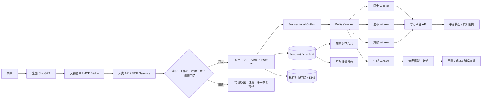

# 大麦商家营销平台产品总文档

**版本**：v2.0
**日期**：2026-09-10
**状态**：产品、技术与验收基线（账号密码版；不等同于生产上线）
**适用范围**：ChatGPT App/插件、商家运营后台、平台运营后台、API/MCP、模型中转、商品/SKU、知识库、规则扫描、任务 Worker、钱包/账务、平台发布和生产门禁

本文是大麦项目的产品总文档。它把“用户从安装插件到发布商品”的主链路、三端职责、登录注册、知识库使用、权限、计费和验收口径放在同一份文档中。

本文中的“目标方案”描述应该如何工作；“当前状态”描述仓库目前能被证实的行为。静态代码、Fixture、Mock 和本地截图不能替代真实生产证据。

### 文档分区（Diátaxis）

| 分区 | 本文对应内容 | 读者要解决的问题 |
| --- | --- | --- |
| Tutorial（教程） | §5、§6、§16 | 第一次从安装到生成/发布，应该按什么顺序操作？ |
| How-to（操作指南） | §9、§10、§12、§14、§15、§17、§18 | 某一步如何配置、恢复或验收？ |
| Reference（参考） | §7、§8、§19–§24 | 页面、接口、数据、权限、测试和门禁的精确定义是什么？ |
| Explanation（原理） | §3、§4、§13、§20、§22、§25 | 为什么三端必须共用事实、为什么缺证据就阻断？ |

最短演示路径是：先读 §5 的主链路，再按 §6 登录，按 §16 导入一件商品，最后按 §12 → §14 生成、审核和下载。要判断能否上线，直接看 §24–§25；“本地可演示”不等于“生产可商用”。

## 0. 一句话定义

大麦是安装在桌面 ChatGPT 中的电商商品营销助手。商家用自然语言选择商品和 SKU，系统从商家自己的工作区读取已确认的商品事实、素材、品牌和规则，通过大麦自己的模型中转站生成文案、主图、详情页和视频，商家审核后可以下载或发布到已授权店铺。

ChatGPT 只是交互入口。权限、商品事实、账务、模型调用、规则、发布状态和审计都以大麦服务端为准。

## 1. 阅读方式与状态标记

| 标记 | 含义 |
| --- | --- |
| 目标 | 本文要求最终达到的产品行为，尚不表示代码已经完成 |
| 本地可演示 | 在本地 Fixture、隔离数据库或演示后台中已能验证 |
| 部分闭环 | 代码和测试存在，但仍缺真实依赖、配置或生产证据 |
| 上线阻断 | 当前必须停止，不得对外宣称可用 |
| 真实证据 | 来自真实 ChatGPT 宿主、API/MCP、数据库、Worker、平台、支付或部署环境的可追溯记录 |

## 2. 产品目标与边界

### 2.1 目标

1. 用户可在 ChatGPT App 市场搜索并安装“大麦”。
2. 用户可用大麦账号和密码注册、登录插件及商家后台。
3. 平台运营可审核商家申请、绑定企业、开通套餐和创意点。
4. 商家可绑定自己的电商店铺并同步商品、SKU、库存和素材。
5. 商家可通过 Excel/CSV 批量上传商品、SKU、材质、卖点、图片和规则资料。
6. 上传资料经过安全扫描、事实确认、版权/AI 修改许可检查和规则扫描。
7. 用户在 ChatGPT 中输入商品名称时，插件能从当前工作区取得对应知识库和 SKU 信息。
8. 用户可生成文案、主图、详情页、Banner、视频脚本和真实视频任务。
9. 生成结果可审核、修改、导出、下载，并在满足条件后发布到店铺。
10. 创意点、支付、模型用量、成本、退款、发布和审计都可追溯。
11. 所有大麦业务模型调用必须经过大麦自有模型中转站。

### 2.2 非目标

- 不要求手机、平板或移动端适配；运营后台是桌面工作台。
- 不让商家配置第三方模型 API Key。
- 不使用网页抓取、平台账号密码托管或验证码自动化绑定店铺。
- 不用本地 Fixture、空数组、截图或宿主模型结果冒充真实平台、支付、模型或发布成功。
- 不用前端角色、请求体里的 workspace ID 或请求头替代服务端授权和数据库 RLS。
- 不把平台后台公开注册给不受控用户。

### 2.3 核心功能需求编号

| 编号 | 需求 | 优先级 | 验收结果 |
| --- | --- | --- | --- |
| AUTH-01 | 平台运营和商家用大麦账号密码注册/登录/登出/重置；平台入口不公开注册 | P0 | 会话、角色和审计可复现，旧会话可撤销 |
| AUTH-02 | ChatGPT 首用通过大麦授权页完成同一 identity 的 OAuth/MCP 授权 | P0 | ChatGPT 不接触密码，token 只能访问商家 workspace |
| ONB-01 | 商家提交账号标识/申请编号，平台运营绑定企业、合同和批准套餐 | P0 | 未支付/未审核不授予生成和发布 capability |
| STORE-01 | 商家以官方 OAuth 绑定六类平台店铺并按 `platform + account_id` 管理 | P0 | 授权、同步、撤权、刷新和回查状态可追踪 |
| CAT-01 | 商品事实、品、Listing、SKU 可导入、确认、修订并隔离多店铺 | P0 | 一行一 SKU 导入无半批、重复可幂等处理 |
| KB-01 | Excel/素材经过扫描、解析、权益确认、知识资产绑定和索引 | P0 | 只有 approved/ready 内容进入插件上下文 |
| RULE-01 | 广告法、平台、促销、品类、版权和媒体规则自动扫描 | P0 | 规则缺证据按 blocking，结果可追溯 |
| GEN-01 | 文案、主图、详情页、视频脚本/成片通过大麦 relay 生成 | P0 | provider request/usage/cost/错误证据完整 |
| REVIEW-01 | 内容版本、候选图、人工审核、修改和下载可恢复 | P0 | 历史版本不覆盖，下载受扫描/权限门禁 |
| PUB-01 | 发布必须 prepare→diff→二次确认→confirm→远端回查 | P0 | 只有真实回查才能显示 published，unknown 不伪造 |
| BILL-01 | 套餐、支付、点数、预占/结算/退款和对账全链路可审计 | P0 | V2 订单为主事实，微信/支付宝回调幂等 |
| UI-01 | 后台所有列表目标为服务端每页 20 条，错误/空态/筛选一致 | P0 | 1000+ 数据翻页无漏项、无全量拉取 |

## 3. 三个使用面和一套数据事实

三个使用面不是三个独立产品。它们共享同一个工作区、商品、SKU、素材、任务、内容版本、规则、发布状态、创意点和审计事实，只按身份和权限展示不同内容。

| 使用面 | 用户 | 主要职责 | 正式结果 |
| --- | --- | --- | --- |
| 桌面 ChatGPT 插件 | 商家 Owner、运营、内容人员 | 自然语言交互、选平台/店铺/商品、生成、审核确认 | 文案、候选图、视频任务、发布确认和交付包 |
| 商家运营后台 | 商家管理员、编辑、审核、客服 | 店铺、商品、SKU、Excel、知识库、素材、任务、账单和发布 | 可追溯商品数据、内容版本、审核记录和发布状态 |
| 平台运营后台 | 平台 Owner、运营、财务、规则、模型、安全、发布人员 | 租户、权限、商业、规则、模型、平台连接、事故和上线门禁 | 平台聚合、权限决策、成本账本、规则版本、对账和审计 |

Merchant Studio 仅用于开发调试和演示，不是商家正式入口，也不能作为生产能力证明。

“商家运营后台”是目标中的 workspace-scoped 桌面自助工作台：商家用自己的账号登录，只能看到自己的商品、知识、任务、账单和发布状态。当前仓库尚未交付独立的生产商家 Web 登录入口；Merchant Studio 是演示/调试台，Ops Console 中的 workspace 页面是平台运营受控视图。两者都不能被误称为已上线的商家自助后台，Phase 1–2 必须把商家登录、路由、RLS 和 Excel/知识库入口真正接通。

## 4. 系统边界和主架构



代码入口：

- 插件清单：[apps/plugin/.codex-plugin/plugin.json](../apps/plugin/.codex-plugin/plugin.json)
- MCP Bridge：[apps/plugin/mcp/bridge.mjs](../apps/plugin/mcp/bridge.mjs)
- 商家 Skill：[apps/plugin/skills/merchant-marketing/SKILL.md](../apps/plugin/skills/merchant-marketing/SKILL.md)
- API/MCP：[apps/api/src/server.ts](../apps/api/src/server.ts)
- OpenAPI：[apps/api/openapi.yaml](../apps/api/openapi.yaml)
- 共享契约：[packages/contracts/src/domain.ts](../packages/contracts/src/domain.ts)
- 持久化：[packages/persistence/src/schema.sql](../packages/persistence/src/schema.sql)
- Worker：[apps/worker/src/main.ts](../apps/worker/src/main.ts)

## 5. 全量端到端主链路

下面的链路是产品验收的主线。它严格按商家实际操作顺序展开；“把账号给平台运营”只指提供账号标识/申请编号，绝不提供密码。平台 Owner 的账号预置属于后台初始化，不是商家每次使用的前置动作。每一步都必须有明确输入、输出、责任边界和失败恢复动作。

```text
① 在 ChatGPT App 市场搜索并安装“大麦”
   → 插件首屏打开大麦账号注册/登录页（账号 + 密码）
② 商家注册账号密码，提交企业资料
   → 获得 merchant_pending 和申请编号
③ 商家把“大麦账号/申请编号”发给平台运营
   → 平台运营在平台后台查找并绑定企业、合同和批准套餐 SKU
④ 用户在线支付，或平台运营核验已到账的线下付款
   → 服务端验证订单/回调/对账后，才授予 entitlement、创意点和 access_revision
⑤ 商家用同一账号密码登录商家后台；在插件授权页再次完成安全授权
   → 插件、商家后台映射到同一个 identity + workspace
⑥ 商家选择第三方平台并走官方 OAuth 授权店铺
   → 同步商品、SKU、库存和图片（第三方店铺密码不交给大麦）
⑦ 商家在后台上传 Excel/CSV 和素材
   → 扫描、解析、事实/权益确认、规则检查、知识索引
⑧ 商家在 ChatGPT 输入商品名/SKU
   → 插件只从当前工作区取已批准事实和知识，调用大麦中转生成
⑨ 商家审核、下载，或在发布中心预览并二次确认
   → Worker 调用官方平台 API，回查真实回执；同时完成点数结算和审计
```

三类凭据必须分开：

| 凭据 | 谁输入 | 存在哪里 | 不能做什么 |
| --- | --- | --- | --- |
| 大麦账号密码 | 商家/平台运营本人登录大麦页面 | 认证服务端的哈希与会话系统 | 不能传给平台运营、插件工具参数或模型 |
| ChatGPT 授权码/MCP token | 大麦授权页与 ChatGPT 宿主协议 | 短期 code + 受限 token 存储 | 不能访问 `ops.*` 或切换工作区 |
| 第三方店铺 OAuth 凭据 | 商家在官方平台授权页 | Secret Manager/Vault 的 `credential_ref` | 不能回显到浏览器、聊天、日志或导出 |

平台后台的初始化支线（由平台 Owner 在交付商家前完成）是：

```text
平台账号准备
 → 商业目录/点数费率审批
 → 六平台、规则、模型、支付、存储和扫描器 readiness
 → 创建平台运营账号和角色
 → 运营账号密码登录
 → 等待商家申请并完成企业/订单绑定
```

### 5.1 主链路分阶段表

| 阶段 | 谁操作 | 输入 | 服务端动作 | 成功结果 | 失败时 |
| --- | --- | --- | --- | --- | --- |
| 平台准备 | 平台 Owner | 平台账号、角色、规则、商业配置 | 创建平台账号、角色、能力和审计 | 运营账号可登录 | 拒绝访问，不创建默认账号 |
| 商家注册 | 商家 | 账号、密码、企业资料 | 创建 identity、申请编号和待绑定工作区 | `merchant_pending` | 说明缺失字段，不开放生成/发布 |
| 申请交接 | 商家 → 平台运营 | 账号标识/申请编号（不是密码） | 平台运营检索申请并绑定企业、合同、套餐 | `platform_review` | 找不到或资料不一致时保持待审核 |
| 商业开通 | 商家/平台运营 | 订单/合同/支付证据 | 核验、绑定企业、生成 entitlement 和点数 ledger | `active` + capability | 保持 pending，不提前授予能力 |
| 店铺绑定 | 商家 | 平台选择和官方授权 | 生成一次性 state/PKCE，服务端保存凭据引用 | `authorized` 店铺 | 保留任务，提示重新授权或配置缺失 |
| 商品准备 | 商家/运营 | 平台同步或 Excel | 解析、去重、事实版本化、SKU 关联 | 可检索商品事实 | 输出行级错误报告，不保留半批数据 |
| 知识库 | 商家/运营 | 品牌资料、素材、规则、SKU | 扫描、解析、切片、embedding、审批 | 可引用的知识版本 | 标记 pending/rejected，不进入生成上下文 |
| 规则扫描 | 服务端/Worker | 商品、SKU、素材、平台规则 | 生成可追溯 findings 和 policy snapshot | pass/warning | blocking 时停止生成或发布 |
| 生成 | 商家/插件 | 商品、SKU、目标、已确认方案 | 预占点数，调用大麦 relay，保存结果和成本 | `review_required` 版本 | 释放点数或进入对账，不重复调用 |
| 审核 | 商家/运营 | 内容版本和 findings | 人工确认、修改、批准 | `approved` 版本 | 生成新版本，历史版本不覆盖 |
| 发布 | 商家 | 最新预览、字段 diff、明确确认 | Worker 提交平台并记录回执 | 远端回查为 `published` | `rejected/unknown/manual_attention` |
| 账务 | 系统/平台财务 | provider receipt、支付回调 | 结算点数、订单、退款和收入状态 | 可对账 ledger | 保留 pending，不伪造到账或收入 |

## 6. 登录、注册和账号生命周期

### 6.1 用户可见的登录规则

正式用户登录方式只有：

```text
大麦账号 + 密码
```

平台运营后台、商家运营后台和 ChatGPT 插件都使用大麦账号密码。不能使用企业 SSO、手机号验证码、微信登录、支付宝登录、本机自动连接或手工 Token 作为用户登录方式。

ChatGPT 插件底层仍需要标准 OAuth/MCP authorization code 流程，这是宿主识别插件用户所需的协议，不是另一种用户登录方式。用户在大麦授权页输入的仍然是大麦账号和密码；密码只在大麦认证服务端校验，ChatGPT 不会得到密码。

### 6.2 平台运营登录

入口建议：

```text
https://admin.yxsona.com/login
```

页面只包含：

- 运营账号输入框；
- 密码输入框；
- 登录按钮；
- 忘记密码；
- 帮助和服务状态。

平台账号由平台 Owner 创建或停用，不开放公开注册。首个 Owner 通过安全初始化流程创建，其他账号由 Owner 或安全管理员邀请/预创建。

登录成功后服务端创建平台会话，随后调用 `ops.session` 获取：

- 身份状态；
- 账号状态；
- platform/workspace 工作台；
- 角色和 capability；
- 会话过期时间；
- 当前允许访问的页面。

账号密码认证成功但没有 `platform` 权限时，页面必须显示“身份已验证，当前账号没有平台运营权限”，不能把用户当作未登录，也不能展示平台业务数据。

### 6.3 商家注册和开通

默认方案是“插件首用触发的自助注册”；平台也可以发送邀请链接作为同一注册接口的快捷入口。两种入口最终都创建同一种大麦 identity，不得再分裂成两套账号。

商家允许自助注册：

```text
填写大麦账号和密码
 → 验证账号唯一性
 → 创建 merchant identity
 → 创建待审核申请
 → 创建待绑定工作区
 → 等待平台运营审核
```

注册页面最少收集：登录账号（唯一）、密码、密码确认、企业名称、联系人和同意的服务条款。注册成功只返回申请编号和脱敏账号，不返回 token、密码哈希或内部密钥。插件首用时显示“注册大麦账号 / 已有账号登录”两张卡；注册完成后自动回到授权页，不要求用户复制内部 ID。

商家向平台运营提交的是“大麦登录账号或申请编号”。平台运营只能查看申请、绑定企业和批准商业订单，不能代填密码、模拟商家会话或直接把 `active` 开关写入数据库。

状态机：

```text
registered
 → merchant_pending
 → platform_review
 → enterprise_bound
 → payment_pending
 → payment_reconciled
 → entitlement_granted
 → active
 → suspended / revoked / refunded
```

只有 `active` 且 entitlement、点数、模型和必要连接器均可用时，才开放相应业务能力。

目标认证接口（最终以 OpenAPI/运行态契约为准）：

| 接口 | 用途 | 关键约束 |
| --- | --- | --- |
| `POST /v1/auth/register` | 创建商家账号和待审核申请 | 平台账号不开放公开注册；账号唯一、密码强度和条款同意必填 |
| `POST /v1/auth/login` | 账号密码登录 | 返回 HttpOnly 会话；不返回密码或长期 Bearer token |
| `GET /v1/auth/session` | 获取当前会话和工作区摘要 | 只返回服务端计算的身份/角色/capability |
| `POST /v1/auth/logout` | 撤销当前会话 | 幂等，写审计 |
| `POST /v1/auth/refresh` | 轮换短期会话 | 检查账号、成员、entitlement 和撤销状态 |
| `POST /v1/auth/password/reset-request` | 发起重置 | 统一响应，防止账号枚举 |
| `POST /v1/auth/password/reset-confirm` | 一次性重置密码 | 成功后撤销旧会话 |
| `POST /v1/invitations/accept` | 接受平台邀请（可选入口） | 绑定已有 identity 或创建待审核 identity，不绕过审核 |

**当前实现差距**：仓库目前可证实的是 OIDC/Bearer、平台身份会话和本地 OIDC fixture；没有生产账号密码 credential、注册、重置和登录接口。上述接口是 P0 目标，未完成前 §24 门禁必须保持 NO-GO。

### 6.4 插件授权流程

```text
ChatGPT 安装“大麦”
 → 插件打开大麦授权页
 → 输入大麦账号密码
 → 选择允许访问的工作区
 → 服务端签发一次性 authorization code
 → ChatGPT 交换受限 MCP token
 → Bridge 调用 /mcp
```

插件 token 必须绑定 identity、workspace、客户端、过期时间和撤销状态。插件不能用 token 切换到平台工作台，也不能调用 `ops.*` 方法。

### 6.5 密码安全要求

- 使用 Argon2id 加盐哈希，数据库不保存明文或可逆密码。
- 账号和密码错误使用统一提示，防止账号枚举。
- 按账号、IP 和设备进行限流，连续失败后临时锁定。
- 登录成功后轮换 session ID，防止会话固定。
- 浏览器会话使用 `HttpOnly`、`Secure`、`SameSite` Cookie。
- 平台运营会话建议空闲 30 分钟、最长 8 小时。
- 修改密码、重置密码或停用账号后撤销旧会话。
- 密码重置链接一次性、短时效、不可重复使用。
- 登录、失败、锁定、解锁、重置、登出和角色变化写审计。
- 日志、前端响应、MCP 上下文、导出文件中不得出现密码或密码哈希。

### 6.6 登录界面状态

| 状态 | 用户看到的内容 | 禁止行为 |
| --- | --- | --- |
| 加载中 | 正在验证账号 | 加载业务列表 |
| 未登录 | 大麦账号、密码和登录按钮 | 显示空业务页或旧工作区 |
| 密码错误 | 账号或密码错误 | 暴露账号是否存在 |
| 被锁定 | 尝试过多，稍后重试/联系管理员 | 无限重试 |
| 会话过期 | 请重新登录，登录后返回原页面 | 使用旧会话继续写入 |
| 无平台权限 | 身份已验证，但没有平台权限 | 反复跳转登录 |
| 本地演示 | 本机演示会话（仅验收） | 在生产包显示本地连接 |
| 已登录 | 账号、工作台、角色和权限范围 | 显示密码、token 或密钥 |

## 7. 三层权限和配置关系

### 7.1 权限链

```text
账号身份
 → 工作区成员关系
 → 角色
 → 服务端 capability projection
 → 商业 entitlement
 → 规则/素材/店铺门禁
 → API/MCP 操作
 → Worker 执行前再次复核
```

角色名称本身不能授权。前端只能展示服务端返回的 capability，API、RLS 和 Worker 必须独立复核。

### 7.2 平台配置如何影响商家和插件

| 平台配置 | 影响商家后台 | 影响插件 | 最终门禁 |
| --- | --- | --- | --- |
| 商家状态/套餐 | 显示开通、停用、到期 | 决定能否开始业务 | `CommercialAccessDecision` |
| 创意点额度/费率 | 显示余额、点数包和数值明细 | 只显示余额是否足够及充值/恢复入口，不显示数值报价或扣点 | reserve/settle/release |
| 平台 OAuth/API | 显示未配置、只读或可写 | 决定能否连接/同步/发布 | connector readiness |
| 平台规则版本 | 显示来源、版本和 findings | 生成前带入规则上下文 | rule preflight |
| 模型 relay | 显示模态 readiness | 决定能否生成 | relay/cost evidence |
| 存储/扫描器 | 显示容量和扫描状态 | 决定能否使用素材 | object/scanner gate |
| Feature Flag | 控制页面和能力可见性 | 控制工具是否可用 | 服务端 flag + capability |

### 7.3 商家配置如何影响插件

```text
商家绑定店铺
 → 插件可选择 platform + account_id
商家导入商品/SKU
 → 插件可按商品名检索事实
商家批准知识/素材
 → 生成上下文可引用
商家完成规则和事实确认
 → 正式生成可进入队列
商家审核并准备发布
 → 插件可展示最终确认卡
```

商家后台是知识、商品和内容事实的维护入口；插件只是读取和推进当前一步。

### 7.4 角色能力矩阵

| 能力 | 平台 Owner/运营 | 商家 Owner/管理员 | 商家编辑/审核 | ChatGPT 插件 |
| --- | --- | --- | --- | --- |
| 管理平台账号、商业目录、规则、模型和支付配置 | 可按角色 | 不可 | 不可 | 不可 |
| 查看/绑定指定商家企业和 entitlement | 受控、需审计 | 查看自身 | 只读摘要 | 只读自身状态 |
| 绑定第三方店铺、同步商品 | 代办需临时授权 | 可 | 按授权可 | 发起并确认，不能看凭据 |
| 上传/确认商品、SKU、知识和素材 | 受控支持 | 可 | 按授权可 | 可提交资料/确认当前步骤 |
| 生成与修改内容 | 运营调试需单独授权 | 可 | 可 | 可发起，服务端门禁 |
| 批准与发布 | 不代替商家最终确认 | Owner/发布者 | 审核者可审，不一定可发布 | 只能收集明确确认 |
| 查看点数消费 | 平台聚合和内部成本 | 详细点数明细 | 按授权 | 余额是否足够/状态，不显示实际扣点 |
| 财务成本、收入、退款和调账 | 财务 capability | 订单/支付状态 | 不可 | 不可 |

任何“代商家操作”都必须创建临时授权 grant、限定 workspace/resource/action/有效期，并在审计中心留下原因和结果；平台运营不能通过 URL、请求头或前端切换绕过该矩阵。

## 8. 商品、品和 SKU 设计

“商品 SKU”和“套餐 SKU”必须分开命名，避免运营后台混淆。

### 8.1 商品领域

```text
brand / 品
  └─ canonical_product / 商品事实
       ├─ product_listing / 平台店铺映射
       │    └─ platform + account_id + remote_product_id
       └─ sku
            ├─ sku_id
            ├─ 颜色/尺码/规格
            ├─ 价格/库存
            └─ SKU 原图和素材绑定
```

- 商品事实是跨平台可复用的事实源。
- Listing 是商品在具体平台和店铺的映射。
- SKU 是价格、库存、规格和原图的最小经营单位。
- 店铺范围必须使用 `platform + account_id`，不能只用店铺名称。
- 同名商品、多店铺、多平台不能自动合并。
- 商品或 SKU 发生变化后，旧内容、审核和发布确认需要重新验证。

> **当前实现边界**：仓库现状没有独立的 `sku` 关系表；同步商品的 SKU 主要保存在 `products.data->skus` JSON 中，`canonical_products`/`product_listings` 也尚未建立 SKU 外键。上面的规范化关系是目标数据模型，Phase 2 必须补齐迁移、repository、RLS、幂等导入和回填校验后，才能作为生产事实。

### 8.2 套餐 SKU

套餐 SKU 是平台售卖的商业对象，例如基础版、成长版、点数包和增值服务；它不等于商品的颜色/尺码 SKU。

竞品模式和本项目的账号、VIP、月包、创意包拆分见[商业目录与竞品定价评审](/Users/lixiaomei/Desktop/code/codexSkills/docs/competitive-pricing-and-packaging-review-2026-09.md)。该文档是产品层设计依据；价格、点数和有效期仍以持久化目录快照为准。

套餐 SKU 至少包含：

- `sku_code` 和版本；
- 展示名称和描述；
- 价格、币种和税务属性；
- 可用工作区数、品数、店铺数、存储和服务小时；
- 创意点额度和有效期；
- 可用模态和功能；
- 退款和停服策略；
- `lifecycle`、`approved`、`executable`；
- 创建、审批、激活和废止审计。

默认费率提案（需以已批准的商业目录版本为准）：

| 动作 | 默认点数 |
| --- | ---: |
| 标准文本请求 | 1 点 |
| 标准图片 | 1 点/张 |
| 图片编辑 | 1 点/张 |
| 标准 15 秒视频 | 90 点 |
| 500 点点包 | 300 元 |
| 2000 点点包 | 1000 元 |

套餐和工作区配额（以已审批且 `executable` 的目录版本为准）：

| 套餐 | 价格 | 每月创意点 | 主要配额 |
| --- | ---: | ---: | --- |
| 基础版 | ¥2,000/月 | 5,000 点 | 1 个品、最多 5 店、共享 50 GB 存储 |
| 成长版 | ¥5,000/月 | 12,500 点 | 3 个品、最多 15 店、共享 50 GB 存储 |
| 定制版 | ¥10,000/月起 | 按合同 | 品、店铺、点数、服务和存储按合同 |

这里的 **50 GB** 固定解释为每个工作区共享的十进制 `50,000,000,000 bytes`，不是每个用户各自 50 GB。超额上传必须阻断并给出清理、升级或扩容动作，不能静默超配；对象存储、KMS 和生产配额证据仍需上线前验收。

50 GB 是基础版/成长版包含的工作区权益，不代表向商家按 50 GB 另收一笔费用。平台内部成本应按实际云对象存储、请求、KMS、出口和备份报价建立 COGS 预算；在没有锁定云区域、冗余、保留期和供应商合同前，产品文档不虚构一个固定成本数字。

任何价格、点数、有效期或权益变化必须创建新版本，不能修改已用于订单或任务的快照。

## 9. 店铺授权和商品同步

### 9.1 支持平台

产品模型支持：

- 京东 `jd`
- 淘宝 `taobao`
- 天猫 `tmall`
- 拼多多 `pinduoduo`
- 小红书 `xiaohongshu`
- 抖音 `douyin`

### 9.2 官方授权流程

```text
商家选择平台
 → API 检查平台配置和 readiness
 → 生成 workspace/platform 绑定的 state + PKCE
 → 跳转官方授权页
 → callback 消费 state 并交换 code
 → 凭据写入 Vault/凭据服务
 → 数据库只保存 credential_ref 和脱敏摘要
 → workspace.health 返回授权状态
 → 商家选择具体 account_id
 → 启动 catalog.sync
```

系统绝不保存或展示平台账号密码，不把 access token 返回到插件、浏览器、日志或导出文件。

当前连接器实现主要是通用 HTTP 适配器和 fixture profile；六个平台的真实应用审批、OAuth endpoint、Vault 凭据、字段映射、媒体上传、读写回查和 canary 证据仍需逐平台配置。`fixture` 状态只能演示契约，不能让商家误以为店铺已真实绑定。

### 9.3 店铺状态

| 状态 | 含义 | 可做什么 |
| --- | --- | --- |
| `not_configured` | 平台没有真实配置 | 查看阻断原因 |
| `pending_authorization` | 等待官方授权 | 完成授权 |
| `authorized` | 已有授权摘要 | 查看并启动同步 |
| `readable` | 读 API canary 通过 | 读取/同步商品 |
| `write_ready` | 写入和回查 canary 通过 | 经审核后发布 |
| `refresh_required` | 需要重新授权 | 只读历史，不能刷新/写入 |
| `revoked` | 已撤销 | 查看历史，重新连接 |
| `fixture` | 本地演示 | 只能演示，不能当真实授权 |

### 9.4 同步要求

同步任务按页执行，记录：

- `workspace_id`、`platform`、`account_id`；
- 授权 revision；
- 分页游标；
- 最近尝试、最近完整成功和最近可用时间；
- 平台 request ID；
- 失败原因和可重试项；
- 商品事实和远端快照版本。

同步失败时保留旧事实，但必须标记 freshness，不能把旧数据称为实时数据。

## 10. Excel、素材和知识库

### 10.1 知识库的目的

知识库不是一个“把所有文件丢给模型”的文件夹。它是按工作区、商品、SKU、品、平台和版本组织的可审计事实集合。

知识分为四层：

1. **商品事实**：名称、类目、材质、规格、价格、库存、SKU、图片。
2. **品牌资产**：品牌定位、目标人群、语气、禁用词、颜色、字体和视觉规则。
3. **商家规则**：商家自己的促销、表达、审核和运营偏好。
4. **平台规则**：平台官方广告、发布、类目、促销和媒体规范。

### 10.2 Excel/CSV 支持字段

- 平台、店铺账号、商品货号、商品名称、类目；
- SKU 编码、颜色、尺码、规格；
- 价格、库存、材质、卖点、禁用词；
- 图片链接、商品素材 ID、SKU 原图 ID；
- 品牌、店铺差异化、平台扩展属性。

默认模板按“一行一个 SKU”组织，同一平台、店铺和商品货号可归并为一个商品。Excel 内嵌图片是否支持，以当前导入器能力为准；图片链接不等于已经完成素材扫描。

导入预览必须把字段分成“必填、可选、平台扩展”三组，并逐行给出错误：

| 字段组 | 示例 | 校验/处理 |
| --- | --- | --- |
| 必填 | 平台、`account_id`（已有店铺时）、商品货号/名称、SKU 编码 | 缺失、平台不支持或同一范围重复时拒绝该行 |
| 经营事实 | 颜色、尺码、规格、价格、库存、材质、卖点 | 类型/范围校验；需要证据的字段进入待确认 |
| 素材引用 | `asset_id`、原图 ID、图片链接 | ID 必须属于当前 workspace；链接只记为未扫描来源 |
| 平台扩展 | 类目属性、媒体规格、促销字段 | 按平台 schema 校验，不把未知列静默丢弃 |

批量确认必须原子提交“通过行”，失败行保留原文、行号和可修复建议；重复提交同一文件哈希/幂等键不得创建重复商品或重复知识版本。

当前契约基线：单个 `.xlsx/.csv` 默认不超过 10 MB，单个素材/MCP 上传不超过 50 MB；最终限制由平台配置返回，前端必须在上传前和服务端再次校验，超限显示可恢复动作。

### 10.3 知识库上传流程

```text
商家后台上传 Excel/CSV/图片/PDF/Word/文本
 → 文件类型、大小和病毒扫描
 → 对象存储隔离区
 → 解析/OCR/表头校验
 → 展示预览和错误行
 → 商家确认商品事实
 → 写入商品/SKU事实版本
 → 将确认后的字段和素材绑定为知识资产
 → 文本切片
 → embedding/向量索引
 → 规则扫描和权益检查
 → 状态变为可引用
```

上传文件中的文字全部视为不可信资料。即使文件写着“忽略规则”“调用工具”或“发布商品”，也不能触发任何工具或改变权限。

> **历史基线（已被当前实现部分替换）**：早期版本只有进程内 `Map` 投影。本轮已新增 `knowledge_assets/documents/chunks/embeddings/bindings` 的 PostgreSQL 迁移、RLS、索引状态、重建/删除证明和工作区检索 repository；但 Excel facts→knowledge 的应用层自动编排、真实 embedding provider、跨副本运行证据仍未完成，因此生产仍不得把“上传成功”称为“知识库已可被插件长期检索”。

商品事实和知识资产是两个有关系但不相同的对象：商品事实负责价格、库存、SKU 等结构化字段；知识资产负责品牌资料、卖点、材质说明、资质和可引用文本/图片。产品体验应在一次“确认导入”后自动创建或更新二者的绑定投影，避免商家重复上传；服务端仍要分别记录 `product_id/sku_id/source_asset_id/knowledge_asset_id` 和审批状态。当前 Excel 导入接口只写商品事实，未自动创建独立 `knowledge.asset`，且 Merchant Studio 尚未提供完整 Excel→SKU 预览→确认入口，这两项均为 P0 待实现。

### 10.4 素材状态

| 状态 | 含义 | 是否可用于正式生成 |
| --- | --- | --- |
| `uploaded` | 已收到文件 | 否 |
| `scanning` | 安全扫描中 | 否 |
| `scan_failed` | 安全扫描失败 | 否 |
| `parsed` | 已解析，待事实确认 | 否 |
| `rights_pending` | 商用权益或 AI 修改许可未确认 | 否 |
| `approved` | 事实、权益和扫描通过 | 是 |
| `rejected` | 被人工或规则拒绝 | 否 |
| `expired` | 来源或有效期过期 | 否，需重新确认 |

独立上传图片并要求生成一张未绑定候选图时，可以在安全扫描通过后先生成“未绑定、未批准、不可发布”的候选；这条快捷路径不能升级为正式商品事实或发布素材。

### 10.5 向量索引元数据（目标能力）

完成 Phase 2 后，每个向量片段至少保存：

```text
workspace_id
brand_id / product_id / sku_id
source_asset_id
source_version
knowledge_type
embedding_model / embedding_version
rights_status
approval_status
rule_snapshot_version
created_at / expires_at
```

索引写入必须先绑定 `workspace_id + product_id + sku_id`，再进行相似度排序；删除、撤销权益、素材过期、规则版本变化和 embedding 模型升级都要产生可审计的失效/重建事件。索引状态至少包括 `queued / indexing / ready / stale / failed / deleted`，并提供重试、全量重建和租户级删除证明。

### 10.6 插件如何使用知识库

用户在 ChatGPT 输入：

```text
帮我做“轻薄防晒外套”的淘宝主图，使用蓝色 M 码的真实信息。
```

插件执行：

1. 读取当前 identity 和 workspace。
2. 检查当前工作区是否有有效店铺和商品事实。
3. 调用 `catalog.search`，使用商品名、平台、店铺和 SKU 条件检索。
4. 获取商品名称、SKU、材质、颜色、尺码、价格、库存、图片和来源版本。
5. 在同一 workspace 且已批准的范围内读取已绑定的品牌/知识资产和平台规则；未完成索引时显示处理中，不用模型常识补齐。
6. 把事实、知识版本和规则快照冻结到任务上下文。
7. 让商家确认方向和制作方案。
8. 通过大麦模型中转生成候选图。
9. 返回候选图、来源、规则结论和通用点数状态（不显示实际扣点数）。

插件不需要商家再次上传已经进入当前工作区的 Excel，也不需要商家输入内部 `product_id`、`sku_id` 或向量 ID。

插件消费知识的最小响应契约（示意）是：

```json
{
  "workspace_id": "ws_...",
  "retrieval_status": "ready",
  "products": [{
    "product_id": "product_...",
    "title": "轻薄防晒外套",
    "skus": [{"sku_id": "sku_...", "color": "蓝色", "size": "M", "facts_version": 3}]
  }],
  "knowledge_context": [{
    "knowledge_type": "material",
    "content": "锦纶 88%，氨纶 12%",
    "source_asset_id": "asset_...",
    "source_version": 4,
    "approval_status": "approved"
  }],
  "rule_snapshot": {"platform": "taobao", "version": "rule-...", "decision": "pass"}
}
```

响应必须带 workspace 和版本来源；`retrieval_status` 为 `missing / indexing / stale / blocked` 时，插件只能解释原因并引导后台修复，不得把 ChatGPT 常识拼进正式商品事实。

### 10.7 知识更新和失效

以下变化会使旧检索或任务上下文失效：

- 商品、SKU、价格或库存变化；
- 素材被撤销、过期或扫描状态变化；
- 品牌规则版本变化；
- 平台规则版本变化；
- 目标平台或店铺变化；
- embedding 模型或索引版本变化。

旧版本保留用于审计，但新生成必须读取最新可用快照。

## 11. 自动规则扫描

### 11.1 扫描范围

- 广告法禁词、绝对化和夸大宣传；
- 平台广告和发布规则；
- 促销、价格、优惠和活动表达；
- 品类禁限售、资质和必填属性；
- 图片、视频、Logo、肖像和版权；
- AI 修改许可；
- 平台标题、详情、媒体规格和字段映射。

平台规则由平台后台从官方来源同步，不接受插件或商家上传的“规则截图”作为权威版本。同步 Worker 必须校验来源 URL、签名、checksum、发布时间/生效时间、适用平台和审批人，生成不可变 `rule_snapshot`；同步失败、版本过期或签名缺失时，该平台状态为 `not_configured/blocked`，不能降级为搜索摘要或模型常识。

### 11.2 扫描结果

```json
{
  "scan_id": "scan_...",
  "workspace_id": "ws_...",
  "product_id": "product_...",
  "sku_id": "sku_...",
  "platform": "taobao",
  "rule_source_version": "rule-2026-09-09",
  "policy_checksum": "sha256:...",
  "findings": [],
  "decision": "pass|warning|blocking",
  "evidence_refs": []
}
```

`blocking` 禁止正式生成、批准和发布；`warning` 必须在审核页和发布预览中显式展示。规则来源、版本或 checksum 缺失时，状态必须按 **fail-closed 的 blocking** 处理（而不是普通 warning），只能查看阻断原因和恢复动作，不能正式生成、批准或发布。

## 12. 内容、图片和视频生成

### 12.1 正式生成前置条件

- identity、workspace 和成员关系有效；
- 商品、SKU、平台和店铺范围明确；
- 商品事实已确认；
- 相关知识和素材 approved；
- 规则扫描没有 blocking；
- 制作方向和方案已确认；
- 创意点余额可读并完成预占；
- 模型 relay、模态、鉴权、用量和成本证据就绪；
- 生成请求带幂等键和 action 记录。

### 12.2 主图和详情图

正式商品主图流程：

```text
确认 SKU 原图
 → 生成 1–6 张候选
 → 产物写入 quarantine 隔离区
 → 签名扫描器回调并提升到 clean 区
 → 自动视觉/事实检查
 → 商家明确选择图片和顺序
 → 产生新的待审核内容版本
 → 审核/批准
 → 发布预览
```

候选图不会覆盖商品当前图片。没有真实商品原图时只能标记为概念候选，不能说成还原了真实颜色、结构或款式。

`catalog.image.get` 只有在候选全部获得可信扫描回执并进入 `clean` 存储后，才可返回可展示/下载的图片 URL；仍在 quarantine 时只能显示“安全扫描中”。生产环境禁止用商家或前端手工把素材标 clean。

### 12.3 视频

视频分两层：

1. 脚本/分镜：只产生可审阅文本，不代表成片。
2. 真实渲染：调用 `multimodal.video.request`，查询同一 provider job，下载、签名校验、归档、扫描和保真复核。

只有存在真实视频 artifact、provider request ID、用量/成本和归档证据时，才能称为已生成视频。

### 12.4 任务状态

```text
draft
 → resolving_context
 → blocked_missing_facts / blocked_conflict
 → ready_for_direction
 → direction_selected
 → plan_confirmed
 → generating
 → review_required
 → changes_requested
 → approved
 → publish_prepared
 → publishing
 → delivered
```

失败状态分为 `failed_recoverable` 和 `failed_terminal`。任务必须可恢复，不能因为 ChatGPT 对话结束而丢失。

### 12.5 商品设计图出不来：排查顺序

当插件没有返回商品设计图时，客服和研发必须按下面顺序取证，不得用“模型可能没生成”结案：

| 检查层 | 要查看的证据 | 常见状态/恢复动作 |
| --- | --- | --- |
| 身份与工作区 | `identity`、`workspace_id`、成员 capability、`authorization_revision` | 401/403：重新登录或恢复成员权限；禁止切换到别的工作区 |
| 商品与 SKU | `catalog.search` 请求范围、商品事实确认状态、SKU 原图/素材绑定 | `PRODUCT_FACTS_CONFIRMATION_REQUIRED` 或 SKU 不明确：回后台确认事实并重新选择 |
| 知识与规则 | knowledge/asset 状态、rule source/version/checksum、blocking findings | 规则缺失或素材未 approved：保持阻断，补资料/规则后重试 |
| 商业与点数 | balance state、reservation、rate version、access revision | 余额不足显示通用充值入口；余额 unknown 不得当作可用 |
| 中转站 | relay URL/allowlist、模态 readiness、provider request ID、usage/cost receipt | 配置缺失或 evidence 缺失：检查 `/readyz` 和 Secret Manager；不得直连供应商 |
| 队列与 Worker | outbox event、lease、retry/dead-letter、generation worker readiness | `queued` 超时：查看 Redis/Worker/迁移版本，执行可审计重试 |
| 资产与扫描 | artifact storage key、对象哈希/大小、扫描 receipt、`clean` 状态、quarantine age | 仍在 quarantine：查 scan outbox、签名 callback 和 dead-letter；等待/受控重驱，禁止返回不可验证下载链接 |
| provider 结果 | provider job 状态、超时/unknown、reconciliation 记录 | unknown：按 request ID 对账，不盲目再次调用或重复扣点 |

每次排障至少保存 `request_id/trace_id/action_id/task_id/provider_request_id/error_code/evidence_ref`。只有拿到真实 artifact、归档哈希和扫描通过证据后，页面才显示“设计图已生成”；否则显示具体阻断原因和唯一下一步。

当前本地图片测试会在模型产物归档后显式完成扫描，再查询到图片；它证明合同闭环，不证明生产扫描 Worker/签名回调已经部署。若生成 Worker 已产出但 scanner/outbox/签名回调未就绪，图片会长期停在 quarantine，这正是“任务显示生成过、插件却一直没有图”的首要排查方向。

## 13. 大麦自有模型中转站

### 13.1 唯一出口

以下业务调用只能走 `MODEL_RELAY_BASE_URL`：

- 文案和文本生成；
- 图片生成；
- 图片编辑；
- OCR 和图片事实提取；
- 视频脚本、分镜和真实渲染；
- embedding/向量化（如果由模型服务提供）。

应用、插件、Worker 和商家浏览器不得直接调用第三方模型 endpoint，也不得要求商家提供模型 Key。

### 13.2 必须保留的证据

- provider request ID；
- action/run/workspace 关联；
- 模态、模型和版本；
- 输入/输出用量；
- 实际成本、费率版本和币种；
- receipt hash；
- 错误、重试和 settlement 状态；
- 观察时间和当前 release 绑定。

### 13.3 Fail-closed 条件

```text
relay 地址非 HTTPS
或 host 不在 allowlist
或 API Key/模型缺失
或模态未配置
或 usage/cost evidence 缺失
或 provider request 无法关联
 → 禁止生成、禁止扣点、禁止发布
```

宿主 ChatGPT 模型只负责理解对话和选择工具。宿主模型的回答不能当成大麦模型产物，不能进入大麦用量账本，也不能替代 relay 证据。

## 14. 审核、下载与发布

### 14.1 审核

审核页必须同时展示：

- 商品和 SKU 事实来源；
- 使用的素材、品牌和知识版本；
- 规则来源、版本和 findings；
- 图片/视频扫描状态；
- 内容版本和差异；
- 需要人工确认的字段；
- 点数预估、实际消耗和结算状态。

### 14.2 下载

下载只允许当前工作区有权限、扫描通过和已归档的资源。下载链接短时有效并写审计。下载不等于批准，批准不等于发布。

### 14.3 发布状态机

```text
publish.prepare
 → 字段/平台/授权/规则检查
 → 远端商品快照
 → 展示 diff 和冻结选图
 → 商家明确确认
 → publish.confirm
 → queued / submitting
 → submitted / reviewing
 → published / rejected / unknown
 → reconcile / manual_attention
```

只有远端回查、回执和版本哈希都匹配时，才能显示 `published`。`queued`、`submitted`、`reviewing` 和 `unknown` 都不能显示为已发布。

任何商品事实、SKU、图片、内容版本、店铺授权或平台规则变化都会使旧确认哈希失效。

## 15. 钱包、创意点、充值和账务

### 15.1 商家看到什么

商家后台展示：

- 可用创意点；
- 冻结创意点；
- 已消耗创意点；
- 点数包和套餐状态；
- 订单支付状态；
- 消费时间和业务用途；
- 到期时间和恢复动作。

插件展示范围更窄：只显示“余额是否足够”、当前任务的成功/失败/处理中状态、通用的充值入口和恢复动作。**插件不显示实际扣除点数、点数费率、供应商成本或平台利润**；详细消耗明细只在商家后台的钱包/账单页展示。

商家看不到模型供应商、底层人民币成本、平台利润、内部加价或密钥。

### 15.2 平台运营看到什么

平台运营和财务可以查看：

- 合同、订单和支付渠道；
- provider request、usage、cost 和 pricing version；
- 点数授予、预占、结算、释放和调整；
- 退款、对账、发票和收入确认状态；
- 角色、权益、模型和平台审计。

平台财务唯一事实投影必须以 V2 `commercial_orders`、verified payment events、entitlement snapshots、creative-point ledger、provider receipts/refunds 为主；legacy wallet/order 只能作为历史迁移与对账来源，不能反向决定准入。页面授权使用服务端 canonical capability（例如 `billing.platform.read`），不是把 MCP 方法名或前端角色字符串当权限；所有调账使用服务端返回的当前 revision，冲突后刷新并重新确认，不能把 `expected_revision` 写死。

### 15.3 充值流程

```text
插件/商家后台发现余额不足
 → commercial.catalog.get
 → 只展示 approved + executable 的点数包
 → commercial.order.create
 → 服务端生成 checkout（支付链接/二维码）
 → 微信/支付宝支付
 → provider 签名回调
 → commercial.order.payment.get 查询
 → grant 写入
 → creative point ledger 入账
 → access_revision 更新
 → 插件/后台刷新余额
```

客户端不能提交任意金额、点数、价格或权益。支付页面成功、订单 `pending` 或前端回调成功都不能直接当作到账。

微信/支付宝商户密钥只放在独立支付网关或 Secret Manager，插件和普通 API 不接触。

**当前实现差距（P0）**：已新增 V2 checkout resource、provider order/过期时间、幂等持久化、HMAC/时窗/nonce/payload hash 回调验签、退款与 reconciliation service，并在 Bridge 暴露服务端 checkout resource；但真实微信/支付宝 provider、生产回调地址、对账与账务凭证尚未注入，仍不能对外宣称充值闭环已上线。

现有插件 `recharge.html` 仍偏只读/legacy，可能展示人民币流水或每次扣点信息；正式版必须改成最小投影，只显示“余额是否足够、支付状态、通用充值动作”，不能把平台财务或供应商成本字段下发给 ChatGPT。

### 15.4 生成扣点协议

```text
quote
 → reservation
 → provider call
 → receipt + usage + cost
 → settled
```

- 已知失败：释放预占；
- provider 结果未知：保留预占，进入对账；
- 成本证据缺失：阻断；
- 重试必须复用幂等键，不能重复调用或重复扣点。

### 15.5 收入确认

“开通权限即收入 5000 元”不是系统规则。正确顺序是：

```text
合同/订单创建
 → 支付确认
 → 权益开通
 → 履约开始
 → 对账完成
 → 按合同和财务政策确认收入
```

权限开通、支付到账、账务入账和收入确认必须是不同状态和不同审计事件。

### 15.6 批量生产闭环

批量生成不是把多个请求拼成一条聊天消息，而是一个可恢复的批次：

```text
批量选择商品/SKU
 → 逐项校验事实、素材、规则和平台范围
 → 按项或小批次预占创意点
 → 异步生成图片/文案/视频
 → 记录每项 queued/running/succeeded/failed/unknown
 → 汇总审核和差异
 → 成功项批量下载；发布仍逐项 prepare→二次确认→confirm
 → 结算成功项、释放失败项、对 unknown 项进入对账
```

部分失败不能让整个批次显示成功，也不能重复扣点。单项重试必须复用业务幂等键并只重试可恢复项；批次页要显示成功数、失败原因、待对账数和可执行的下一步。

## 16. 知识库使用操作手册

### 16.1 商家第一次准备商品

1. 用大麦账号密码登录商家后台。
2. 进入“商品与 SKU”。
3. 下载 Excel 模板。
4. 按“一行一个 SKU”填写商品名称、货号、颜色、尺码、价格、库存、材质和图片引用。
5. 上传 Excel，等待安全扫描和解析。
6. 核对预览中的商品数、SKU 数、错误行和图片关系。
7. 确认商品事实导入，并确认要作为知识资产使用的字段/素材绑定。
8. 进入“知识库与素材”，上传或关联品牌资料、详情页、资质、规则和原图。
9. 等待扫描、解析、权益确认和（目标）索引状态变为 `ready`。
10. 处理规则扫描中的 blocking 或 warning；未通过前不要在插件发起正式生成。

当前本地 Merchant Studio 没有完整的 Excel/CSV 上传入口；专用批量导入组件目前位于 Ops Console 的受控页面。该页面位置不满足“商家自己在商户后台上传”的正式需求，必须迁移/复用为商家工作区页面并补齐 facts confirm、知识资产绑定和真实浏览器验收。

### 16.2 在 ChatGPT 中使用已上传的品

用户可以直接说：

```text
查看我知识库里的“轻薄防晒外套”，做淘宝主图。
```

插件应该：

1. 识别当前工作区；
2. 检索商品和 SKU；
3. 展示多个同名商品供选择；
4. 读取已批准的材质、卖点、品牌规则和图片；
5. 展示事实来源和规则状态；
6. 让用户确认目标和方向；
7. 调用大麦模型中转；
8. 返回候选图或内容版本；
9. 给出审核、下载或发布的唯一下一步。

用户不需要重新上传已经入库的商品 Excel，也不需要填写内部 ID。

### 16.3 知识库查不到商品时

插件必须明确说明原因属于以下哪一类：

- 当前工作区没有该商品；
- 商品存在但 SKU 不明确；
- 商品资料尚未确认；
- 素材仍在扫描；
- 素材权益未确认；
- 店铺授权失效；
- 知识索引仍在处理中；
- 当前规则或平台配置未就绪。

不能用模型常识补齐材质、库存、认证、销量、性能或平台要求。

### 16.4 桌面演示与验收脚本

演示必须把“当前本地可演示”和“目标正式链路”分开。缺少真实账号密码、支付、平台 OAuth、模型中转、扫描器或 ChatGPT 宿主证据时，主持人必须在开始前说明对应步骤是阻断项，不能切到 Fixture 后宣称正式成功。

| 步骤 | 操作面 | 演示动作 | 必须看到的结果/证据 |
| --- | --- | --- | --- |
| 1 | ChatGPT 桌面 App | 在市场搜索并安装“大麦”，打开插件 | 真实 App/插件标识、版本、MCP 工具发现和宿主 trace；没有宿主证据则标记不可演示 |
| 2 | 大麦授权页 | 用测试商家账号密码登录 | 同一 identity、workspace 和受限 token；ChatGPT/日志中没有密码 |
| 3 | 平台运营后台 | 按申请编号查商家，展示企业、订单、权益与 capability | 未支付保持 pending；支付/核验后才变 active；操作有审计 |
| 4 | 商家后台 | 官方 OAuth 连接一间店铺并同步 | 平台/account、授权 revision、同步游标、远端 request ID；Fixture 必须明显标识 |
| 5 | 商家后台 | 上传一份“一行一 SKU”Excel 和一张原图 | 扫描、解析预览、错误行、事实确认、知识绑定和容量变化 |
| 6 | ChatGPT 插件 | 输入商品名和指定 SKU，请求生成主图 | 命中当前工作区的事实/知识来源与规则版本；插件不显示数值扣点 |
| 7 | API/Worker/中转证据 | 等待生成 | relay request ID、usage/cost、任务状态、对象 quarantine→signed scan→clean |
| 8 | 插件/商家后台 | 查看候选图、审核并下载 | 图片可真实打开；版本、素材权益、扫描状态和审核记录一致 |
| 9 | 商家后台 | 点击“一键发布” | 先出现 prepare diff/规则/授权检查，再二次确认；远端回查后才显示 published |
| 10 | 商家/平台账务 | 查看点数和账务 | 商家后台有点数明细；插件只有余额状态；平台可追到订单、provider 成本和对账 |

演示失败时保留浏览器 trace、API/MCP 请求摘要、Worker/outbox 状态、provider request ID、扫描回执和截图。不能通过删除任务、清空数据库或手工把状态改成成功来恢复演示。

## 17. 商家运营后台

| 页面 | 主要内容 | 关键动作 |
| --- | --- | --- |
| 总览 | 工作区、套餐、点数、店铺、任务和风险 | 查看唯一阻断和恢复动作 |
| 商品与 SKU | 商品事实、SKU、库存、图片和导入（目标） | Excel 导入、确认、停用、修订 |
| 平台连接 | 六平台授权和同步状态 | 连接、重新授权、同步 |
| 知识库与素材 | 品牌、规则、素材、扫描、向量索引（目标） | 上传、确认、驳回、绑定 |
| 任务与内容 | 任务、方向、内容版本、批量任务 | 生成、修改、审核、恢复 |
| 审核与发布 | findings、diff、选图、发布回执 | 批准、准备、确认、对账 |
| 钱包与账单 | 点数、订单、消耗和充值 | 查看、充值、导出 |
| 成员与权限 | 成员、角色、工作区范围 | 邀请、变更、停用 |
| 客服/事故 | 工单、SLA、异常任务 | 分配、回复、升级、恢复 |

目标规范是所有列表服务端分页、默认每页 20 条；“一键发布”按钮也必须先执行 `publish.prepare`，展示字段 diff/规则/授权状态，再要求商家二次确认后调用 `publish.confirm`，不能单击直接写入平台。筛选、排序、总数和空态必须与当前工作区一致。

当前验收必须逐页确认网络请求的 `limit=20`、游标/总数和刷新行为；不能只因为表格视觉上显示 20 行就判定分页完成。

## 18. 平台运营后台

平台运营后台使用大麦账号密码登录，默认进入 `platform` 工作台。

| 页面 | 主要内容 | 对商家的影响 |
| --- | --- | --- |
| 总览 | 租户、套餐、平台、模型、存储、告警和发布门禁 | 决定总体可用性 |
| 用户与租户 | 商家账号、企业、成员、风险和会话 | 决定身份和工作区是否有效 |
| 商业目录 | 套餐、点数包、费率和 Feature Flag | 决定功能、额度和售卖状态 |
| 订单与支付 | 订单、checkout、回调、退款和对账 | 决定权益是否到账 |
| 权益与点数 | grant、reservation、settlement、adjustment | 决定生成是否放行 |
| 平台连接 | OAuth、API、媒体规格、写入 canary | 决定同步和发布能力 |
| 规则中心 | 官方规则、版本、审批、checksum | 决定扫描和发布门禁 |
| 模型服务 | 五模态 relay、用量、成本、错误 | 决定生成能力 |
| 存储与扫描 | 配额、对象、KMS、ClamAV、队列 | 决定素材是否可用 |
| 发布与事故 | 发布回执、unknown、事故和恢复 | 决定写入和人工处理 |
| 审计中心 | 身份、权限、账务、模型、发布审计 | 提供责任和证据链 |

平台后台看到的是平台聚合和受控脱敏数据。读取指定商家内容必须有明确工作区范围、capability、临时授权和审计记录。

当前代码状态：部分 Ops 页面已把表格行数改为 20，但若干接口仍返回 `next_cursor: null` 或由前端切片；Merchant Studio 仍存在商品 10 条、任务 12 条、图片/发布/资产全量拉取等旧路径。全量“每页 20 + 服务端游标”是 P0 性能/稳定性验收项，不应写成已完成。

## 19. API、MCP 和异步 Worker

### 19.1 MCP 工具分组

当前 Bridge/共享注册表的运行态工具数量以 `tools/list` 和 release metadata 为准，文档不把数量当作生产就绪证明。主要工具组如下：

| 工具组 | 示例 | 用途 |
| --- | --- | --- |
| 身份/工作区 | `merchant.start`、`workspace.health`、`workspace.bootstrap` | 启动会话、健康和工作区 |
| 店铺/商品 | `platform.connect`、`catalog.sync.start`、`catalog.search` | 授权、同步、检索 |
| 品和 SKU | `brand-unit.list`、`brand-unit.product.create`、`catalog.sku.update` | 维护品、商品和变体 |
| 素材/知识 | `asset.list`、`asset.parse`、`knowledge.asset.list`、`knowledge.rule.list` | 素材、品牌和规则 |
| 任务/内容 | `task.create`、`task.answer`、`creative.directions`、`content.generate` | 任务和内容生成 |
| 图片/视频 | `catalog.image.generate`、`catalog.image.get`、`multimodal.video.request` | 视觉候选和视频任务 |
| 审核/发布 | `content.review`、`content.approve`、`publish.prepare`、`publish.confirm` | 审核、预览和写入 |
| 商业/钱包 | `commercial.catalog.get`、`commercial.order.create`、`billing.status`、`creative-points.balance.get` | 套餐、订单和点数 |
| 恢复/反馈 | `task.resume`、`task.timeline`、`feedback.submit` | 恢复任务和记录反馈 |

商家 Bridge 不暴露 `ops.*`、内部模型密钥、规则发布管理、支付密钥或平台控制面工具。

### 19.2 REST 资源组

OpenAPI 目前覆盖：

```text
/v1/commercial/*
/v1/creative-points/*
/v1/platform-capabilities
/v1/delivery-readiness
/v1/rules/*
/v1/brand-profile
/v1/assets/*
/v1/platform-accounts/*
/v1/sync-jobs/*
/v1/products/*
/v1/tasks/*
/v1/content-versions/*
/v1/publish-jobs/*
/v1/worker-events/*
/v1/oauth/callback/{platform}
/mcp
```

写请求必须使用幂等键；更新请求使用 revision/乐观并发；错误使用稳定错误码，不直接暴露第三方 SDK 异常。

### 19.3 Worker 角色

Worker 角色包括：

- `sync`：平台商品和库存同步；
- `generation`：文案、图片、视频模型任务；
- `publish`：已确认的平台写入；
- `reconcile`：unknown、超时和远端状态对账；
- `automation`：只读巡检或受控策略任务；
- `scan`：文件安全扫描、OCR 和素材状态；
- `all`：本地或受控环境组合运行。

队列消息只保存引用和哈希，不保存密码、token、商品正文或素材字节。Worker 执行前必须重新检查身份授权、商业状态、规则、素材和 relay readiness。

## 20. 数据隔离和持久化

### 20.1 工作区边界

所有商家业务数据都必须带 `workspace_id`，包括：

- 商品、SKU、Listing；
- 素材、知识、向量、规则快照；
- 任务、内容版本、审核和发布；
- 点数、订单、用量和账单；
- Worker 事件和审计。

数据库使用 PostgreSQL 强制 RLS。事务通过 workspace scope 设置数据库 session context；缺少 scope 时直接拒绝。

当前本地运行探针的迁移尾为 180（其中 180 仍需纳入冻结发布清单）；仓库发布基线文档曾记录 179，不能把两者差异当作已完成迁移。“迁移文件存在”不等于数据面完整：审计发现部分 repository 仍引用未建成的 `sync_jobs`，存在待验证约束/权限授予和历史 schedule 漂移风险。上线前必须在冻结数据库上执行 schema、RLS、grant、约束和回滚校验，并把结果绑定到 release evidence。

### 20.2 平台控制面和商家数据面

- 商家运行库使用强制 workspace RLS。
- 平台控制面可使用独立 `OPS_DATABASE_URL`，不能用它绕过商家业务 RLS。
- 平台运营跨租户读取必须经过受控 capability 和审计。
- `platform` 工作台不能通过请求头伪装成 `workspace`，反之亦然。

### 20.3 对象存储

原件、图片、视频、预览、交付包和远端响应归档进入私有对象存储；数据库只保存对象引用、哈希、大小、扫描和权益状态。生产对象存储必须使用 HTTPS、KMS、版本控制和生命周期策略。

## 21. 性能、可靠性和列表分页

以下全部是上线目标；当前尚未全量闭环：

- 所有后台列表默认每页 20 条，采用服务端分页或游标分页。
- 不在未认证状态加载业务数据。
- 商品、任务、审计和对账列表必须有稳定排序、总数、游标、空态和错误态。
- Excel、OCR、embedding、扫描、生成、发布和对账全部异步化。
- Worker 使用租约、重试、退避、死信和 unknown 状态。
- 重复点击、浏览器刷新和网络重试不能重复扣点或重复发布。
- 关键查询禁止 N+1；向量检索必须先做 workspace/product/SKU 过滤，再做相似度排序。
- 需要建立 `ops.session`、同步、检索、生成、发布和支付的延迟、成功率和失败原因指标。

分页验收必须同时满足：请求带 `limit=20`；响应有稳定 `total` 或 `next_cursor`；翻页不重复/不漏项；筛选和排序由服务端执行；刷新后页码和查询条件可恢复；空态/错误态不显示旧数据。当前多处接口的 `next_cursor: null`、前端 `fetchAllPages` 或内存切片都属于未完成，不能作为大工作区商用实现。

## 22. 审计和可观测性

每个关键动作至少关联：

```text
actor_id
workspace_id
operation
resource_id
request_id
trace_id
idempotency_key
authorization_revision
policy/rule version
evidence_ref
created_at
```

必须监控：

- 登录成功率、失败率、锁定数和会话撤销；
- 403 越权拒绝和跨工作区尝试；
- 店铺 OAuth 失败、过期和重新授权；
- Excel/扫描/embedding 队列年龄和死信；
- relay 模态可用性、usage/cost evidence 缺失；
- 点数预占未结算、支付回调重复和退款异常；
- 发布 unknown、回执超时和人工对账；
- 数据库、Redis、对象存储、KMS 和 Worker readiness。

日志不得包含密码、token、平台凭据、模型 Key、完整支付签名或不必要的商家正文。

## 23. 测试方案

### 23.1 单元和契约测试

- 账号密码哈希、统一错误、限流、锁定和 session 轮换；
- 账号领域与商家/平台工作台隔离；
- 插件 OAuth code 一次性消费和 token 范围；
- workspace、platform、account_id 和 SKU 关系校验；
- Excel 字段、重复行、原子导入和错误报告；
- 知识版本、向量 metadata、权益状态和检索过滤；
- 规则 severity、blocking 和版本失效；
- relay 模态、cost evidence 和 fail-closed；
- 点数 quote/reserve/settle/release；
- publish confirmation hash 和幂等键；
- 每页 20 条分页和游标边界。

### 23.2 API 和安全测试

- 未登录返回 401；
- 登录但无平台角色返回 403；
- 商家账号调用 `ops.*` 被拒绝；
- workspace 会话伪造 platform 请求被拒绝；
- nonce 重放、签名错误、时间戳过期被拒绝；
- 跨租户商品、知识、任务、账单和审计读取被 RLS 拒绝；
- 停用账号、撤销成员、撤销店铺后旧会话/任务停止；
- 密码重置后旧会话失效；
- 支付金额、订单、回调和退款篡改被拒绝；
- relay 缺失、成本缺失或 provider unknown 不生成、不扣点、不发布。

### 23.3 桌面 Playwright E2E

平台运营：

1. 账号密码登录成功；
2. 错误密码和锁定；
3. 会话过期、刷新、登出和返回原页面；
4. 无平台权限；
5. 生产构建不出现本机自动连接、SSO 或 token 文案；
6. 键盘焦点、错误提示和 `aria-live`；
7. 所有列表每页 20 条。

商家后台：

1. 商家注册和待审核；
2. 权益开通和低点数状态；
3. 店铺授权、重新授权和多店铺选择；
4. Excel 预览、错误行、确认导入和重复导入；
5. 知识库上传、扫描、人工确认和检索；
6. 商品名检索到正确 SKU/材质/素材；
7. 主图候选选择、内容审核和版本差异；
8. 视频脚本与真实渲染状态分离；
9. 充值、余额刷新和订单 pending；
10. 发布预览、二次确认、失败、unknown 和对账。

插件/ChatGPT 宿主：

1. 市场搜索和安装“大麦”；
2. 账号密码授权；
3. `merchant.start` 和 workspace 恢复；
4. `catalog.search` 读取知识库；
5. 图片、编辑、OCR、视频和文案调用 relay；
6. 点数不足弹充值入口；
7. 任务恢复和幂等；
8. 工具列表不包含 `ops.*`；
9. 真实发布回执；
10. 宿主不可用时明确阻断，不切换到假数据。

### 23.4 数据、并发和故障测试

- 大文件和 1000+ SKU 导入；
- 同一任务重复生成和并发确认；
- Worker 重启、Redis 短暂不可用、数据库故障；
- provider 超时、unknown、重复回执和价格变化；
- 扫描器定义过期、回调丢失和死信；
- 对象存储孤儿对象和恢复；
- 多租户并发下的查询、锁和公平调度；
- 50 个并发工作区容量和长稳测试。

### 23.5 需求到测试/证据追踪

| 需求 | 现有定向测试/证据入口 | 还必须补的真实证据 |
| --- | --- | --- |
| 账号密码注册、平台/商家隔离 | `apps/api` auth/RBAC tests、桌面 Playwright | 真实账号注册、密码重置、平台角色开通和会话撤销 |
| 商品/SKU 批量导入 | `apps/api/src/spreadsheet-batch-import.e2e.test.ts`、`packages/application/src/spreadsheet-batch.test.ts` | 商家后台 1000+ SKU 浏览器导入、facts confirm、知识资产绑定和跨副本恢复 |
| 知识消费 | `apps/api/src/knowledge-consumption.e2e.test.ts`、`apps/api/src/mcp-content-knowledge-http.e2e.test.ts` | 持久 documents/chunks/embedding、RLS、索引重建/删除和语义检索准确率 |
| 图片候选与审核 | `apps/api/src/product-image-review.e2e.test.ts`、`apps/api/src/image-generation-action-contract.test.ts` | 真实 relay + scanner 签名回调 + clean artifact + ChatGPT 宿主展示 |
| 多平台授权/同步 | `apps/api/src/four-platform-authorization.e2e.test.ts`、`sync-job.e2e.test.ts` | 六个平台真实 OAuth、读写/media canary、撤权和回查 |
| 点数和模型计费 | `apps/api/src/video-cost-preflight.e2e.test.ts`、relay evidence tests、账本测试 | 当前 release 的五模态 request/usage/cost、支付回调、退款和对账 |
| 插件主流程 | `apps/plugin/mcp/merchant-conversation-flow.test.ts`、`bridge.test.ts`、`host-evidence-contract.test.ts` | ChatGPT App 市场安装、账号密码授权、真实 MCP transport 和无假数据失败路径 |
| 分页/性能 | Ops/Merchant 页面测试与 API 分页测试 | 每个后台列表真实 `limit=20` + cursor/total、1000+ 数据、并发和长稳 |

本地历史报告中的“通过”只代表对应 fixture、隔离数据库或本地服务通过；必须在 release 冻结后重新运行，并附 URL、commit、请求/响应摘要、截图、trace 和外部回执。任何 skipped 场景都不能计入通过率。

## 24. 上线门禁

以下任意一项未通过，发布状态保持 NO-GO：

1. 真实账号密码认证、密码重置、会话撤销和平台角色开通。
2. 生产环境没有默认账号、本机会话、Fixture 或 token 登录入口。
3. ChatGPT App 市场安装和真实宿主 MCP 证据。
4. 商家注册、企业绑定、订单/支付、权益和创意点完整闭环。
5. 六平台真实 OAuth、商品读取、写入、媒体和回查 canary。
6. Excel、素材、知识库、向量和规则扫描在真实存储/RLS 下通过。
7. 大麦 relay 五模态有当前 release 的 request/usage/cost/evidence。
8. 微信/支付宝支付、重复回调、退款和对账通过。
9. 发布 `published` 由真实远端回查证明，unknown 不被改写。
10. PostgreSQL/RLS、Redis、对象存储、KMS、扫描器和 Worker 健康。
11. 监控、告警、审计、备份、恢复、容量和回滚演练完成。
12. 全量单元、API、桌面 Playwright、容器和发布门禁通过，且无 P0/P1 安全缺陷。

## 25. 当前仓库状态

当前状态使用三态：`代码/本地可验证`、`部分闭环`、`生产阻断`。CodeGraph 只用于定位文件/符号/调用关系，不能替代 API、数据库、浏览器、宿主或外部平台证据。

| 能力 | 当前可证实状态 | 判定 |
| --- | --- | --- |
| 插件/MCP | Bridge、共享工具注册表、商家 Skill 和本地 MCP 测试存在 | 部分闭环；真实 ChatGPT 市场/宿主证据不足 |
| 账号密码 | 当前为 OIDC/Bearer、平台会话和本地 fixture；无生产密码 credential/register/login/reset | **生产阻断** |
| 商品/SKU | Product、品牌、Listing 和导入测试存在；SKU 仍主要位于 JSON，未规范化落表 | 部分闭环 |
| 商家 Excel | API/批量解析测试存在；完整入口在受控 Ops 页面，Merchant Studio 无正式 Excel→SKU→facts confirm 页面 | **生产阻断** |
| 知识库 | 有界 knowledge context、素材/规则和事件恢复存在；无持久 documents/chunks/vector index，导入也未自动绑定 knowledge asset | **生产阻断** |
| 商品图片 | 生成、隔离归档、扫描后展示的合同/本地测试存在 | 部分闭环；生产 scanner/签名回调/对象存储证据缺失会导致一直无图 |
| 规则 | 规则/审核代码存在；六平台官方签名 manifest/新鲜度未配置完整 | **生产阻断** |
| 商业/点数 | 目录、订单快照、预占/结算/释放和 ledger 基础存在 | 部分闭环 |
| 微信/支付宝 | 旧充值入口被禁用；V2 `commercial.order.create` 尚无正式 checkout UI/resource | **生产阻断** |
| 插件点数展示 | 当前 Skill/Bridge 仍可能展示预估/实际扣点，与“插件不显示实际扣点”目标冲突 | 待修改与回归 |
| 平台/发布 | 六平台 fixture/适配器与状态机存在；真实 OAuth、读取、写入、媒体和回查 canary 不完整 | **生产阻断** |
| 后台分页 | 部分表格已显示 20 行；若干接口仍无真实 cursor，部分页面全量拉取/内存切片 | 待全量整改 |
| 平台财务 | 账本和页面骨架存在；真实 checkout/对账/收入证据及 canonical capability/revision 交互仍待闭环 | 部分闭环 |
| 基础设施 | PostgreSQL 迁移、强制 RLS、Outbox、Redis、多角色 Worker 和本地容器存在 | 部分闭环；托管存储/KMS/备份/告警/容量缺生产证据 |
| 模型中转 | 文本/图像/编辑/OCR/视频适配和 fail-closed 门禁存在 | **生产阻断**：需当前 release 的五模态 request/usage/cost evidence |

需要单独建单的 P0/P1 问题：

- Merchant Studio 的 Excel 上传、事实确认和知识资产绑定尚未形成商家可操作闭环；当前 Ops 导入页不能代替商家入口。
- V2 商业订单尚未接入微信/支付宝 checkout、回调验签和插件/后台充值 UI；旧任意金额充值路径不得恢复为正式入口。
- 插件 Skill/Bridge 仍存在展示实际预估/扣点的旧文案或字段（例如 `apps/plugin/mcp/bridge.mjs` 的 `pointsText`、商家 Skill 的点数提示），必须按 §15.1 改为余额/状态投影并回归；在修改完成前不能宣称插件账务展示合规。
- 图片产物在签名 scanner 回调前停留 quarantine；生产 scanner、outbox、死信和对象存储缺失会造成“生成后无图”。
- 平台财务查询需要统一 `billing.platform.read` capability 与 canonical role，并以 V2 订单/点数/权益为主事实，legacy 只读历史。

### 25.1 CodeGraph 与运行探针快照

- `codegraph status --json` 在 2026-09-10 owner 复核后报告 1,229 files、17,187 nodes、64,983 edges，索引状态 `complete`，末次探针仍显示 1 个新增和 3 个修改文件待同步（共享工作区有并发改动）；因此它是关系线索，不是冻结 release 的完整证明。
- 本地 `dev:doctor -- --json` 在 2026-09-10 owner 复核为 40 pass / 13 warning / 0 failure，容器、API readiness、迁移 180、商业目录和点数 RLS 可检查；这些通过项不证明外部生产链路。
- 生产 doctor 最近探针为 39 pass / 1 warning / 13 failure，失败集中在插件 bridge/宿主证据、生产配置、支付、六平台 OAuth、五模态成本证据、对象存储、扫描器、告警和 release readiness。

本次 owner 复核（2026-09-10）还执行了：

- `npx vitest run apps/api/src/knowledge-consumption.e2e.test.ts apps/api/src/spreadsheet-batch-import.e2e.test.ts packages/application/src/spreadsheet-batch.test.ts apps/api/src/product-image-review.e2e.test.ts`：4 个文件、20/20 通过；
- `npx vitest run apps/plugin/mcp/bridge.test.ts apps/plugin/mcp/merchant-conversation-flow.test.ts`：2 个文件、148/148 通过；
- `npm run test:merchant-studio-smoke`：`PASS`，仅做生产只读 smoke，完整写入流程明确为 `SKIPPED_READ_ONLY_PRODUCTION`。

这些测试证明本地契约和只读界面行为，不能替代账号密码生产认证、真实 ChatGPT 宿主、支付、六平台 OAuth、relay 成本回执、对象存储或扫描器证据。

任何状态数字都必须绑定命令、时间、工作区 commit/dirty 状态和 artifact；共享工作区继续变化后需要重新执行。

当前准确结论：

```text
本地演示：部分可用
代码和契约：覆盖面较高
真实生产身份：未完成
真实平台/支付/模型/发布：未完成
生产商用：NO-GO
```

## 26. 实施顺序

### Phase 0：产品和数据契约冻结

- 以本文为产品基线；
- 生成“需求 → 页面 → MCP/API → 服务 → 数据表/RLS → Worker → 测试 → 证据”追踪矩阵；
- 确认平台账号和商家账号领域；
- 确认账号密码规则、角色、套餐 SKU 和点数费率；
- 清理旧文档中把 OIDC/本机会话当正式登录的表述。

### Phase 1：账号密码认证

- 平台和商家账号密码登录、注册、登出、重置和会话；
- 平台/商家工作台隔离；
- 插件 OAuth 授权页接入账号密码登录；
- 生产移除本机自动会话和 SSO 文案；
- API、RLS、插件和 Worker 认证回归。

### Phase 2：商家数据和知识库

- 店铺 OAuth、商品同步、Excel、素材、扫描、embedding；
- SKU/品/Listing 关系和多店铺隔离；
- 插件按商品名检索知识并返回来源/版本；
- 规则扫描结果进入生成和发布门禁。

### Phase 3：生成、计费和发布

- 五模态 relay 真实证据；
- 创意点、充值、支付、退款和对账；
- 文案、图片、视频、批量任务；
- 审核、发布预览、平台写入和 unknown 对账。

### Phase 4：生产验收

- 真实 ChatGPT 宿主；
- 真实平台和支付 canary；
- PostgreSQL/RLS、对象存储、扫描器、Worker、告警和容量；
- 全量 Playwright、故障演练、发布门禁和回滚。

## 27. 相关文档和代码

- [现有商家营销 PRD](damai-merchant-marketing-prd.md)
- [商家使用介绍](product-usage-guide.md)
- [运营后台架构](ops-console-architecture.md)
- [插件链路审计](plugin-chain-audit.md)
- [测试架构与上线验收](test-architecture-and-release-readiness-2026-09-08.md)
- [生产证据设计](production-readiness-evidence-design.md)
- [ChatGPT 宿主 canary 手册](chatgpt-host-canary-runbook.md)
- [插件入口](../apps/plugin/README.md)
- [OpenAPI](../apps/api/openapi.yaml)

## 28. 文档验收标准

这份文档只有在以下条件满足时才可升级为“生产产品说明”：

- 登录注册流程与真实实现一致；
- 每个主链路阶段都有页面、API/MCP、数据、权限和测试映射；
- 知识库上传、审核、向量检索和插件消费可以用真实工作区复现；
- 生成和发布都有真实模型/平台证据；
- 账务和点数显示与财务 ledger 一致；
- 文档中的任何“已完成”都有可定位的运行证据。
