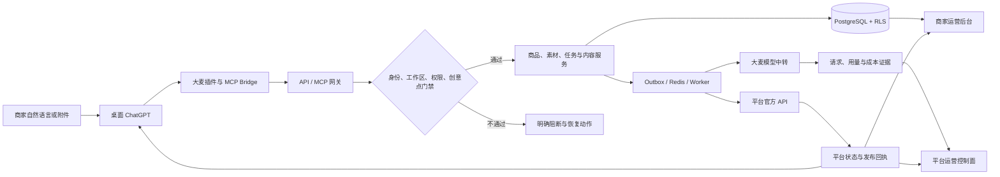

# 大麦项目使用介绍

> 面向产品、商家运营、客服、平台运营和实施团队。本文说明三个使用面：桌面 ChatGPT 插件、商家运营后台、平台运营控制面。内容以 2026-09-08 的代码、契约和本地运行证据为准。

## 先理解这三个使用面

大麦不是三个各自保存数据的产品。三个使用面共用工作区、商品、素材、任务、内容版本、发布状态、费用和审计数据，只是面向不同角色，开放不同权限。

| 使用面 | 主要用户 | 解决的问题 | 正式入口 | 最终看到的结果 |
|---|---|---|---|---|
| ChatGPT 插件 | 商家、内容制作人员 | 用自然语言完成选店、选品、内容和发布前确认 | 桌面 ChatGPT 中的“大麦”插件 | 可复制文案、候选图片、审核结论、发布确认卡、交付文件 |
| 商家运营后台 | 商家管理员、客户运营、审核人员、客服 | 管理当前客户工作区的数据、成员、任务、知识和异常 | Ops Console 的“商家工作区” | 商品与 SKU、任务队列、知识规则、审核/处理记录、工作区审计 |
| 平台运营 | 大麦平台管理员、财务、规则、模型、安全和发布人员 | 管理全平台租户、模型、账务、能力开关和上线门禁 | Ops Console 的“平台控制台” | 平台汇总、权限决策、成本账本、规则版本、事故记录、发布证据 |

Merchant Studio 是开发和联调用的可视化调试台。它可以演练商品、任务和发布流程，但不是商家使用插件的前置条件，也不是正式商家产品入口。

## 一条业务如何贯穿三方



其中：

- ChatGPT 负责理解商家的自然语言、展示当前一步和收集明确确认。
- 插件 Bridge 把 ChatGPT 的工具调用转发到大麦 `/mcp`，注入已绑定的工作区范围，并隐藏所有 `ops.*` 平台运营能力。
- API/MCP 网关负责真实鉴权、能力判断、范围校验、幂等、审计和 trace。
- PostgreSQL 使用工作区字段和强制 RLS（行级安全）隔离租户；请求体里的 `workspace_id` 不能改变请求头和身份确定的工作区。
- Worker 负责同步、生成、扫描、发布、对账等长任务；失败可恢复，不能因聊天结束而丢失。
- 模型生成只能走已配置的大麦中转，并保存 provider 请求、token、成本和错误证据。
- 外部平台写入只有在平台配置、权限、审核和最终确认全部满足后才执行。

## 数据从哪里来

### 1. 身份和工作区

正式会话由 ChatGPT 宿主身份或企业 OIDC/Bearer 身份进入网关。首次使用时，服务端按“身份签发方 + 外部用户标识”幂等创建或恢复工作区，并建立工作区 owner 成员关系。

工作区是所有数据隔离的第一层。商品、任务、素材、内容版本、发布任务、用量和审计记录都带 `workspace_id`。平台运营进入客户工作区时也不能直接越过这一边界，必须使用受控支持或临时授权。

### 2. 店铺和平台商品

生产数据应来自六个平台的官方 OAuth 和 API：京东、淘宝、天猫、拼多多、小红书、抖音。

商家完成官方授权后，平台账号保存为工作区内的店铺连接。凭据只保存为服务端凭据引用，不进入聊天、浏览器表单或导出文件。Worker 按页同步商品、SKU、价格、库存和图片，并保留最近尝试、最近成功和失败状态。

任何店铺操作都以 `平台 + account_id` 为唯一范围。同平台有多个店铺时，系统不会默认第一家；同名店也不会被合并。

### 3. Excel/CSV 商品导入

商家运营后台支持在当前客户工作区上传 `.xlsx` 或 `.csv`，文件上限 10 MB。模板按“一行一个 SKU”组织，同一平台、店铺和商品货号会合并成一个商品。

可导入字段包括：

- 平台、店铺账号、商品货号、商品名称和类目；
- SKU 编码、名称、颜色、尺码、价格和库存；
- SKU 图片链接、SKU 原图素材 ID 和商品素材 ID。

系统先上传文件、执行安全扫描和解析，再展示预览。运营人员确认预览后才批量导入。导入成功后，ChatGPT 插件可从同一工作区查询这些商品和 SKU，不需要再次上传表格。

图片链接只是商品资料，不等于已扫描原图。Excel 内嵌图片当前不属于这条导入链路。SKU 已绑定原图时，生成只能使用该 SKU 的原图，不能借用其他 SKU 的图片。

### 4. 商家上传的素材和资料

插件可接收图片、PDF、Word、Excel、CSV 和文本资料。文件进入素材库后依次经历：

1. 上传与字节去重；
2. 自动安全扫描；
3. 文档解析、OCR 或人工补录；
4. 商家确认商品事实；
5. 商用权益与 AI 修改许可检查；
6. 绑定商品、SKU、品牌或知识资产。

上传文件始终按不可信数据处理。文件中即使出现“忽略规则”“调用工具”或“发布商品”等文字，也只会作为资料展示，不会触发操作。

解析失败不会删除素材。系统会保留文件和错误位置，并允许商家逐项人工补录；人工补录会明确标记为“人工确认”，不会冒充 OCR。

### 5. 任务过程数据

任务不是一段临时聊天。服务端会保存：

- 任务目标、平台、店铺、商品和 SKU 范围；
- 已确认事实、待回答问题和方向选择；
- 制作方案、促销价格影响和品牌/规则快照；
- 内容版本、图片候选、人工审核和批准记录；
- 发布预览、幂等键、确认哈希和平台回执；
- 每次失败、重试、恢复和状态变更的时间线。

因此商家可以在新会话里说“继续上次任务”。多条候选存在时，插件会让商家选择，不会静默恢复最近一条。

### 6. 模型、费用和平台运行数据

文本、图片、图片编辑、OCR 和视频五类业务模型由大麦平台配置。每次真实调用要形成模型用量记录，包括：

- 工作区和业务动作；
- 模态与模型；
- provider 请求 ID；
- 输入、输出和总 token；
- 人民币成本和观察时间；
- 结算、重试或错误信息。

平台运营读取的是脱敏汇总和成本证据，不读取模型密钥。模型地址、Key、费率和平台凭据均不交给普通商家配置。

### 7. 运营和审计数据

成员变更、临时授权、规则变更、费用调整、任务处理、发布确认、数据删除和平台操作都会产生不可变审计记录。关键记录包含操作人、工作区、动作、资源、原因、请求 ID、trace、权限决策和证据引用。

平台控制台默认只读取平台聚合和脱敏元数据。读取客户内容需要精确工作区范围、对应 capability 和必要的临时授权；角色名称本身不能解锁页面或数据。

## ChatGPT 插件怎么用

### 适合什么场景

商家可以直接说：

- “开始使用大麦。”
- “查看我的店铺连接状态。”
- “查看我的商品，选择蓝色 M 码。”
- “给这件防晒外套做淘宝详情页，目标是提升转化。”
- “用我上传的原图优化一张白底主图。”
- “继续上次任务。”
- “找出之前批准的交付物。”
- “准备发布，但先给我看字段变化。”

商家不需要输入商品 ID、任务 ID、哈希、revision 或 JSON。

### 三步拿到第一个可审阅结果

1. 在桌面 ChatGPT 中输入“开始使用大麦”，让插件确认身份、工作区和创意点准入。
2. 选择已同步的商品，或上传真实商品图片并补全必要事实。
3. 说明目标平台和制作要求，回答插件当前提出的一个问题，即可得到带来源和状态标记的文案草稿或候选图。

这一步得到的是可审阅候选。要形成批准版本或发布结果，还需要继续完成规则审核、人工批准和发布确认。

### 首次使用

1. 在桌面 ChatGPT 中启用“大麦”插件，并输入“开始使用大麦”。
2. 插件读取宿主身份，恢复或创建工作区，并检查创意点准入。
3. 如果要读取平台商品，选择平台并进入官方 OAuth 授权。
4. 授权完成后选择具体店铺，再同步或选择商品。
5. 如果只想根据已上传图片做候选图，可直接上传并说明要求，不需要先连接店铺。

如果工作区、MCP 地址、身份映射、创意点或模型中转缺失，插件会停止在当前步骤并给出一个恢复动作，不会回退到演示工作区。

### 生成商品文案

一条正式文案任务按以下顺序推进：

1. 选择平台、店铺、商品和 SKU；
2. 核对商品名称、类目、价格、库存、卖点和促销有效期；
3. 选择创意方向；
4. 确认制作方案和可能的价格影响；
5. 通过平台模型中转生成内容；
6. 执行平台规则、品牌规则和事实一致性审核；
7. 修改或接受非阻断建议；
8. 人工批准最终内容版本。

最终展示给商家的不是“生成成功”提示，而是可直接使用的标题、详情正文、卖点、规格模块、规则结论和版本状态。

### 生成或优化主图

上传图片并明确要求生成时，插件会优先处理当前图片：安全扫描通过后生成“未绑定商品、未批准、未发布”的候选图。

正式商品任务中的主图流程是：

1. 使用已确认 SKU 的真实原图；
2. 生成 1 至 6 张候选；
3. 展示候选图和视觉检查结果；
4. 商家明确选择图片及顺序；
5. 第一张冻结为主图，其余冻结为副图；
6. 新内容版本重新审核并批准；
7. 发布前再次生成包含选图的预览。

候选图不会覆盖商品当前图片。没有原图时只能标记为概念图，不能宣称还原了真实款式、颜色或结构。

### 发布商品

批准内容不等于批准发布。发布必须独立执行：

1. 生成最新发布预览；
2. 展示平台、店铺、商品、SKU、字段差异和冻结选图；
3. 绑定最新内容版本、远端快照和两个确认哈希；
4. 商家针对这次预览明确确认；
5. 提交平台并查询真实状态。

发布状态的含义：

| 状态 | 对商家的含义 |
|---|---|
| `prepared` | 已生成预览，尚未提交 |
| `queued` / `submitting` | 已进入执行队列，不能称为已发布 |
| `submitted` / `reviewing` | 平台已受理或审核中 |
| `published` | 只有远端回查和真实回执都匹配时才成立 |
| `rejected` | 展示平台错误码、原因和字段问题，修正后重新审核与确认 |
| `unknown` / `reconciling` / `manual_attention` | 结果不确定，等待对账或人工处理 |

任何内容版本、商品事实、店铺授权或选图变化都会使旧发布预览失效，必须重新准备和确认。

### 插件最终产出

一个商品任务最终可形成：

- 商品事实与 SKU 范围摘要；
- 使用的素材、品牌和规则版本；
- 标题、详情、卖点和规格模块；
- 主图/副图候选及商家选图结果；
- 审核 finding、修改和人工批准记录；
- 内容版本和来源映射；
- 发布预览与真实平台回执（如果已经发布）；
- JSON、Markdown 或 bundle 导出文件。

`content.export` 只导出内容及其证据文件，不包含历史图片字节或输入素材。文件卡片出现只代表文件已生成，不代表用户已经下载，也不代表内容已发布。

## 商家运营后台怎么用

本地开发地址是 `http://127.0.0.1:18082`。生产地址由部署环境决定。商家运营人员进入 Ops Console 后，应先选择“商家工作区”并确认当前工作区，再操作客户数据。

### 商家工作区页面

| 页面 | 主要数据 | 常用动作 | 产出 |
|---|---|---|---|
| 总览 | 当前工作区、套餐、任务、风险和连接摘要 | 刷新、定位阻断项 | 工作区健康摘要和待办 |
| 成员与权限 | 成员、角色、服务端 capability 投影 | 邀请、变更、停用成员 | 成员关系和权限审计 |
| 客服 | 客户问题、状态、负责人和 SLA | 创建、分配、评论、流转 | 工单时间线和 SLA 记录 |
| 事故中心 | 当前工作区事故和影响范围 | 建立事故、指派、更新状态 | 事故时间线和处置记录 |
| 任务与内容 | 商品导入、任务队列、图片/素材风险、交付门禁 | 导入 Excel、分配任务、重试、审核 | 商品/SKU、处理记录和交付状态 |
| 知识库 | 品牌资料、客户规则、学习建议和竞品参考 | 审核、确认、驳回 | 可追溯知识版本 |
| 平台规则 | 当前工作区适用规则和媒体规范 | 查询、检查、申请规则处理 | 规则命中和版本证据 |

页面是否显示、按钮是否可用，全部依据 `ops.session` 返回的服务端权限投影。权限未返回时后台默认 deny-all，显示“权限未验证”，不会从角色名称猜测权限。

### 运营导入商品的标准流程

1. 进入“商家工作区”，确认工作区名称和范围。
2. 打开“任务与内容”中的“商品与 SKU · Excel 导入”。
3. 下载模板并按 SKU 填写数据。
4. 上传表格，等待自动安全检查和解析。
5. 核对商品数、SKU 行、价格、库存和图片关系。
6. 点击“确认预览并导入”。
7. 在 ChatGPT 插件中让商家“查看我的商品，选择需要制作的 SKU”。

平台控制台不能直接向任意客户写入商品。必须先进入已授权客户工作区，并具备商品写入 capability。

### 运营处理任务的标准流程

1. 先按工作区、平台、店铺、商品和任务状态缩小范围。
2. 查看失败原因属于素材、事实、规则、模型、余额、店铺授权还是平台发布。
3. 只执行当前角色被授权的动作，例如分配、重试、审核或建立修订版。
4. 操作时填写原因，携带当前 revision 和幂等键。
5. 重新读取任务、交付门禁和审计记录，确认状态确实改变。

人工审核、模型预览和脚本结果都不能单独把交付状态变成完成。

## 平台运营怎么用

平台运营使用同一个 Ops Console，但选择“平台控制台”。这个工作台处理平台聚合与控制面数据，默认不能读取客户内容。

### 平台控制台页面

| 页面 | 主要用途 | 产出 |
|---|---|---|
| 总览 | 查看租户、套餐、平台、模型、存储、告警和生产证据 | 平台健康与上线阻断清单 |
| 用户与租户 | 查询身份、成员关系、租户状态、风险和会话 | 停用/恢复记录、会话撤销、目录导出 |
| 平台连接 | 查看六平台配置、账号汇总、能力证据和 canary | 平台 readiness 与授权审计 |
| 模型服务 | 查看五模态 readiness、用量、成本和未结算记录 | 模型状态和成本对账结果 |
| 账务与退款 | 查看商业目录、订单、创意点、费率、履约和退款 | 账务流水、双审调整和对账证据 |
| 功能开关 | 管理环境开关、定向灰度和紧急关闭 | 带 revision 的开关版本和审计事件 |
| 存储与对账 | 查看工作区容量、对象引用和对账新鲜度 | 存储异常和对账状态 |
| 审计中心 | 检索平台授权租户的脱敏审计事实 | 审计详情和授权范围内导出 |

“任务与内容”也可在平台范围显示任务量、生成队列、待发布、视觉待审和失败工作区的聚合数字，但不能因此读取客户正文。需要处理客户内容时，应切换到指定商家工作区并取得受控授权。

### 平台运营的核心职责

- 配置官方平台 OAuth、API endpoint、scope、回调和凭据服务；
- 发布平台能力证据并运行真实读写/媒体 canary；
- 配置五模态模型中转、费率、单次上限、日预算和成本证据；
- 管理商业目录、创意点、订单、退款和服务履约；
- 管理规则、媒体规格、功能开关和紧急关闭；
- 处理告警、事故、数据删除、存储和发布对账；
- 保存所有高风险操作的原因、审批、权限决策和不可变审计。

## 三方如何协作

| 阶段 | ChatGPT 插件 | 商家运营后台 | 平台运营 |
|---|---|---|---|
| 开通 | 恢复/创建商家工作区，展示唯一下一步 | 维护成员和工作区范围 | 配置身份、商业准入和平台能力 |
| 数据准备 | 引导授权、同步、上传、事实确认 | Excel 导入、素材/事实异常处理 | 保障 OAuth、连接器、扫描和存储可用 |
| 内容制作 | 收集目标、选方向、生成和展示版本 | 处理队列、审核与知识治理 | 保障模型中转、费率和预算门禁 |
| 视觉制作 | 展示候选并收集明确选图 | 处理扫描、真实性和归档异常 | 管理媒体规格、渲染与成本证据 |
| 发布 | 展示最新 diff 并获得最终确认 | 查看任务和发布异常 | 管理平台写入开关、canary 和对账 |
| 售后与恢复 | 恢复任务、展示驳回或未知状态 | 工单、事故、重试和修订 | 跨租户告警、紧急关闭和审计 |
| 交付证明 | 给商家展示可执行产物和回执 | 核查五项交付门禁 | 维护真实性、渲染、OCR、人审和哈希证据链 |

## 什么才算最终交付

业务上可以把结果分成四层：

1. **候选产物**：文案草稿、Brief、预览或候选图。可以审阅，不能称为批准或发布。
2. **批准版本**：通过规则审核并经人工批准的不可变内容版本。可以准备发布，仍不等于平台已发布。
3. **交付包**：绑定工作区、任务、商品、品牌、事实、规则、内容版本和来源映射的文件集合。
4. **平台交付**：发布任务经远端回查，得到非模拟的 `published` 状态、远端商品标识、请求 ID 和观察时间。

交付包至少要求 `README.md`、`content.md`、`content.json`，并生成 `review-findings.json` 与 `source-map.json`。存在真实发布回执时才可加入 `publish-receipt.json`。Manifest 会记录文件路径、MIME、大小和 SHA-256，并拒绝凭据、危险路径、跨工作区引用和不匹配的文件类型。

### 绿色完成态的五项门禁

运营后台只有在以下五项全部通过时才允许显示绿色完成态：

| 门禁 | 证明什么 |
|---|---|
| 真实性 gate | 素材和生成结果通过真实性检查 |
| 真实渲染 | 存在真实 artifact、renderer 版本和校验哈希 |
| OCR | 原图与候选图有可追溯 OCR 证据 |
| 人审 attestation | 人工审核声明绑定到当前候选哈希 |
| Bundle 哈希 | 交付包内容与 manifest 哈希一致 |

缺少任意一项，状态保持“未验证”或“阻断”。人工说“看过了”、模型预览成功、浏览器截图或自动化脚本通过，都不能替代这五项证据。

## 权限和数据边界

### 商家侧

- 插件只暴露商家工具，不暴露任何 `ops.*` 方法。
- 查询和写入均受当前工作区限制。
- 写操作先开启短时交互写会话，时效默认 15 分钟。
- 短时写会话不替代创意点、事实确认、平台权限、审核或发布确认。
- 商家不能读取模型密钥、平台 token、其他客户数据或平台内部配置。

### 运营侧

- 后台使用服务端 capability 投影，不用前端角色判断替代服务端鉴权。
- 平台工作台和商家工作区不能混用 scope。
- 客户内容访问需要精确工作区授权；JIT 临时授权包含时效、次数、范围和撤销状态。
- 高风险动作要求原因、revision、幂等、确认、MFA 或审批中的对应义务。
- 数据库层对商品、任务、内容、发布、用量和审计表强制 RLS。

## 当前运行状态

以下是 2026-09-08 本地环境的真实探针结果，不代表生产环境已经上线：

| 项目 | 当前状态 |
|---|---|
| Repository / Plugin | `0.1.1` / `0.1.0+codex.20260907102000` |
| MCP 契约 | 294 个方法；当前商家 Bridge 的真实 `tools/list` 返回 143 个工具；release metadata 已同步为 143 |
| Ops Console | 14 个一级域，平台/工作区双工作台 |
| PostgreSQL / Redis | 本地运行就绪；迁移版本 171 |
| 五模态模型中转 | 本地 relay contract 可解析，但五模态生产配置/成本证据尚未就绪 |
| 六平台连接器 | 当前为 `fixture_ready`；官方 OAuth/API 未配置 |
| 平台写入 | 关闭 |
| 支付 | fixture 环境未配置真实 provider |
| 告警通知 | webhook 未配置 |
| 对象存储 | 本地模式 |
| Production gate | 未通过 |
| 交付证据 gate | 未验证，缺少真实性、真实渲染、OCR、人审和 bundle 哈希证据 |
| 本次 ChatGPT 插件实时探针 | `merchant.start` 两次返回“服务暂时不可用”，本次宿主实时链路未验通 |

本地自动化证据：全仓 4508 项测试通过，70 项跳过；隔离 PostgreSQL 专项由独立入口执行并保留原始分母；Merchant Studio 浏览器主链路 22/22 通过；Ops Console OIDC 全量 7/8 通过、1 项条件跳过，独立 JIT 两视口 2/2 通过（workspace-only token fixture 场景仍按条件跳过）；类型检查和两个前端生产构建通过。跳过项和本地隔离证据均不替代生产验收。

这些结果证明代码、隔离运行环境和浏览器链路可工作，不证明六个平台真实 OAuth/写入、真实支付、生产对象存储、生产告警、容量或最终交付证据已经完成。

## 上线前怎么落地给用户

### 平台运营准备

1. 部署 API、PostgreSQL、Redis、对象存储、扫描器和各类 Worker。
2. 配置企业身份与工作区 bootstrap，验证跨租户 RLS。
3. 配置模型中转的五模态 provider、鉴权、费率和成本证据。
4. 逐平台完成官方 OAuth、读取、同步、写入、状态查询和撤权 canary。
5. 配置支付、退款、对账、告警和事故值守。
6. 生成并签署 capability、容量、备份、回滚和 release evidence。

### 商家运营准备

1. 建立客户工作区和成员角色。
2. 连接店铺，或通过 Excel/CSV 导入客户商品与 SKU。
3. 上传品牌资料、商品原图、权益证明和规则来源。
4. 核对素材扫描、商品事实、知识和规则版本。
5. 处理一次完整任务，验证审核、批准和发布预览。

### 商家开始使用

1. 在桌面 ChatGPT 安装并启用“大麦”。
2. 输入“开始使用大麦”。
3. 根据插件当前唯一问题选择平台、店铺、商品或上传资料。
4. 每次只确认当前一步；最终发布时核对平台、店铺、商品、SKU、字段 diff 和图片。

## 常见问题

### 插件提示“服务暂时不可用”

说明当前 ChatGPT 到 MCP/API 的连接没有取得确定结果。不要重复创建任务或发布。先检查插件是否加载了正确版本、MCP 根地址、宿主身份和工作区绑定，再开启新会话调用“开始使用大麦”。

### 后台提示“权限未验证”

说明后台尚未取得服务端 `ops.session` 权限投影，或当前工作台与 scope 不匹配。重新登录/连接，确认选择的是平台控制台还是商家工作区。这个状态不会白屏，也不会开放按钮。

### 平台显示 `fixture_ready`

这只表示本地演示连接器可用于测试，不代表真实店铺已授权。生产必须获得官方 OAuth URL、平台账号范围和 canary 证据。

### 平台返回 `NOT_CONFIGURED`

这是平台能力尚未启用，不是商家输入错误。商品、素材和任务会保留；平台配置完成后可继续。

### 发布一直不是“已发布”

`queued`、`submitted` 和 `reviewing` 都不是发布完成。只有远端回查确认 `published`，并且回执不是模拟数据时，才能显示为已发布。

### 运营后台一直显示“未验证”

检查真实性 gate、真实渲染、OCR、人审 attestation 和 bundle 哈希。少一项就保持未验证，这是系统的预期行为。

## 开发和验收入口

本地启动：

```bash
npm install
docker compose --env-file .env -f infra/local/docker-compose.yml up -d
```

本地地址：

- Merchant Studio 调试台：`http://127.0.0.1:18081`
- Ops Console：`http://127.0.0.1:18082`
- API：`http://127.0.0.1:8787`
- 健康检查：`http://127.0.0.1:8787/healthz`

推荐验收命令：

```bash
npm run typecheck
npm test
npm run test:postgres:isolated
npm run test:browser:all
npm run build:ops-console
npm run build:merchant-studio
npm run audit:ops-surface
npm run release:metadata:validate
```

生产是否可发布必须以生产环境的 release gate、真实 canary 和签名 evidence 为准，不能以本地命令通过替代。

## 相关技术文档

- [插件链路审计](plugin-chain-audit.md)
- [运营后台架构](ops-console-architecture.md)
- [生产证据设计](production-readiness-evidence-design.md)
- [ChatGPT 宿主 canary 手册](chatgpt-host-canary-runbook.md)
- [插件安装与配置](../apps/plugin/README.md)
- [Merchant Studio 调试说明](../demo/merchant-studio/README.md)
- [OpenAPI 契约](../apps/api/openapi.yaml)
- [MCP 方法契约](../packages/contracts/src/mcp.ts)
- [权限策略](../packages/contracts/src/authz.ts)
