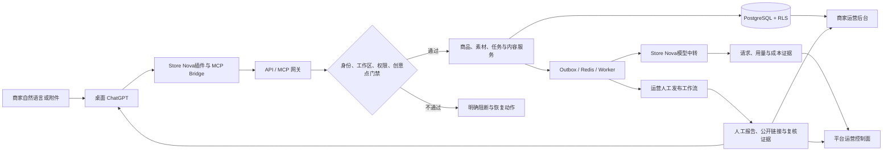

# Store Nova项目使用介绍

Store Nova 是面向电商商家的商品营销内容工作流：商家在桌面 ChatGPT 中提交商品资料、图片或公开链接，制作文案、商品视觉和视频脚本等候选，经审核后导出；运营后台管理商家工作区、人工导入资料、业务权限、规则与账务。它主要解决商品资料整理、内容生产和审核交接分散的问题。当前六平台店铺同步与自动发布不属于商家工作流，发布由运营在官方商家后台人工完成并回填。

模型中转、支付、对象存储和安全扫描等生产依赖已有真实配置或调用证据；应按对应环境、版本、模态和流程理解验收范围。历史单次成功、依赖健康或某个服务已配置，不单独证明当前候选的完整业务链路已验收。

> 面向产品、商家运营、客服、平台运营和实施团队。本文说明三个使用面：桌面 ChatGPT 插件、商家运营后台、平台运营控制面。商业套餐部分以 2026-10-05 候选代码与冻结需求为准；历史运行结果保留其原日期，不代表新候选通过验收。

> **当前产品基线**：登录与开通流程以 [《Store Nova商家营销平台产品总文档》](store-nova-product-master-document.md) v2.0 为准。本文中的 OIDC/Bearer 是历史实现或服务端协议背景；商家正常登录仍为 Store Nova 账号密码。新开户使用授权运营创建的一次性激活邀请，由客户自行设密，账号激活不代表商业开通或已发权益。向量知识库仍按当前生产证据判定。

## 先理解这三个使用面

Store Nova不是三个各自保存数据的产品。三个使用面共用工作区、商品、素材、任务、内容版本、发布状态、费用和审计数据，只是面向不同角色，开放不同权限。

| 使用面 | 主要用户 | 解决的问题 | 正式入口 | 最终看到的结果 |
|---|---|---|---|---|
| ChatGPT 插件 | 商家、内容制作人员 | 用自然语言完成选店、选品、内容和发布前确认 | 桌面 ChatGPT 中的“Store Nova”插件 | 可复制文案、候选图片、审核结论、发布确认卡、交付文件 |
| 商家运营后台 | 商家管理员、客户运营、审核人员、客服 | 管理当前客户工作区的数据、成员、任务、知识和异常 | Ops Console 的“商家工作区” | 商品与 SKU、任务队列、知识规则、审核/处理记录、工作区审计 |
| 平台运营 | Store Nova平台管理员、财务、规则、模型、安全和发布人员 | 管理全平台租户、模型、账务、能力开关和上线门禁 | Ops Console 的“平台控制台” | 平台汇总、权限决策、成本账本、规则版本、事故记录、发布证据 |

Merchant Studio 由 `demo/merchant-studio` 构建为商家 Web 使用面，与插件共享当前企业事实；2026-10-05 候选已加入商业通知与购买中心，但这些页面的真实部署及付款/授予仍须验收。它不是安装插件的前置条件，不将本地 fixture 页面当已交付正式商业能力。Ops Console 的商家工作区供获授权运营处理客户数据，普通商家不因此获得 Ops 权限。

## 一条业务如何贯穿三方


```mermaid
flowchart LR
    A[商家自然语言或附件] --> B[桌面 ChatGPT]
    B --> C[Store Nova插件与 MCP Bridge]
    C --> D[API / MCP 网关]
    D --> E{身份、工作区、权限、创意点门禁}
    E -->|通过| F[商品、素材、任务与内容服务]
    E -->|不通过| G[明确阻断与恢复动作]
    F --> H[(PostgreSQL + RLS)]
    F --> I[Outbox / Redis / Worker]
    I --> J[Store Nova模型中转]
    I --> K[运营人工发布工作流]
    J --> L[请求、用量与成本证据]
    K --> M[人工报告、公开链接与复核证据]
    H --> N[商家运营后台]
    L --> O[平台运营控制面]
    M --> B
    M --> N
    M --> O
```

其中：

- ChatGPT 负责理解商家的自然语言、展示当前一步和收集明确确认。
- 插件 Bridge 把 ChatGPT 的工具调用转发到Store Nova `/mcp`，注入已绑定的工作区范围，并隐藏所有 `ops.*` 平台运营能力。
- API/MCP 网关负责真实鉴权、能力判断、范围校验、幂等、审计和 trace。
- PostgreSQL 使用工作区字段和强制 RLS（行级安全）隔离租户；请求体里的 `workspace_id` 不能改变请求头和身份确定的工作区。
- Worker 负责导入、生成、扫描、交付和对账等长任务；失败可恢复，不能因聊天结束而丢失。
- 模型生成只能走已配置的Store Nova中转，并保存 provider 请求、token、成本和错误证据。
- 当前版本不连接六平台店铺 OAuth，也不自动写入外部平台。运营人员在官方商家后台人工发布并回填结果；人工记录始终标记为未获官方 API 验证。

## 数据从哪里来

### 1. 身份和工作区

当前正式会话采用桌面本地模式：Ops Console 使用 Store Nova 账号密码登录；商家通过本地插件登录 CLI 输入 Store Nova 账号密码并绑定管理员分配的工作区，取得受限短期凭据后由 stdio bridge 通过 HTTPS 调用 MCP。项目不采用 ChatGPT 云端远程 OAuth 或公开/团队插件市场链路。

工作区是所有数据隔离的第一层。商品、任务、素材、内容版本、发布任务、用量和审计记录都带 `workspace_id`。平台运营进入客户工作区时也不能直接越过这一边界，必须使用受控支持或临时授权。

#### 企业、工作区和用户的边界

当前版本采用“一家商家企业对应一个工作区”的租户模型：

| 标识 | 当前职责 | 是否用于业务数据隔离 |
|---|---|---|
| `workspace_id` | 商家企业/租户的安全边界 | 是，商品、SKU、知识库、素材、账单、创意点、任务和审计均按此隔离 |
| `identity_id` | 登录用户身份 | 否，只用于认证、会话、风险和身份生命周期 |
| `workspace_members` | 用户与工作区的成员关系 | 用于角色、成员状态和权限，不替代租户边界 |
| `enterprise_name` | 开通时记录的企业名称 | 否，仅用于展示和运营识别，不得用于授权或 RLS |

同一个用户可以被授权到多个工作区；请求必须同时满足“登录身份有效”和“当前 `workspace_id` 在该身份授权范围内”。因此，同一用户在企业 A 和企业 B 中看到的是两套相互隔离的数据。请求体或前端参数中的 `workspace_id` 不能覆盖认证上下文和数据库 RLS。

当前数据库尚未建立独立的 `enterprise_id` 主表。如果未来支持“一家企业多个工作区、统一企业账单或跨工作区知识共享”，需要新增企业主表并建立 `enterprise_id → workspace_id → identity_id/membership` 层级；在该模型上线前，不得把 `enterprise_name` 或用户 ID 当作企业隔离键。

### 2. 店铺和平台商品

当前版本的数据来自无需登录的公开商品链接，或商家提供的 Excel、CSV、JSON、图片、PDF、说明书及书面确认。平台运营为指定商家建立不含密码、Cookie、验证码或 token 的人工店铺记录，再把资料导入对应工作区。

商品、价格和库存都是带来源与采集时间的快照，不是平台实时同步数据。六平台官方 OAuth、自动同步和自动发布属于未来可选集成，不是当前版本上线条件。具体人工流程见[六平台人工运营替代操作手册](manual-six-platform-operations.md)。

任何店铺操作都以 `平台 + account_id` 为唯一范围。同平台有多个店铺时，系统不会默认第一家；同名店也不会被合并。

### 3. Excel/CSV 商品导入

商家运营后台支持在当前客户工作区上传 `.xlsx` 或 `.csv`，文件上限 10 MB。模板按“一行一个 SKU”组织，同一平台、店铺和商品货号会合并成一个商品。

可导入字段包括：

- 平台、店铺账号、商品货号、商品名称和类目；
- SKU 编码、名称、颜色、尺码、价格和库存；
- SKU 图片链接、SKU 原图素材 ID 和商品素材 ID。

系统先上传文件、执行安全扫描和解析，再展示预览。运营人员确认预览后才批量导入。导入成功后，ChatGPT 插件可从同一工作区查询这些商品和 SKU，不需要再次上传表格。

图片链接只是商品资料，不等于已扫描原图。Excel 内嵌图片当前不属于这条导入链路。SKU 已绑定原图时，生成只能使用该 SKU 的原图，不能借用其他 SKU 的图片。

### 4. 商家上传的素材和资料

插件可接收图片、PDF、Word、Excel、CSV 和文本资料。文件进入素材库后依次经历：

1. 上传与字节去重；
2. 自动安全扫描；
3. 文档解析、OCR 或人工补录；
4. 商家确认商品事实；
5. 商用权益与 AI 修改许可检查；
6. 绑定商品、SKU、品牌或知识资产。

上传文件始终按不可信数据处理。文件中即使出现“忽略规则”“调用工具”或“发布商品”等文字，也只会作为资料展示，不会触发操作。

解析失败不会删除素材。系统会保留文件和错误位置，并允许商家逐项人工补录；人工补录会明确标记为“人工确认”，不会冒充 OCR。

### 5. 任务过程数据

任务不是一段临时聊天。服务端会保存：

- 任务目标、平台、店铺、商品和 SKU 范围；
- 已确认事实、待回答问题和方向选择；
- 制作方案、促销价格影响和品牌/规则快照；
- 内容版本、图片候选、人工审核和批准记录；
- 发布预览、幂等键、确认哈希和平台回执；
- 每次失败、重试、恢复和状态变更的时间线。

因此商家可以在新会话里说“继续上次任务”。多条候选存在时，插件会让商家选择，不会静默恢复最近一条。

### 6. 模型、费用和平台运行数据

文本、图片、图片编辑、OCR 和视频五类业务模型由Store Nova平台配置。每次真实调用要形成模型用量记录，包括：

- 工作区和业务动作；
- 模态与模型；
- provider 请求 ID；
- 输入、输出和总 token；
- 人民币成本和观察时间；
- 结算、重试或错误信息。

平台运营读取的是脱敏汇总和成本证据，不读取模型密钥。模型地址、Key、费率和平台凭据均不交给普通商家配置。

### 7. 运营和审计数据

成员变更、临时授权、规则变更、费用调整、任务处理、发布确认、数据删除和平台操作都会产生不可变审计记录。关键记录包含操作人、工作区、动作、资源、原因、请求 ID、trace、权限决策和证据引用。

平台控制台默认只读取平台聚合和脱敏元数据。读取客户内容需要精确工作区范围、对应 capability 和必要的临时授权；角色名称本身不能解锁页面或数据。

## ChatGPT 插件怎么用

### 适合什么场景

商家可以直接说：

- “开始使用Store Nova。”
- “查看我的店铺连接状态。”
- “查看我的商品，选择蓝色 M 码。”
- “给这件防晒外套做淘宝详情页，目标是提升转化。”
- “用我上传的原图优化一张白底主图。”
- “继续上次任务。”
- “找出之前批准的交付物。”

商家不需要输入商品 ID、任务 ID、哈希、revision 或 JSON。

“准备发布，但先给我看字段变化”这一类发布前确认在当前上线档不可用，原因见下文“发布商品”。

### 开始之前：三个硬前置条件

插件可以完成很多只读和准备工作，但**几乎所有业务动作都必须同时满足下面第 1、2 项（包括插件入口 `merchant.start` 本身）**；**第 3 项只在需要素材的图片链路上成立**（纯文案链路不经过扫描器）。缺任何一项都会被服务端直接拒绝——这是阻断，不是提示。前两项由服务端商业准入门禁统一执行（`packages/application/src/commercial-access-service.ts`），第 3 项由图片链路的素材门禁执行（`apps/api/src/server.ts` 的 `requireApprovedAssetForImageGeneration()`）。

| 前置条件 | 谁负责 | 未满足时返回的确切错误码 |
|---|---|---|
| 创意点余额**已知**且大于 0 | 商家从商家后台购买创意点包或月付套餐 | `CREATIVE_POINTS_UNAVAILABLE`（503，工作区没有任何点数状态记录，余额**未知**——全新工作区就是这个状态，既不是 0 也不是已购）；`CREATIVE_POINTS_EXHAUSTED`（402，余额为 0）；`CREATIVE_POINTS_INSUFFICIENT`（402，余额不足本次报价） |
| 有效的月付套餐权益 | 商家购买当前上架的批准套餐版本，真实到账及依赖满足后写入权益快照 | `COMMERCIAL_ENTITLEMENT_REQUIRED`（402） |
| 生产素材扫描器已配置 | 平台运营（`ASSET_SCANNER_MODE=clamav_worker` + 签名扫描回执） | `IMAGE_SOURCE_ASSET_INVALID`（409，素材未通过扫描）；`GENERATED_IMAGE_SCAN_REQUIRED`（409，生成结果仍在隔离区） |

最容易误解的是「同时成立」的范围：点数与套餐权益对每一个业务动作都成立，扫描器只对需要素材的图片链路成立——但只要走图片链路，三项就同样没有例外：

- **只买创意点包不能替代主套餐。** 点包只授予批准点数批次，不产生持续功能权限或后台角色；生成必须同时有当前有效主套餐及相应功能授权。未来待生效合同及其点数不能提前消费。
- **只买套餐也可能点数为 0**，此时仍是 402。
- **扫描器没配好，素材永远停在隔离区**，再多点数也无法生成。

余额为 0 时，除身份/状态、下单、余额与流水、**商业目录**（`commercial.catalog.get`，即可售点包与套餐的价格）、导出等恢复类方法外，**其余业务方法一律返回 402 `CREATIVE_POINTS_EXHAUSTED`**；零余额判断先于操作分类，与操作类型无关（`packages/application/src/commercial-access-service.ts` 的 `CommercialAccessService.decide()` 中 `available_points === 0` 分支）。

> 注意两个“目录”不是一回事：`commercial.catalog.get` 是**商业目录**（`RECOVERY_CONTROL`，零余额仍可用），而 `catalog.search`、`catalog.categories` 是**商品检索与类目**（`POINT_REQUIRED_NO_CHARGE`，零余额返回 402）。别把“目录可用”当成“商品类目也能读”。

**注意：“开始使用Store Nova”（`merchant.start`）也在这道门禁之内。** 它被归类为 `POINT_REQUIRED_NO_CHARGE`，必须同时有可用点数和套餐权益；余额为 0 返回 `CREATIVE_POINTS_EXHAUSTED`（402），余额未知返回 `CREATIVE_POINTS_UNAVAILABLE`（503），没有权益快照返回 `COMMERCIAL_ENTITLEMENT_REQUIRED`（402）（分类见 `packages/contracts/src/commercial-access.ts` 的 `COMMERCIAL_MCP_FOUNDATION_POLICIES`；逐条行为断言见 `apps/api/src/server.test.ts` 的 `central commercial access gate` 用例）。零余额工作区里真正还能读的第一入口是 `onboarding.status` 和 `workspace.health`。

> **交付前确认销售和支付模式**：目录必须是真正当前在售且批准、可执行的版本；服务器选择已批准线上通道或 `manual_transfer` 并冻结到订单。人工转账独立核验收款配置、银行流水和权限，未启用微信/支付宝不能单独阻断它。没有批准模式或收款核验配置缺失时禁止建单，不让商家反复付款。配置及完整流程见下文。

### 三步拿到第一个可审阅结果

1. 先让插件读取工作区与准入状态（“开始使用Store Nova”在余额为 0 或权益缺失时会直接返回 402/503，见上文；此时可改用 `onboarding.status` / `workspace.health` 读取状态）。
2. 选择一件已由运营导入的商品，或上传真实商品图片并补全必要事实。
3. 说明目标平台和制作要求，回答插件当前提出的一个问题，即可得到带来源和状态标记的文案草稿或候选图。

第 2、3 步只有在上面三个前置条件全部满足时才能走通。这一步得到的是可审阅候选，响应会明确标记 `candidateOnly=true`、`publishable=false`、`formalVersionCreated=false`。候选不会自动变成正式版本。

如果商家确认候选内容，应先准备一个已绑定店铺、商品事实已确认且制作方案已确认的任务，然后调用 `content.draft.confirm`，提交目标 `task_id`、候选内容的 `body_json`（JSON 对象）和可选确认原因。服务端会在同一工作区校验任务、商品事实和已确认方案，成功时创建一个 `review_required` 的正式内容版本，并返回 `formalVersionCreated=true`、`candidateOnly=false` 和版本 ID；这一步只完成绑定和进入审核，不代表已经批准或发布。缺少绑定、事实或方案时保持 fail-closed，并返回对应的 `STORE_ONBOARDING_REQUIRED`、`PRODUCT_FACTS_CONFIRMATION_REQUIRED` 或任务方案门禁错误。

正式版本创建后，按 `content.review` / `content.review.decide` 处理规则发现，必要时用 `content.modify` 生成修订，再用 `content.approve` 完成人工批准，最后调用 `content.export` 导出。任何一步返回阻断错误时，都必须保留错误码和 `next_actions` 作为阻断证据，不能把候选响应或文件卡片称为已批准、已发布。

### 首次使用

1. 在桌面 ChatGPT 中启用“Store Nova”插件，并输入“开始使用Store Nova”。
2. 插件读取宿主身份与管理员已分配、合法绑定的工作区，再检查创意点与套餐；缺绑定先按安装手册完成本地登录，不自建工作区或使用演示租户。
3. 当前上线档为 `manual`：**插件不连接六平台 OAuth，插件内也没有可用的“连接店铺/授权”步骤**。`platform.connect` 与 `platform.store.list` 已从商家工具面隐藏，调用会得到 `Unknown tool`（`apps/plugin/mcp/bridge.mjs` 的 `MERCHANT_HIDDEN_METHODS`）。要读取平台商品，需要平台运营先在运营后台为该商家建立人工店铺记录并导入商品资料，商家再从中选择。
4. 要使用商品同步、正式任务与发布能力，需要已绑定至少一个店铺；未绑定时这些方法返回 `STORE_ONBOARDING_REQUIRED`（428），响应里的 `next_actions` 会指向可执行的下一步（`apps/api/src/server.ts` 的 `requireStoreOnboarding()`）。
5. 如果只想根据已上传图片做候选图，**不需要先连接店铺**——`catalog.image.generate` 等创作入口在店铺边界之外（该文件中的 `STORE_BOUNDARY_EXEMPT_METHODS`）——但**仍必须**同时满足“有创意点余额 + 有月付套餐权益 + 生产扫描器已配置”，否则分别得到 `CREATIVE_POINTS_EXHAUSTED`（402）、`COMMERCIAL_ENTITLEMENT_REQUIRED`（402）或 `IMAGE_SOURCE_ASSET_INVALID`（409）。

如果工作区、MCP 地址、身份映射、创意点、套餐权益或模型中转缺失，插件会停止在当前步骤并给出一个恢复动作，不会回退到演示工作区。

### 生成商品文案

一条正式文案任务按以下顺序推进：

1. 选择平台、店铺、商品和 SKU；
2. 核对商品名称、类目、价格、库存、卖点和促销有效期；
3. 选择创意方向；
4. 确认制作方案和可能的价格影响；
5. 通过平台模型中转生成内容；
6. 执行平台规则、品牌规则和事实一致性审核；
7. 修改或接受非阻断建议；
8. 人工批准最终内容版本。

最终展示给商家的不是“生成成功”提示，而是可直接使用的标题、详情正文、卖点、规格模块、规则结论和版本状态。

### 生成或优化主图

上传图片并明确要求生成时，插件会优先处理当前图片。这条路径不需要先绑定店铺，但必须同时满足“创意点余额大于 0 + 有效月付套餐权益 + 素材已通过安全扫描”，否则分别得到 402、402 和 409（见上文“三个硬前置条件”）。

安全扫描在生产环境由服务端扫描 Worker 自动完成，配置为 `ASSET_SCANNER_MODE=clamav_worker`（就绪检查会要求 `asset_scanner_mode_must_be_clamav_worker`），只有拿到签名扫描回执并进入 `clean` 存储的素材才能用于生成。商家和运营人员都不需要、也不能提交扫描证据；素材未通过时生成请求在 `apps/api/src/server.ts` 的 `requireApprovedAssetForImageGeneration()` 直接返回 `IMAGE_SOURCE_ASSET_INVALID`（409）。全部通过后才会生成“未绑定商品、未批准、未发布”的候选图。

正式商品任务中的主图流程是：

1. 使用已确认 SKU 的真实原图；
2. 生成 1 至 6 张候选；
3. 展示候选图和视觉检查结果；
4. 商家明确选择图片及顺序；
5. 第一张冻结为主图，其余冻结为副图；
6. 新内容版本重新审核并批准；
7. 发布前再次生成包含选图的预览。

候选图不会覆盖商品当前图片。没有原图时只能标记为概念图，不能宣称还原了真实款式、颜色或结构。

### 发布商品

**当前上线档（`manual`）不由插件发布。** 插件的 `publish.prepare`、`publish.confirm`、`publish.get`、`publish.batch.*` 都是隐藏工具：它们不出现在 `tools/list` 中，调用会直接得到 `Unknown tool`（`apps/plugin/mcp/bridge.mjs` 的 `MERCHANT_HIDDEN_METHODS`）。当前档的发布由平台运营在官方商家后台人工完成并回填结果，人工记录始终标记为未获官方 API 验证。

下面是**未来 `official_api` 路线的目标流程**，不是当前可执行流程（因此也没有对应的当前错误码可查）：

1. 生成最新发布预览（目标工具 `publish.prepare`）；
2. 展示平台、店铺、商品、SKU、字段差异和冻结选图；
3. 绑定最新内容版本、远端快照和两个确认哈希；
4. 商家针对这次预览明确确认；
5. 提交平台并查询真实状态（目标工具 `publish.confirm` + 远端回查）。

发布状态的含义（用于描述运营回填的人工记录与未来 API 回执）：

| 状态 | 对商家的含义 |
|---|---|
| `prepared` | 已生成预览，尚未提交 |
| `queued` / `submitting` | 已进入执行队列，不能称为已发布 |
| `submitted` / `reviewing` | 平台已受理或审核中 |
| `published` | 只有远端回查和真实回执都匹配时才成立 |
| `rejected` | 展示平台错误码、原因和字段问题，修正后重新审核与确认 |
| `unknown` / `reconciling` / `manual_attention` | 结果不确定，等待对账或人工处理 |

`rejected` 一行之后的表项同样只描述状态机本身。当前档客户看不到 `publish.*` 工具，发布结果由平台运营在运营后台展示的人工发布记录体现。

任何内容版本、商品事实、店铺授权或选图变化都会使旧发布预览失效，必须重新准备和确认（目标流程约束）。

### 插件最终产出

一个商品任务最终可形成：

- 商品事实与 SKU 范围摘要；
- 使用的素材、品牌和规则版本；
- 标题、详情、卖点和规格模块；
- 主图/副图候选及商家选图结果；
- 审核 finding、修改和人工批准记录；
- 内容版本和来源映射；
- 发布预览（仅目标流程；当前档插件不提供）；
- JSON、Markdown 或 bundle 导出文件。

`content.export` 只导出内容及其证据文件，不包含历史图片字节或输入素材。文件卡片出现只代表文件已生成，不代表用户已经下载，也不代表内容已发布。

## 商家运营后台怎么用

本地开发地址是 `http://127.0.0.1:18082`。生产地址由部署环境决定。商家运营人员进入 Ops Console 后，应先选择“商家工作区”并确认当前工作区，再操作客户数据。

### 商家工作区页面

| 页面 | 主要数据 | 常用动作 | 产出 |
|---|---|---|---|
| 总览 | 当前工作区、套餐、任务、风险和连接摘要 | 刷新、定位阻断项 | 工作区健康摘要和待办 |
| 成员与权限 | 成员、角色、服务端 capability 投影 | 邀请、变更、停用成员 | 成员关系和权限审计 |
| 客服 | 客户问题、状态、负责人和 SLA | 创建、分配、评论、流转 | 工单时间线和 SLA 记录 |
| 事故中心 | 当前工作区事故和影响范围 | 建立事故、指派、更新状态 | 事故时间线和处置记录 |
| 任务与内容 | 商品导入、任务队列、图片/素材风险、交付门禁 | 导入 Excel、分配任务、重试、审核 | 商品/SKU、处理记录和交付状态 |
| 知识库 | 品牌资料、客户规则、学习建议和竞品参考 | 审核、确认、驳回 | 可追溯知识版本 |
| 平台规则 | 当前工作区适用规则和媒体规范 | 查询、检查、申请规则处理 | 规则命中和版本证据 |

页面是否显示、按钮是否可用，全部依据 `ops.session` 返回的服务端权限投影。权限未返回时后台默认 deny-all，显示“权限未验证”，不会从角色名称猜测权限。

### 运营导入商品的标准流程

1. 进入“商家工作区”，确认工作区名称和范围。
2. 打开“任务与内容”中的“商品与 SKU · Excel 导入”。
3. 下载模板并按 SKU 填写数据。
4. 上传表格，等待自动安全检查和解析。
5. 核对商品数、SKU 行、价格、库存和图片关系。
6. 点击“确认预览并导入”。
7. 在 ChatGPT 插件中让商家“查看我的商品，选择需要制作的 SKU”。

平台控制台不能直接向任意客户写入商品。必须先进入已授权客户工作区，并具备商品写入 capability。

### 运营处理任务的标准流程

1. 先按工作区、平台、店铺、商品和任务状态缩小范围。
2. 查看失败原因属于素材、事实、规则、模型、余额、店铺授权还是平台发布。
3. 只执行当前角色被授权的动作，例如分配、重试、审核或建立修订版。
4. 操作时填写原因，携带当前 revision 和幂等键。
5. 重新读取任务、交付门禁和审计记录，确认状态确实改变。

人工审核、模型预览和脚本结果都不能单独把交付状态变成完成。

## 平台运营怎么用

平台运营使用同一个 Ops Console，但选择“平台控制台”。这个工作台处理平台聚合与控制面数据，默认不能读取客户内容。

### 平台控制台页面

| 页面 | 主要用途 | 产出 |
|---|---|---|
| 总览 | 查看租户、套餐、平台、模型、存储、告警和生产证据 | 平台健康与上线阻断清单 |
| 用户与租户 | 查询身份、成员关系、租户状态、风险和会话 | 停用/恢复记录、会话撤销、目录导出 |
| 平台连接 | 查看六平台配置、账号汇总、能力证据和 canary | 平台 readiness 与授权审计 |
| 模型服务 | 查看五模态 readiness、用量、成本和未结算记录 | 模型状态和成本对账结果 |
| 账务与退款 | 查看商业目录、订单、创意点、费率、履约和退款 | 账务流水、双审调整和对账证据 |
| 存储与对账 | 查看工作区容量、对象引用和对账新鲜度 | 存储异常和对账状态 |
| 审计中心 | 检索平台授权租户的脱敏审计事实 | 审计详情和授权范围内导出 |

“任务与内容”也可在平台范围显示任务量、生成队列、待发布、视觉待审和失败工作区的聚合数字，但不能因此读取客户正文。需要处理客户内容时，应切换到指定商家工作区并取得受控授权。

### 平台运营的核心职责

- 配置官方平台 OAuth、API endpoint、scope、回调和凭据服务；
- 发布平台能力证据并运行真实读写/媒体 canary；
- 配置五模态模型中转、费率、单次上限、日预算和成本证据；
- 管理商业目录、创意点、订单、退款和服务履约；
- 管理规则和媒体规格；
- 处理告警、事故、数据删除、存储和发布对账；
- 保存所有高风险操作的原因、审批、权限决策和不可变审计。

## 套餐、权益包和运营代购（2026-10-05 候选）

商家 Web 候选的“通知”和“购买中心”位于 Merchant Studio；运营目录与代购位于 Ops Console 财务中心。桌面 ChatGPT 只使用本地安装的商家 MCP 工具，不暴露运营方法。

本节依据[冻结需求](../doc/todo/product/platform-package-and-benefit-management-prd-2026-10-05.md)和当前共享 schema。代码读取基线 `189135dba07232efddc1c310a0d77731256c904b`，包含本轮尚未提交的实施改动；插件 manifest 为 `0.1.0+codex.20261005113527`。这不是冻结发布候选或上线证明，正式验收应重新绑定最终 SHA、插件安装版本、数据库及证据。

### 商家：通知、首次购买和已购合同

1. 在合法 Workspace 中查看“通知”和当前在售商品；通知保存当时价格，打开详情重新读取当前销售版本。下架商品不能新购，旧订单/合同不因下架消失。
2. 初始开通费 5000 元不包含首期；基础/成长/尊享初始价为 2000/5000/10000 元每月，均可由授权运营按版本改价。尊享需完整额度审批，不把历史定制起价称为可售尊享。开通赠点初始为六个月每月 500 点，改开通价不自动改已售赠点计划。
3. 首次开通同时确认开通费与首期套餐两行及总额，联合结算创建关联订单；后者明确依赖开通资格。已有资格不重复收开通费。
4. 付款只使用本订单批准模式。银行转账核对服务器提供的收款资料和订单引用；实际到账、收款分配及全部依赖满足后才授予。截图、点击“已付款”或账号激活都不表示已开通。
5. 已购页分别显示当前合同、已付未来合同、历史合同和权益包来源。当前为空而未来存在时查看原合同和衔接处理，不直接误判从未购买；未来周期和未来批次点数未生效前不能使用。

### 商家：升级与权益包

升级先选择当前合同对应的更高等级套餐，再读取冻结报价：当前成交周期价、目标周期价、剩余有效期、差额、增量权益、原到期和报价截止。前端不自行算钱；确认时引用 `upgrade_quote_id`，旧客户端缺报价不能回退全价新购。原合同到期不延长，未来已付续期不被重写；并发变更/过期需要重新报价确认，零/负价差按批准政策处理。

权益包有套餐内含和独立销售两种；内含包不产生第二笔费用。当前独立销售复用 `point_pack`，其价格和有效期读取版本；存储/功能等扩展包没有已实现消费器时不能上架。点数包不授予主套餐或运营权限。套餐绑定包版本后，包改版不追溯修改旧订单。

### 运营：目录改价、开户与代购

在桌面平台财务中心的目录管理中，创建或基于指定版本编辑新草稿，填写价格、购买周期、功能、额度、包版本和必要政策；提交审批、批准后上架。保存草稿不改当前售价；下架只停止新购。未发布草稿可逻辑删除，被引用/已发布内容保留历史并归档。按钮由真实 capability 授权，角色名不能替代权限。

用户管理创建激活邀请后客户自行设密，不由运营收密码或手填“已付”授予。财务中心代购查询真实客户，明确选择身份及企业 Workspace，再读取当前目录/合同。首购使用联合两行预览；购买、续购、升级、点数包各用对应服务器预览，确认客户、版本、金额、周期、权益、依赖和截止后建单。普通运营不填写 nonce/hash。

收到银行款后核实收款账户、银行流水、付款方、金额、实际到账时间和证据，登记真实收款，再选择原订单分配。首购一笔合款可把开通费与首期加入联合分配，确认服务器全部明细后事务提交；不得因单条成功报整个首购完成。部分到账、立即生效、未来待生效、待依赖和待处置分别以原订单/授予事实确认。

可用余款不是钱包，也不自动抵扣新售价。未分配款返还原付款方需申请、独立审批和真实返款结果；外部未知保持冻结并查询原意图，不另转第二笔。已付订单退款使用其来源和批准政策，不能扣其他订单、未来批次或其他来源点数。

### 失败、版本与首次求助

| 情况 | 处理与责任人 |
|---|---|
| 配置缺失/503 | 保留原输入，查看 blockers；安装负责人补本地连接，平台管理员补仓储/支付/模型。存在未知提交先查询原请求，不让商家重付 |
| 动作无权/401/403 | 重新核对身份及企业范围；保留获授权读入口，管理员调整真实权限，不改前端开关 |
| 字段非法 | 根据字段错误修正并保留其他输入；金额使用整数分，周期/权益按服务器定义 |
| 版本/revision/报价冲突 | 刷新实际在售版本、客户及当前合同，重新预览或报价，重新确认 |
| 订单/报价/首购结果未知 | 当前 Workspace 与创建者查询原 `*.request.get`；null/未核实保持待确认，禁止换键再建单或重付 |
| 收款/返款结果未知 | 保留原意图及冻结，读取原收款、订单、返款事实交对账负责人；现有现金界面不会依据余额变化自动解锁 |
| 旧插件/未知契约版本 | 按安装手册更新同一批准包、重启并新会话验工具；不手改缓存，不把无报价升级改成普通全价购买 |

首次目录或建单前受阻且没有订单/任务/工单，也可通过已配置的项目内商家支持登记求助；不要求订单或任务 ID。`commercial.subscription.get.support_handoff` 在支持仓储配置时返回 `status=available`、`entry_path=/v1/support/requests`、`method=POST`；没有仓储则 blocked、`support_project_entry_not_configured`，负责人“平台运营支持”。界面必须以真实投影决定可用，不虚构入口。

登记填写问题标题、说明、原幂等键，可附脱敏 request_id/trace_id、版本和失败步骤。企业、账号及 customerId 来自已登录 active 成员，不由商家输入身份范围。`POST /v1/support/requests` 实际创建工单后才返回 `submitted=true`、ticket_id/ticket_number 和 replies_path；`GET /v1/support/requests/{ticket_id}` 只返回当前企业且属于当前账号的工单和客户可见回复。登记结果未知保留同键同内容重试取得原真实 receipt，不能另建第二个工单；同键不同内容拒绝。支持人员沿既有工单机制处理，不向商家开放 Ops 创建权限。

request_id 不能授权查询他人记录；不提交密码/token/完整付款凭证，服务器还会脱敏已识别凭据。支持仓储未配置时列待补项、安装/运营负责人，并明确“当前未提交”；查询旧回复也不等于新问题已提交。该专属 HTTP 支持路径已落代码，真实桌面提交/回复、首次无订单求助、隔离和未知重试验收仍 pending。

完整的本地安装版本矩阵、只读首次成功计时和记录表见[安装手册](store-nova-chatgpt-plugin-install-manual.md)。在已授权、已安装绑定且服务就绪环境的目标是 ≤5 分钟完成 `onboarding.status`、`commercial.catalog.get` 并与桌面同一企业目录/准入核对；当前耗时 unknown。付费、授予、通知及真实中转各自另做闭环验收，不包含在该计时承诺内。

## 三方如何协作

| 阶段 | ChatGPT 插件 | 商家运营后台 | 平台运营 |
|---|---|---|---|
| 开通 | 核对已绑定工作区，读取商业目录及开通状态 | 维护成员、客户激活与工作区范围 | 上架批准版本，配置合法支付模式，核验收款、订单依赖及授予 |
| 数据准备 | 上传与事实确认（当前档不由插件授权/同步） | 建立人工店铺记录、Excel 导入、素材/事实异常处理 | 保障扫描器、连接器和存储可用 |
| 内容制作 | 收集目标、生成和展示版本 | 处理队列、审核与知识治理 | 保障模型中转、费率和预算门禁 |
| 视觉制作 | 展示候选并收集明确选图 | 处理扫描、真实性和归档异常 | 管理媒体规格、渲染与成本证据 |
| 发布 | **当前档不参与**（`publish.*` 为隐藏工具） | 查看任务和发布异常 | 在官方商家后台人工发布并回填结果；管理未来平台写入开关、canary 和对账 |
| 售后与恢复 | 恢复任务、展示驳回或未知状态 | 工单、事故、重试和修订 | 跨租户告警、紧急关闭和审计 |
| 交付证明 | 给商家展示可执行产物和回执 | 核查五项交付门禁 | 维护真实性、渲染、OCR、人审和哈希证据链 |

## 什么才算最终交付

六平台无法取得官方授权、需要由运营人员执行资料导入和平台后台发布时，使用[六平台人工运营替代操作手册](manual-six-platform-operations.md)。人工发布记录不能替代平台 API 回执。

业务上可以把结果分成四层：

1. **候选产物**：文案草稿、Brief、预览或候选图。可以审阅，不能称为批准或发布。
2. **批准版本**：通过规则审核并经人工批准的不可变内容版本。可以准备发布，仍不等于平台已发布。
3. **交付包**：绑定工作区、任务、商品、品牌、事实、规则、内容版本和来源映射的文件集合。
4. **平台交付**：发布任务经远端回查，得到非模拟的 `published` 状态、远端商品标识、请求 ID 和观察时间。

交付包至少要求 `README.md`、`content.md`、`content.json`，并生成 `review-findings.json` 与 `source-map.json`。存在真实发布回执时才可加入 `publish-receipt.json`。Manifest 会记录文件路径、MIME、大小和 SHA-256，并拒绝凭据、危险路径、跨工作区引用和不匹配的文件类型。

### 绿色完成态的五项门禁

运营后台只有在以下五项全部通过时才允许显示绿色完成态：

| 门禁 | 证明什么 |
|---|---|
| 真实性 gate | 素材和生成结果通过真实性检查 |
| 真实渲染 | 存在真实 artifact、renderer 版本和校验哈希 |
| OCR | 原图与候选图有可追溯 OCR 证据 |
| 人审 attestation | 人工审核声明绑定到当前候选哈希 |
| Bundle 哈希 | 交付包内容与 manifest 哈希一致 |

缺少任意一项，状态保持“未验证”或“阻断”。人工说“看过了”、模型预览成功、浏览器截图或自动化脚本通过，都不能替代这五项证据。

## 权限和数据边界

### 商家侧

- 插件只暴露商家工具，不暴露任何 `ops.*` 方法。
- 查询和写入均受当前工作区限制。
- 写操作先开启短时交互写会话，时效默认 15 分钟。
- 短时写会话不替代创意点、事实确认、平台权限、审核或发布确认。
- 商家不能读取模型密钥、平台 token、其他客户数据或平台内部配置。

### 运营侧

- 后台使用服务端 capability 投影，不用前端角色判断替代服务端鉴权。
- 平台工作台和商家工作区不能混用 scope。
- 客户内容访问需要精确工作区授权；JIT 临时授权包含时效、次数、范围和撤销状态。
- 高风险动作要求原因、revision、幂等、确认、MFA 或审批中的对应义务。
- 数据库层对商品、任务、内容、发布、用量和审计表强制 RLS。

## 当前运行状态

以下是截至 2026-09-19 候选版本的本地/远端真实探针结果，不代表生产环境已经上线：

| 项目 | 当前状态 |
|---|---|
| Repository / Plugin | `0.2.1` / `0.1.0+codex.20260917171000` |
| MCP 契约 | 共享注册表与当前代码为准；商家 Bridge 工具数不写死在文档中，以运行态 `tools/list` 和 `release-metadata.json` 为准，且不含 `ops.*` |
| Ops Console | 域数量以 `release-metadata.json` 为准；平台/工作区双工作台 |
| PostgreSQL / Redis | 本地与候选远端运行就绪；当前发布基线迁移版本以 `release-metadata.json` 为准，不写死在文档中 |
| 五模态模型中转 | 本地 relay contract 可解析，但五模态生产配置/成本证据尚未就绪 |
| 六个平台 | 采用 `manual_operations`；商品资料由运营人工上传、审核并分配给商家，不接入平台 OAuth/API |
| 平台写入 | 关闭 |
| 支付（历史 fixture） | 当时未配置真实 provider；不能据此判断 2026-10-05 候选人工转账就绪。新候选须按各批准模式分别验收 |
| 告警通知 | webhook 未配置 |
| 对象存储 | 本地模式 |
| Production gate | 未通过 |
| 交付证据 gate | 未验证，缺少真实性、真实渲染、OCR、人审和 bundle 哈希证据 |
| 本次插件入口实时探针 | 受支持的 `sh apps/plugin/mcp/bridge.sh` 入口与本地 API 健康调用通过；外部 ChatGPT 宿主刷新工具快照的生产证据仍缺失 |

商家 Bridge 的工具面比共享注册表窄，这是插件范围收窄的结果，不是功能回退。当前插件面向商家的对外承诺收敛为四条主链路——资料整理、内容候选、审核、导出；此前挂在 Bridge 上、但不属于这四条链路的内部调试/运营辅助入口，以及当前上线档不启用的店铺授权与发布入口，都已从商家工具面移除，运营侧能力仍完整保留在桌面运营后台。工具总数以共享注册表和运行态 `tools/list` 为准（当前值见 `release-metadata.json`），不在文档中写死。

本地自动化证据：全仓 4678 项测试通过，71 项跳过；隔离 PostgreSQL 专项由独立入口执行并保留原始分母；Merchant Studio 浏览器主链路 22/22 通过；历史 Ops Console OIDC 全量 10/10 结果仅供追溯，当前账号密码浏览器验收结果应引用最近一次 `test:browser:ops` 记录；类型检查和前端生产构建通过。跳过项和本地隔离证据均不替代生产验收。

这些结果证明代码、隔离运行环境和浏览器链路可工作，不证明六个平台真实 OAuth/写入、真实支付、生产对象存储、生产告警、容量或最终交付证据已经完成。

## 上线前怎么落地给用户

### 平台运营准备

1. 部署 API、PostgreSQL、Redis、对象存储、扫描器和各类 Worker；确认扫描器以 `ASSET_SCANNER_MODE=clamav_worker` 运行并且能签发扫描回执。
2. 配置企业身份与工作区 bootstrap，验证跨租户 RLS。
3. 配置模型中转的五模态 provider、鉴权、费率和成本证据。
4. 配置已批准的线上或人工转账模式，上架可执行开通费、套餐及点数包版本；人工转账配置收款账户、审批和核验策略。真实收款、分配、依赖及授予分别验收，不能只把建单或截图当开通。
5. 配置退款、对账、告警和事故值守。
6. 生成并签署 capability、容量、备份、回滚和 release evidence。
7. （未来 `official_api` 路线，不属于当前 `manual` 档）逐平台完成官方 OAuth、读取、同步、写入、状态查询和撤权 canary。

### 商家运营准备

1. 建立客户工作区和成员角色，并确认该工作区已购买月付套餐、有可用创意点余额。
2. 建立人工店铺记录（`平台 + account_id`），上传公开商品资料、商品图片、SKU 与必要的人工核验信息，选择目标商家后发布；商家只能看到被分配的数据。
3. 上传品牌资料、商品原图、权益证明和规则来源。
4. 核对素材扫描、商品事实、知识和规则版本。
5. 处理一次完整任务，验证审核和人工批准；当前档的发布由运营在官方商家后台人工完成并回填结果，没有可用的“发布预览 / 一键发布”。

### 商家开始使用

1. 在桌面 ChatGPT 安装并启用“Store Nova”。
2. 输入“开始使用Store Nova”。
3. 根据插件当前唯一问题选择商品或上传资料。
4. 每次只确认当前一步；需要内容上线时，向运营确认人工发布结果。

## 常见问题

### 插件提示“服务暂时不可用”

说明当前 ChatGPT 到 MCP/API 的连接没有取得确定结果。不要重复创建任务或发布。先检查插件是否加载了正确版本、MCP 根地址、宿主身份和工作区绑定，再开启新会话调用“开始使用Store Nova”。

### 后台提示“权限未验证”

说明后台尚未取得服务端 `ops.session` 权限投影，或当前工作台与 scope 不匹配。重新登录/连接，确认选择的是平台控制台还是商家工作区。这个状态不会白屏，也不会开放按钮。

### 六个平台如何获取商品资料

本项目不通过六个平台 OAuth/API 自动同步。平台运营人员在运营后台上传公开商品资料、商品图片、SKU 与必要的人工核验信息，选择目标商家后发布；商家只能看到被分配的数据。平台状态显示为 `manual_operations`，数据来源显示为 `manual_upload`，不代表店铺已授权，也不会开放平台自动写入。

### 平台返回 `NOT_CONFIGURED`

这是平台能力尚未启用，不是商家输入错误。商品、素材和任务会保留；平台配置完成后可继续。

### 插件返回 `STORE_ONBOARDING_REQUIRED`（428）

这是新客户最可能撞上的错误码：当前工作区还没有绑定任何一个平台店铺，而该动作属于商品同步、正式任务或发布类写入。错误响应里的 `next_actions` 已经写成可执行的商家话术，不会指向插件不暴露的工具。

处理方式：先查看余额、套餐权益与商品资料。上传素材和生成候选内容不要求先绑定店铺，但仍须满足各自的商业权限与创意点门禁；余额未知、余额为 0 或没有有效套餐权益时，上传也会被拒绝。要解锁正式任务或发布链路，请联系平台运营为该商家建立店铺记录（当前档不由商家自行授权）。

### 插件返回 `CREATIVE_POINTS_EXHAUSTED`（402）

创意点余额为 0。零余额判断先于操作分类，所以除身份/状态、下单、余额与流水、目录等恢复类方法外，**其余业务方法全部返回这个错误**。先读取 `commercial.catalog.get` 与 `commercial.subscription.get`：未开通过的企业走联合首购；已有资格按实际合同购买、续购或升级。结果未知先查原请求，不直接重复建单。

### 插件返回 `COMMERCIAL_ENTITLEMENT_REQUIRED`（402）

创意点可能够，但当前企业没有有效主套餐或所需功能。只买点包、账号激活、已付未来合同均不能直接恢复当前功能；读取当前/未来合同和原订单，按获授权下一步处理。价格以当前在售版本为准。

### 插件返回 `COMMERCIAL_PAYMENT_PROVIDER_UNAVAILABLE`（503）

所选支付模式没有批准或依赖缺失。查看本次错误中的已建单/未建单事实及 blockers，由管理员补齐线上或人工转账配置；不要把所有 503 视为可以重新建单或重复付款，结果未知先查询原请求。

### 插件返回 `IMAGE_SOURCE_ASSET_INVALID`（409）

指定的素材还没有通过生成所需的检查：生产安全扫描（`ASSET_SCANNER_MODE=clamav_worker`，签名回执）、商用权益或 AI 修改许可。安全扫描由平台自动完成，商家不需要提交扫描证据；扫描通过后按提示确认权益即可继续。

### 发布一直不是“已发布”

`queued`、`submitted` 和 `reviewing` 都不是发布完成。只有远端回查确认 `published`，并且回执不是模拟数据时，才能显示为已发布。当前 `manual` 档插件不提供发布工具，客户看到的应是运营在官方商家后台人工发布后回填的记录。

### 运营后台一直显示“未验证”

检查真实性 gate、真实渲染、OCR、人审 attestation 和 bundle 哈希。少一项就保持未验证，这是系统的预期行为。

## 开发和验收入口

本地启动：

```bash
npm install
docker compose --env-file .env -f infra/local/docker-compose.yml up -d
```

本地地址：

- Merchant Studio 调试台：`http://127.0.0.1:18081`
- Ops Console：`http://127.0.0.1:18082`
- API：`http://127.0.0.1:8787`
- 健康检查：`http://127.0.0.1:8787/healthz`

推荐验收命令：

```bash
npm run typecheck
npm test
npm run test:postgres:isolated
npm run test:browser:all
npm run build:ops-console
npm run build:merchant-studio
npm run audit:ops-surface
npm run release:metadata:validate
```

`test:browser:all` 会分别运行运营基础桌面验收、模板下载，以及由一次性隔离 PostgreSQL/Redis 和专用 ClamAV fixture 驱动的真实商品导入扫描；扫描只连接 runner 创建的 loopback 服务，不连接线上账号或共享业务容器。

生产是否可发布必须以生产环境的 release gate、真实 canary 和签名 evidence 为准，不能以本地命令通过替代。

## 相关技术文档

- [插件链路审计](plugin-chain-audit.md)
- [运营后台架构](ops-console-architecture.md)
- [生产证据设计](production-readiness-evidence-design.md)
- [ChatGPT 宿主 canary 手册](chatgpt-host-canary-runbook.md)
- [插件安装与配置手册](store-nova-chatgpt-plugin-install-manual.md)
- [商业可执行规则](commercial-executable-spec.md)
- [Merchant Studio 调试说明](../demo/merchant-studio/README.md)
- [OpenAPI 契约](../apps/api/openapi.yaml)
- [MCP 方法契约](../packages/contracts/src/mcp.ts)
- [权限策略](../packages/contracts/src/authz.ts)
