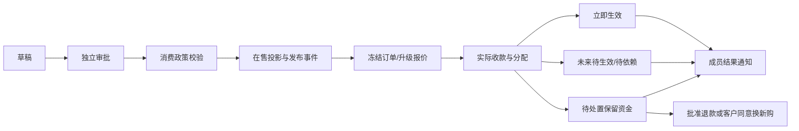

# CEO 当前落地全范围审计

审计日期：2026-10-05。角色：原生 GPT CEO 产品审查，HOLD SCOPE。只读审计共享实现、PRD§1–17和实际验收记录；仅写本报告，不修改业务或 fixture，不运行生产操作。

基线：main HEAD `d051ad085fd9d2ebb42b2ce5b3051da3c963de58`；PRD SHA256 `42ef6ae8fb0305f00727617046de781d0cc4ef6eed59dcc52ed25324b75caddc`。工作目录仍在并行修改，以上不是冻结全候选签字。采用完整 gstack plan-ceo-review 的业务方法；当前 SKILL.md 的11节为内联内容，未伪称读取不存在的 sections/review-sections.md。

**结论：实施和上线 PENDING。5项可证实实现问题尚未闭环；另有运行证据与部署配置门禁未完成。需求最终评审零问题不能代替本轮实施签收。**

## 前提、替代方案与范围

保留用户规则：三档初始2000/5000/10000，独立批准；开通费初始5000且不含首期；历史默认6×500，新批准600只能影响新合同；按剩余有效期升级；运营代办和真实客户自激活；所有价格可改但旧单冻结。未填写的尊享权益、开户收款账户等为配置/批准条件，不由工程猜值。未实现消费器的权益与周期明确阻断，不算必须临时扩展的新功能。

替代方案仅比较实现方式：复用同一消费校验优于复制发布条件；复用事务 outbox 生成结果通知优于前端乐观通知；按数据库游标查询优于取100后内存分页。梦想状态是在同一企业、销售版本和付款事实下，从插件到桌面完整可追溯；本轮无需营销页面、手机适配、OAuth、市场上架或钱包。

## 明确实现问题与最小处理

### CEO-I1 / P1：可发布商品与可购买/升级校验不一致

依据：PRD§6–8要求发布前政策/消费器就绪；`packages/persistence/src/commercial-catalog-repository.ts:185` 只检查 purchasePolicy.version 为字符串及期限正整数；`commercial-transaction-policy.ts:24` 还要求非空版本和期限≤604800。空字符串或604801能通过发布，却被建单拒绝。monthly 发布也未要求非空 planFamily/正整数 tierRank；升级消费 `commercialPlanIdentity` 要求两项明确。

最小处理：发布复用交易消费校验；合法 monthly 必须有批准身份和消费器支持的周期。标准三档身份从明确配置来，不通过名称/价格猜 rank。补发布拒绝空版本、过长窗口、缺身份的反例及合法三档独立生命周期测试。此为校验缺陷，不是业务数值待批准。

### CEO-I2 / P1：商家通知只落了上架消息，结果通知及读状态未闭环

依据：PRD§9、§13.2、§15要求上架消息未读/已读，以及开通/购买/升级按实际立即生效、未来待生效、待依赖、待处置通知。`commercial-transaction-repository.ts:258` 写 `commercial.payment.${grantStatus}` 到 generic outbox；全实现搜索未发现将这些事件写到商家商业通知的消费器。`commercial-notification-repository.ts:43/51/79` 只处理 catalog publish outbox，title固定“已上架”；迁移262的通知记录无read_at，且UPDATE被immutable trigger拒绝；未找到独立读状态仓储/API。

最小处理：同提交事实产生一次受租户/成员权限约束的结果事件，并可靠投递真实状态；复用批准事实，禁止通知触发再次授予。读状态独立可变表或独立受控事实，禁止改消息内容。真实API/worker/桌面验证购买、升级、未来/依赖/待处置、重复投递、读状态及成员隔离。不是再做一套支付流程。

### CEO-I3 / P2：权益包查询可能永久截断，引用缺订单事实

依据：PRD§5、§16要求包版本/引用追溯和稳定游标。`commercial-benefit-bundle-repository.ts:22` 先全版本SQL LIMIT100；`apps/api/src/mcp-commercial-benefit-bundles.ts:20` 再按code/search过滤和分页。第101条后的商品即使精确搜索也看不到。references只查 catalog_bundle_refs、LIMIT100，handler固定next_cursor:null且先从截断list查版本；无订单快照引用。

最小处理：过滤、排序和keyset游标下推仓储，limit+1判下一页；指定版本直接查，不依赖全目录前100条；引用查询覆盖冻结订单中的包版本并分页。用>100版本、最后一个code、跨页稳定性、旧订单引用测试。不能以“首期数据少”代替契约。

### CEO-I4 / P2：商家把所有异SKU月套餐都称为升级

依据：PRD§8/§15限制同族更高rank升级、同级续购、不提供降档入口。`demo/merchant-studio/src/CommercialPurchaseCenter.tsx:11–18` 只比较sku_code，异SKU一律“计算升级差价”。成长用户看基础版也得到升级按钮；服务端拒绝不会修复误导入口。

最小处理：展示由真实源/目标身份或服务端available_actions确定；更高且兼容才升级；相同批准档位按续购规则；降档/不兼容禁用并说明原因；源身份未知不能猜。补成长→基础、尊享→成长、跨族以及合法基本→成长测试与桌面验收。仅调整入口，不开放降级业务。

### CEO-I5 / P2：指定的三档按权益比较仍未实现

依据：PRD§12.2/§15要求权益为行、三档为列的对照，支持识别额度/权限差异；`CommercialPurchaseCenter.tsx:210` 当前是商品为行、benefits_summary整段单列。可购目录存在不能代表此显式设计行为已完成。

最小处理：用真实批准三档的注册权益构造对照；缺值标待确认/不可售，初始价格不伪造可售审批；保留现有包列表与订单冻结摘要。验证2000/5000/10000独立批准、权限/点数/容量单位和200%桌面可读。

## 验收矩阵：不能扩大绿色证据的适用范围

| 显式行为 | 已有证据 | 当前判定及最小闭环 |
|---|---|---|
| 开通费与首期分项、等待依赖、重复核验 | 真实PG第七轮交易10项通过 | 数据层有证据；完整Ops收款→成员商家结果GUI仍待实际整链 |
| 历史6×500与新600、月周年到期/漏窗不补 | run-Sgzgj1真实PG已执行通过 | 不是仅单元；刚补赠点只读projection/UI仍须最新冻结API/桌面核对 |
| 剩余期连续升级、未来合同保留 | 同轮交易PG通过 | 补三标准档独立批准和半期1500/2500/4000真实界面与冻结明细；修I1/I4 |
| 价格变更不改旧订单 | PG锁价/迟核验通过 | 逐类开通/套餐/包的Ops改价→商家当前价/旧单价双端证据待完整销售GUI |
| 目录上下架/归档、权益包 | catalog真实PG、目录桌面1spec通过 | 目录桌面只证明编辑/可读性，不证明完整发布→通知→购买；修I3/I5 |
| 发布通知/私有权限/重跑 | 同轮真实notification PG通过 | worker/API/桌面整链、读状态和购买结果尚未证明；修I2 |
| Ops代办、真实成员自激活 | invitation PG及支持GUI第六轮真实邀请码/登录通过 | 自激活已有运行证据，不可称缺实现；受理商业付款全销售GUI未签收 |
| 收款分配/未分配返款/源退款 | receipt及source blockers真实PG通过，守恒/服务与点数来源覆盖 | 继续真实API/Ops确认/外部结果未知恢复；不以PG替代转账批准配置 |
| 异常负责人、下一期限、逾期提醒、死信恢复 | PRD§14/16有要求；当前材料主要是状态/余额/backlog | 证据不足：列出实际入口/持久字段/授权恢复动作，再运行过期到账和通知耗尽操作；若无实现则专属最小补丁，不静默删需求 |
| 功能权限/真实模型消费 | 注册定义与消费器已有实现与测试 | 五模态真实中转鉴权、成本、commercial拒绝/成功证据仍待矩阵绑定 |
| 插件生产包/真实ChatGPT入口 | 0.2.7个人安装与stdio131工具/68文件已通过 | 宿主未重启且加载新快照未证明；dirty unsigned包不能作最终候选。旧/当前/回滚matrix与首次成功≤5分钟待执行 |
| 迁移/C6/生产上线 | policy/fleet/compose51+installer5等通过 | 工具测试不等于101部署。实际审批文件、动态fleet、路由fence、候选/schema绑定与回滚演练待真实批准执行 |

## 11节 CEO 方法复核

1. 架构：目录不可变事实/销售投影、交易锁、现金分配、源履约与通知outbox分层方向成立；I1及I2显示边界未完整衔接。无需新服务，先共享校验与桥接通知。
2. 错误救援：已付待处置保留资金是正确行为；不能把迟核验、未来待生效当失败并重付。异常责任/SLA和通知耗尽实际恢复仍需运行证明，见下表。
3. 安全：真实app/ops ACL及成员404有证据；读状态/结果通知新增时仍须成员RLS、私有授权和受控恢复。批准配置缺失保持closed；不得用fixture或环境boolean冒充部署批准。
4. 数据边缘：500/600快照、既付future、重复升级、点数预留/消费均有真实PG反例覆盖；I3是可确定的数据规模遗漏，不是泛泛容量建议。
5. 代码质量：共享消费校验应为单一事实源，避免目录/订单复制门禁。UI不能把服务端拒绝当正确产品分支。现有明确定义与功能消费器可复用。
6. 测试：22真实PG零skip与支持GUI为有效局部证据；不得抵销完整release失败或尚未执行的销售/插件/生产环节。后续先修问题再在冻结候选重验适配范围。
7. 性能：发布事务一次outbox和200成员批次避免大事务；包版本前100截断不是容量策略。真实负载/p95/锁等待未证明，不给性能满分。
8. 可观测性：backlog最老时间存在；逐个业务异常的owner、下一期限、授权恢复和通知投递可见性未有端到端证据。检查应落实到可操作队列，不能只读SQL人工猜。
9. 部署：完整release第三轮日志终态22pass/1fail，API bridge purge错误被COMMERCIAL_ENTITLEMENT_UNAVAILABLE覆盖，必须定位兼容路径并完整重验。101配置缺失、新候选未上传/迁移/切流，PENDING。
10. 长期影响：冻结配置/包refs/升级carry降低旧单漂移；查询截断与缺订单引用削弱售后。先保证追溯与复用，不增加钱包、自动续费或额外套餐类型。
11. 设计：当前/未来/历史分区、独立gift、付款未知查询和支持已有进展；I4/I5及通知读状态仍是显式用户行为差距。目录单spec不能替代消费路径可理解性。

## 状态图与失败救援

| 失败模式 | 允许救援 | 禁止的捷径 | 闭环证据 |
|---|---|---|---|
| 发布后建单拒绝 | I1发布前消费校验，保留草稿阻断 | 自动补审批/猜rank | 发布反例+合法建单 |
| 核验晚于期末/源变 | 保留收款待处置，批准退款或经同意新购 | 丢弃款、强行过期授予 | API/Ops队列与资金守恒 |
| 回应丢失/外部结果未知 | 查原幂等意图和事实 | 重造订单/收款/退款 | 真实失败恢复 |
| 通知租约崩溃/耗尽 | 同事件去重、明确授权重试 | 假显示已投递/再授予 | worker重跑、Ops状态、成员读状态 |
| 包查询第101条 | 受控游标读全历史与订单引用 | next_cursor:null掩盖截断 | I3规模测试 |
| 混版本/回滚 | fence新购；保留原冻结履约、赠点与批准退款恢复 | env开关宣称所有实例安全 | 部署attester/Ingress/候选实际记录 |

## 决策与实施任务

保持已确认业务；无需再请用户确认价格或半年500规则。执行顺序：目录owner收口I1；通知owner修I2并协调最小迁移；目录/应用owner修I3；商家owner修I4/I5。每项写实际改动、反例测试和运行产物，然后owner冻结并复查，不用报告勾选代替处理。异常责任/期限/死信恢复由Ops/receipt/worker owner提供确切实现入口与运行证据，缺实现则回到最小补丁。

最后完整typecheck及release gates、商业两端桌面/API/MCP/worker链、插件真实新会话与文档matrix重验。正式收款/审批与C6可信配置来自受保护真实来源，配置缺失保持阻断。审阅提交后重新构建带可验证manifest的候选，再由owner依发布runbook部署101并生产只读/授权闭环与健康检查。

## 完成摘要

本轮只读全scope审计完成：5项明确实现问题（P1两项、P2三项），分别给出源码、PRD依据和最小闭环；另列证据不足与外部配置门禁，不把它们伪装成需求争议。当前无全候选运行/部署签收。旧需求评审结论仍适用于方案；本报告判定实施与上线PENDING。

## 审计后owner处理进展（不改初次审计快照）

I1已按授权落最小发布共享消费校验补丁；目录/交易政策两文件30针对测试通过。待owner冻结的实际PG/API/GUI与完整gates，不将其称为全链闭合。I2准确范围依据已上报owner：当前PRD227明确上架读状态；281/380明确结果商家通知，335明确商品与购买消息；直接用户原文仅明确上架通知，需owner按已确认PRD处理而不擅自扩功能。I3分页方案已和DX协调，仍待实现。完整release round4按owner最新消息依旧exit1，101仍pending。
