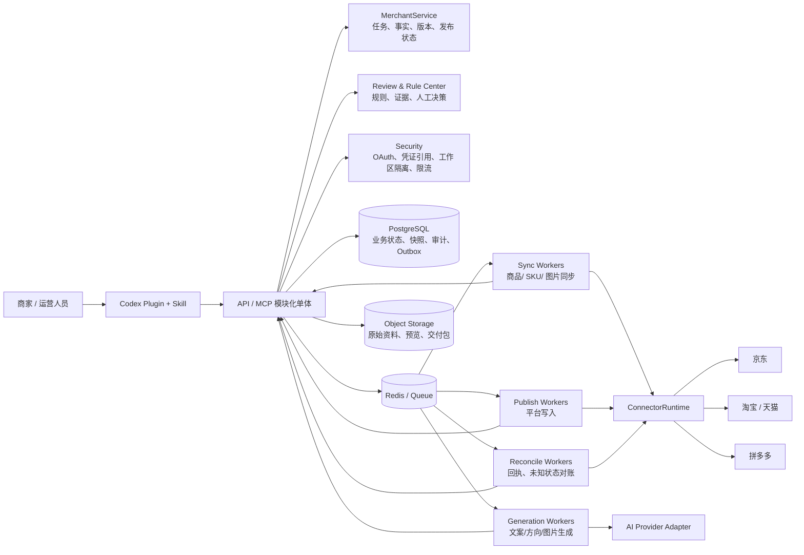

# 商家营销内容助手

## 对外宣讲版：整体架构与能力矩阵

> 版本：2026-08-25  |  依据：当前仓库源码、测试、产品/技术方案文档
>
> 使用边界：本文用于销售、售前和客户交流。凡标注“生产门禁”的能力，必须以真实平台应用、授权范围、测试店铺和生产 Canary 证据为准，不应仅凭代码或模拟环境对外承诺。

## 一句话定位

商家营销内容助手是一套面向电商商家的“事实驱动营销生产平台”：把店铺商品资料、品牌资产和平台规则统一沉淀为可信工作区，帮助商家完成内容策划、文案与视觉素材建议、风险审核、人工确认，并将确认后的商品内容交付到京东、淘宝、天猫、拼多多、小红书、抖音六个平台。

它的核心价值不是“替商家自动写一段文案”，而是把“资料整理—内容生产—合规检查—多平台交付”串成一条可追溯、可恢复、可控风险的业务链路。

## 1. 总体架构



### 架构层次

| 层次 | 代码位置 | 对外可讲的价值 |
|---|---|---|
| 交互入口 | `apps/plugin`、`apps/ops-console` | 商家通过自然语言和工作台完成任务；插件只承载交互和编排 |
| 业务/API 层 | `apps/api`、`packages/application` | 统一处理工作区、任务、事实、版本、生成、审核、同步和发布状态 |
| 领域模型层 | `packages/domain` | 用明确状态机约束内容版本、发布任务和可恢复流程 |
| 规则与审核层 | `packages/review` | 对商品事实、图片、平台规则和高风险问题做确定性检查，并保留人工决策 |
| 连接器层 | `packages/connectors`、`packages/application/src/connector-runtime.ts` | 用统一契约接入不同平台，同时保留平台字段、错误码和状态差异 |
| 异步执行层 | `apps/worker`、`packages/workers` | 将同步、生成、发布、对账拆为隔离任务，避免长任务阻塞交互 |
| 数据与基础设施 | `packages/persistence`、`storage`、`security`、`quotas` | 多租户隔离、快照、审计、Outbox、对象存储、凭证引用、限流和配额 |

### 运营后台控制面

项目已经包含独立的 `apps/ops-console` 运营后台。它面向平台运营、规则维护、财务和客户支持人员，和商家端插件分开部署，通过安全的 `/mcp` API 管理工作区，不直接接触平台密钥或数据库。

当前已具备：

- 工作区、套餐、订阅、额度、账务、退款和增长漏斗；
- 平台开关、店铺别名、授权/readiness、模型和生产证据门禁；
- 成员角色、告警、审计、数据删除双人审批和传统规则中心。

新营销能力的运营治理正在按 FR-17/FR-18～FR-21 扩展：钱包充值与能力解锁、知识规则/资产审核、驳回处理、学习建议、竞品来源与权利审核、内容/图片/视频脚本候选队列、批量发布回执和店铺自动化告警。对外应准确表述为：**已有商业与平台运营后台；钱包账务和基础权限已具备，新营销智能能力的运营治理模块按阶段建设。**

## 2. CodeGraph 式调用关系梳理

当前环境没有可直接调用的独立 CodeGraph MCP 服务，因此本报告采用源码导入关系、导出符号、事件类型、API 路由和测试证据做静态 CodeGraph 还原。关键节点和边如下：

```text
Plugin/MCP
  -> API server
      -> MerchantService
          -> Domain states / ContentVersion / PublishJob
          -> Review engine + Rule Center
          -> ConnectorRuntime
          -> Persistence repositories
          -> Object storage / OAuth / quotas
      -> Outbox events
          -> Sync Worker -> connector.read/sync -> progress/result callback -> API
          -> Generation Worker -> AI adapter -> generation result callback -> API
          -> Publish Worker -> connector.create/update -> observation callback -> API
          -> Reconcile Worker -> connector.query_status -> final state -> API
```

最关键的业务状态链：

```text
资料/商品导入
  -> 事实确认
  -> 任务理解与创意方向
  -> 制作方案确认
  -> 内容生成
  -> 规则审核 / 人工决策
  -> approved
  -> publish_prepared
  -> 用户二次确认
  -> queued / submitting
  -> published | rejected | unknown
  -> reconciliation / manual_attention
```

架构上的三个重要一致性边界：

1. 同步完成后，商品事实必须由用户确认，不能把平台读取结果直接当作最终营销事实。
2. 生成前冻结任务快照、规则版本和素材选择，保证生成结果可以解释和复现。
3. 平台写入后根据回执、回读和对账收敛状态；HTTP 请求成功不等于平台业务发布成功。

## 3. 能力矩阵

状态说明：

- **代码已具备**：当前仓库已有实现和相关测试/契约。
- **生产门禁**：代码路径存在，但对外承诺前还需真实平台、凭证、配额和 Canary 证据。
- **明确边界**：当前版本刻意不承诺或不支持。

| 能力域 | 当前能力 | 状态 | 销售话术 |
|---|---|---|---|
| 工作区与多租户 | `workspace_id` 隔离、成员、状态、用量、操作审计 | 代码已具备 | 每个商家工作区独立管理数据、任务和操作记录 |
| 店铺授权 | OAuth state/PKCE、凭证引用、授权健康检查 | 生产门禁 | 商家通过平台官方授权，不需要把账号密码交给系统 |
| 商品资料同步 | 商品、SKU、价格、库存、图片、平台账户、分页同步与进度回报 | 生产门禁 | 可把多平台商品资料整理到统一工作区，保留来源和同步状态 |
| 资料导入 | 文档事实解析、品牌资产注册、图片元数据、去重与对象存储 | 代码已具备 | 没有完成平台授权时，也可以先用已有资料启动内容工作 |
| 品牌知识沉淀 | 品牌候选字段、定位、受众、语气、禁用词、Logo/颜色/字体等 | 代码已具备 | 内容生产会围绕品牌资料和视觉规范展开，而不是每次从零开始 |
| 任务理解 | 任务问题、目标平台、促销快照、创意方向、制作方案 | 代码已具备 | 用户用自然语言描述目标，系统只追问影响正确性的关键信息 |
| 内容生成 | 文案模块、内容版本、方向、生成 Job、AI provider adapter | 生产门禁 | 可以生成结构化商品营销内容，并支持修改、版本化和导出 |
| 图片能力 | 图片生成接口、素材选择、图片审核和资产偏好 | 生产门禁 | 支持素材建议和受控图片生成；不等同于自动生成完整商品视觉稿 |
| 事实可追溯 | 内容字段关联来源、任务/规则快照、版本 diff、导出 manifest | 代码已具备 | 客户可以知道卖点和参数来自哪份商品资料 |
| 规则审核 | 确定性规则、图片审核、阻断项、规则版本、审核决策与审计 | 代码已具备 | 发布前先检查关键事实和风险，必要时由人工确认例外 |
| 多平台适配 | 统一 `PlatformConnector`，平台字段/错误码/状态保真 | 六个平台分别通过生产门禁 | 一套工作流覆盖六个平台，生产写入按平台证据逐一开启 |
| 内容发布 | 创建/更新、幂等键、发布前执行检查、回执观察 | 生产门禁 | 只有用户确认后的版本才进入平台写入流程 |
| 发布对账 | `unknown`、重试、远端状态查询、人工介入 | 代码已具备 / 生产门禁 | 对平台异步审核、超时和未知结果有独立处理，不把不确定状态伪装成成功 |
| 异步与可靠性 | Outbox、Redis/队列、隔离 Worker、租户公平调度、死信/重试 | 代码已具备 | 大批量同步或模型慢调用不会长期占住主交互链路 |
| 安全与治理 | 工作区边界、OAuth、限流、配额、审计、数据生命周期 | 代码已具备 / 生产门禁 | 凭证、业务状态和审计不依赖对话上下文，支持企业级部署治理基础 |
| 运维与扩展 | API/Worker 无状态化、PostgreSQL、Redis、对象存储、50→500 工作区扩容设计 | 生产门禁 | 首期按 50 个并发工作区设计，架构预留到 500；实际容量以压测为准 |
| 运营后台 | 独立控制台、工作区 grant、角色门禁、商业化/平台/账务/审计/告警 | 代码已具备；新营销运营模块 P1 | 运营人员可以管理商业和平台状态；知识治理、学习审核和生成队列按阶段开放 |
| 知识运营治理 | 规则、品牌/客户资产、来源、版本、权益、学习建议 | API 已具备；后台接入 P1 | 运营人员可在受控范围内审核知识和学习建议，不会自动改写全局规则 |
| 竞品与生成运营 | 公开竞品拆解、差异化参考、文案/图片/视频脚本候选审核 | API 已具备；后台接入 P1 | 只做合法公开信息参考和差异化创作，保留候选、审核和责任链 |

## 4. 销售对外宣讲稿（约 3 分钟）

> 今天介绍的是商家营销内容助手。它解决的不是“不会写文案”这么简单的问题，而是电商团队在日常营销生产中反复遇到的三类问题：商品资料分散、内容生产依赖人工经验、发布前很难确认事实和平台风险。
>
> 我们把商品、SKU、价格、库存、图片、品牌资料和平台规则沉淀到一个商家工作区。商家可以通过平台官方授权同步店铺商品，也可以直接上传已有资料。系统会保留每条关键信息的来源，让后面的营销内容有事实依据。
>
> 在生产环节，运营人员只需要用自然语言描述商品和营销目标。系统会先理解任务、识别缺失信息，再给出创意方向和制作方案。生成的不是一段不可解释的黑盒文案，而是可修改、可比较、可追溯的内容版本。
>
> 在交付前，系统会检查商品事实、图片和规则风险。高风险问题可以阻断，确实需要例外时保留人工决策和审计记录。只有商家确认后的版本，才会进入发布队列。
>
> 发布也不是简单地调用一次接口。系统按平台连接器执行创建或更新，并记录幂等键、回执和远端状态。遇到平台审核、超时或未知结果，会进入对账流程，而不是直接告诉商家“已经成功”。
>
> 因此，商家营销内容助手的价值可以概括为：让营销内容生产更快，让事实和品牌更稳，让平台交付更可控，让每一次修改和发布都能被追溯。

## 5. 客户价值映射

| 客户痛点 | 产品回应 | 可量化的验证方向 |
|---|---|---|
| 商品信息散落在 ERP、表格、图片和聊天记录中 | 统一资料导入、平台同步和事实确认 | 首次看到可审核 Brief 的时间、事实引用覆盖率 |
| 文案依赖少数资深运营 | 任务理解、创意方向、结构化内容版本 | 首稿耗时、平均修改轮次 |
| 促销价格/规格写错会造成损失 | 来源追溯、快照、规则审核、发布前确认 | P0 错误漏检、阻断问题轮次 |
| 多平台重复改写和发布 | 统一工作流 + 平台连接器 + 平台差异保真 | 单商品跨平台交付时间、发布成功率 |
| 平台接口超时后不知道是否成功 | PublishJob、回执观察、远端状态对账 | 未知状态收敛时间、可追踪率 |

## 6. 常见问题与合规边界

**问：系统会不会自动替商家发布？**

答：当前产品设计强调逐任务确认。内容先经过审核，商家确认后才进入发布流程；是否启用真实平台写入，还取决于对应平台应用审批、授权范围和生产门禁。

**问：是否需要把平台账号密码交给系统？**

答：不需要。设计上走平台官方 OAuth 授权，系统保存的是受控凭证引用，不接收或代填商家密码。

**问：能否保证平台一定审核通过？**

答：不能。系统可以在发布前做事实和规则检查，并记录平台回执；平台最终审核仍由平台规则和平台侧审核结果决定。

**问：是否支持所有平台和所有商品类目？**

答：当前首发架构包含京东、淘宝、天猫、拼多多、小红书、抖音六个平台标识和独立连接器边界。具体可用接口、类目、字段和配额以客户应用审批结果为准，应按平台分别验收；其他平台需另立范围评审。

**问：系统会不会自动生成商品本体、Logo 或完整广告片？**

答：不在当前版本承诺范围内。当前重点是商品营销内容、结构化文案、素材建议和受控图片能力。

**问：有没有运营后台？**

答：有独立的运营控制台，当前已经支持工作区、套餐、额度、平台配置、账务、成员、告警、审计和上线 readiness。知识库治理、驳回处理、学习建议、竞品审核和生成任务队列已纳入产品架构，按 P0/P1/P2 分阶段开放。

## 7. 对外承诺前的核验清单

- 已确认客户目标平台、店铺类型、商品类目和所需读写范围。
- 已完成对应平台真实应用、OAuth 回调、测试店铺和最小读写探针。
- 已确认真实平台配额、字段限制、业务审核和回调/查询机制。
- 已区分“代码已具备”“fixture/test E2E”“生产 Canary”三种证据，不用模拟结果代替生产能力。
- 已明确客户数据保留、删除、工作区隔离和凭证管理方案。
- 已将 50 个工作区作为首期容量口径；任何 100/250/500 规模承诺都应附同配置压测证据。

## 8. 证据索引

- 产品与目标边界：`docs/PRD-merchant-marketing-codex-final.md`
- 技术方案与生产门禁：`docs/technical-solution-design.md`
- 9 人架构与交付计划：`docs/architecture-and-delivery-plan-9-fte.md`
- 云资源与部署基线：`docs/cloud-resources-and-deployment.md`
- 可视化架构图：`docs/diagrams/merchant-system-architecture.html`
- API 入口：`apps/api/src/server.ts`
- Worker 角色与事件路由：`apps/worker/src/main.ts`
- 核心业务服务：`packages/application/src/service.ts`
- 持久化与迁移：`packages/persistence/src/`
- 连接器契约与能力证据：`packages/connectors/src/`

## 结论

当前项目的技术骨架已经形成：入口、业务服务、领域状态、审核规则、平台连接器、异步 Worker、持久化、对象存储和安全治理之间有清晰边界。对外最稳妥的产品表述是“可追溯、可审核、可确认、可对账的电商营销内容生产平台”。

需要特别保留的销售边界是：平台真实授权与生产写入、六个平台分别的可用能力、外部模型/平台配额，以及 50→500 工作区的容量，均需以对应环境证据作为最终承诺依据。
